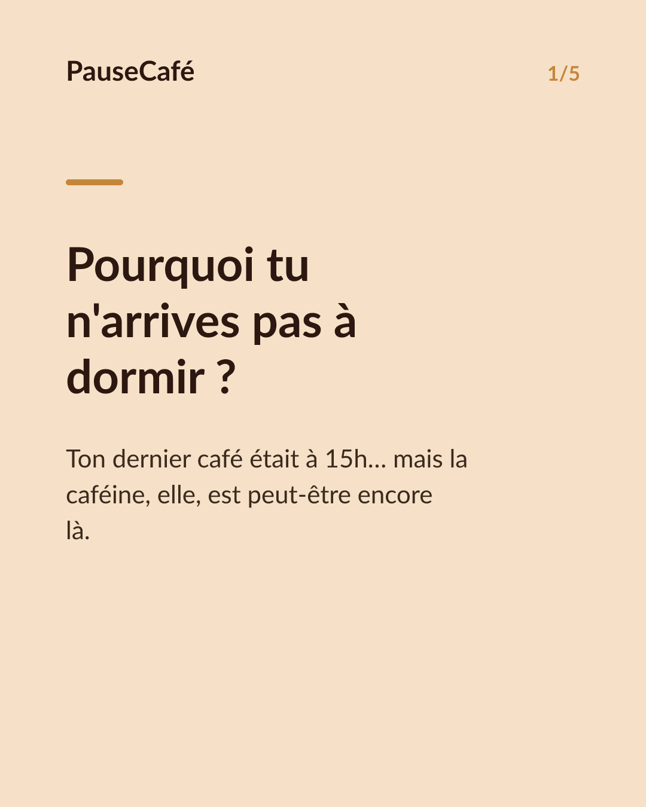
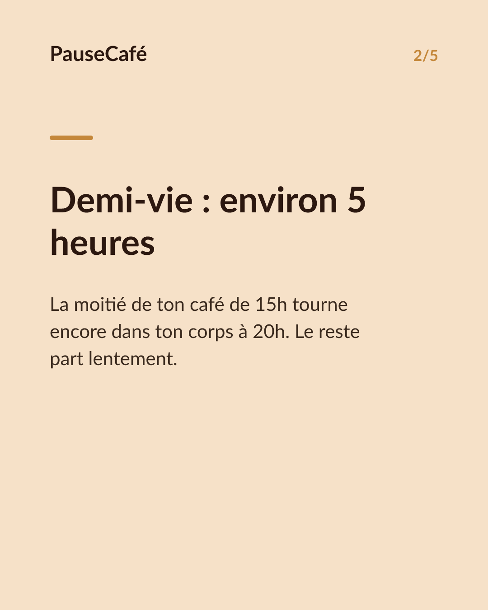
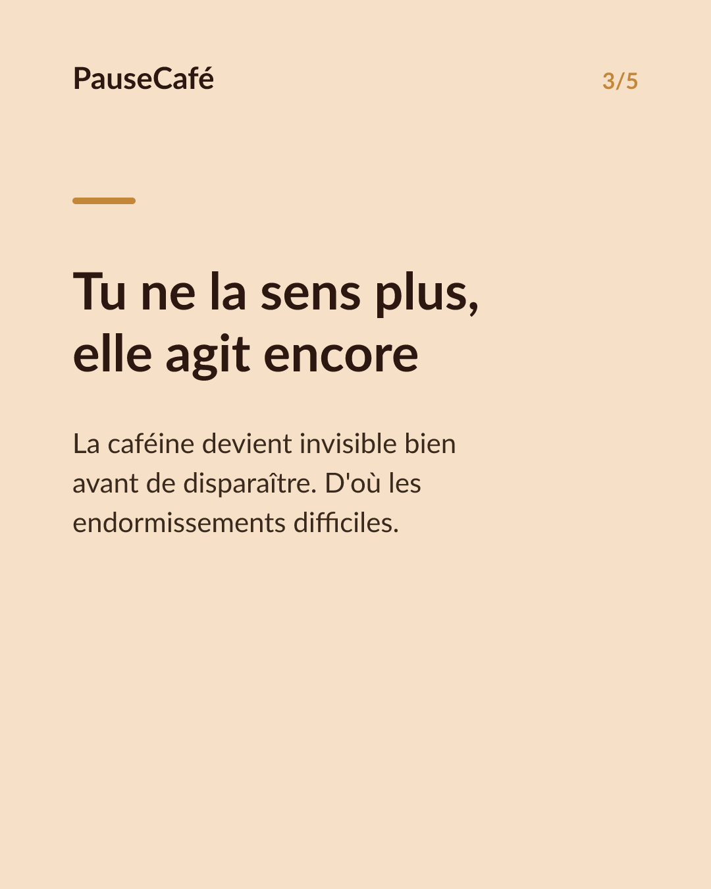
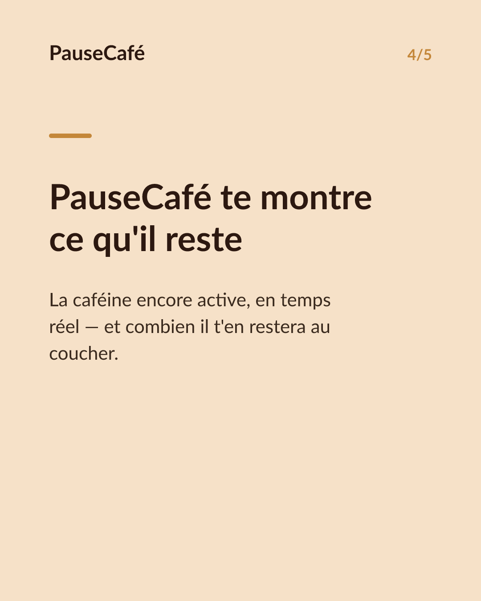

# Brouillon posts sociaux — dernier-cafe-sommeil

- Archétype : Probleme -> solution app
- Angle : Le café de l'après-midi qui gâche la nuit ; PauseCafé montre la caféine active restante au coucher.
- Généré le : 2026-06-10

> À relire et ajuster avant publication. (Le lien App Store est déjà inséré.)

---

## X (thread)

1/ Tu t'endors pas avant minuit… mais ton dernier café était à 15h. Ce n'est peut-être pas un hasard. ☕

2/ La caféine a une demi-vie d'environ 5 h. À 20h, la moitié de ton café de 15h tourne encore dans ton corps. À 23h, il en reste encore une part.

3/ Le piège : tu ne "sens" plus la caféine bien avant qu'elle soit partie. Tu te crois tranquille… elle agit encore en coulisses.

4/ Résultat : tu mets du temps à t'endormir, ton sommeil est plus léger — et tu ne fais pas le lien avec la tasse du goûter.

5/ PauseCafé calcule en temps réel la caféine encore active dans ton corps. En un coup d'œil, tu vois ce qu'il t'en restera à l'heure du coucher.

6/ Tu peux alors décider : décaler la prochaine tasse, réduire la dose, passer au déca. Sans te priver pour rien — juste en comprenant ce qui se passe. 🌙

7/ Indicatif, bien-être, jamais médical. Reprends la main sur tes nuits. PauseCafé, sur l'App Store 👉 https://apps.apple.com/app/id6761892198

## Instagram

**Légende :** Tu dors mal… et si c'était ton café de l'après-midi ? La caféine met des heures à partir. PauseCafé t'aide à voir ce qu'il t'en reste au moment de dormir, pour ajuster sans te priver. Indicatif, bien-être. 👉 lien en bio.

**Hashtags :** #café #caféine #sommeil #bienêtre #habitudes #coffeelover #sleep #santé #productivité #astuce

**Visuel du thread X :** Screenshot de l'écran d'accueil PauseCafé affichant la courbe de caféine active en descente vers le soir, avec l'heure du coucher visible sur l'axe.

**Carrousel (images générées) :**

**Textes des slides :**

1. **Pourquoi tu n'arrives pas à dormir ?** — Ton dernier café était à 15h… mais la caféine, elle, est peut-être encore là.
2. **Demi-vie : environ 5 heures** — La moitié de ton café de 15h tourne encore dans ton corps à 20h. Le reste part lentement.
3. **Tu ne la sens plus, elle agit encore** — La caféine devient invisible bien avant de disparaître. D'où les endormissements difficiles.
4. **PauseCafé te montre ce qu'il reste** — La caféine encore active, en temps réel — et combien il t'en restera au coucher.
5. **Reprends la main sur tes nuits** — Décale, réduis ou passe au déca. Sans te priver pour rien. Indicatif et bien-être. 🌙
