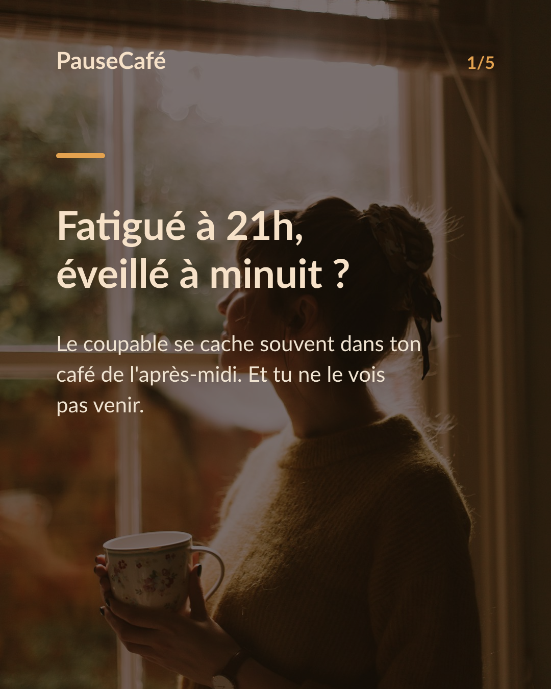
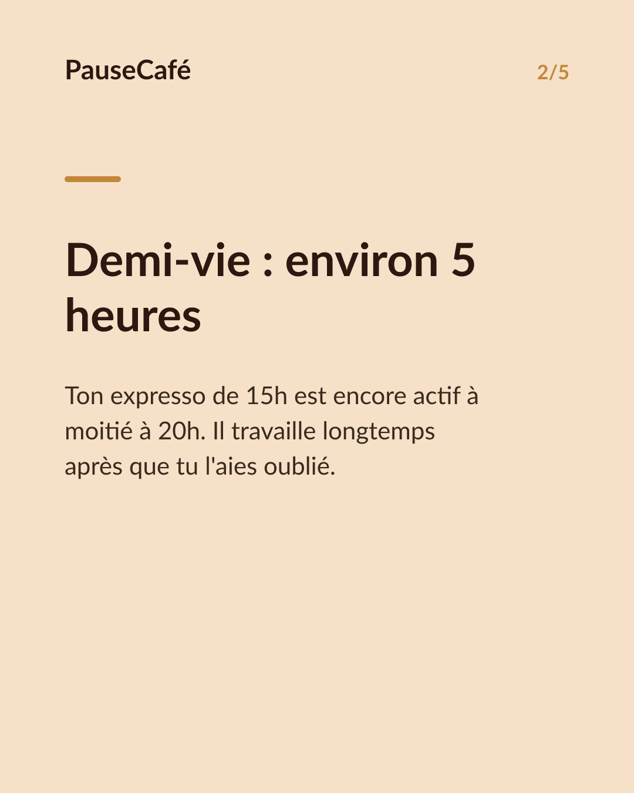
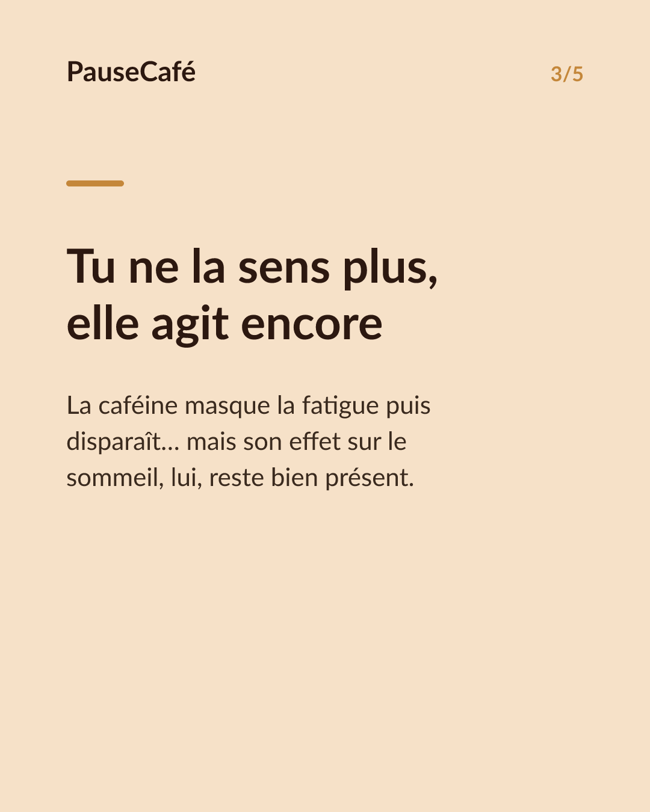
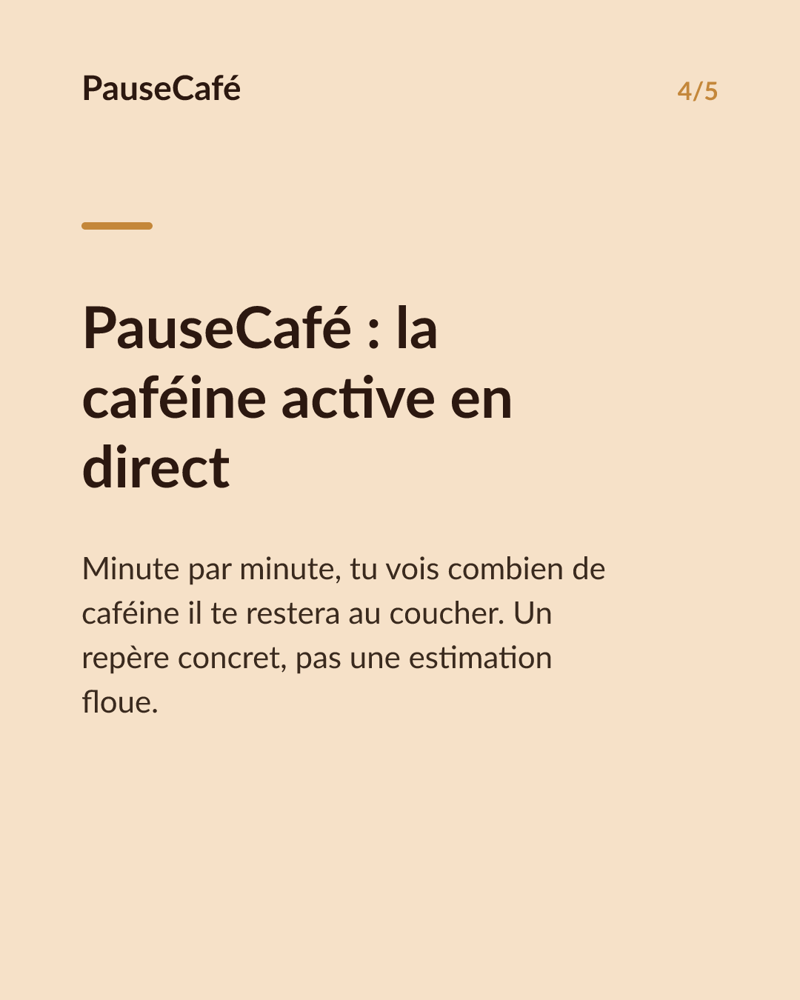

# Brouillon posts sociaux — dernier-cafe-sommeil

- Archétype : Probleme -> solution app
- Angle : Le café de l'après-midi qui gâche la nuit ; PauseCafé montre la caféine active restante au coucher.
- Généré le : 2026-06-11

> À relire et ajuster avant publication. (Le lien App Store est déjà inséré.)

---

## X (thread)

1/ Tu t'endors à minuit passé… alors que tu te sens fatigué depuis 21h. Souvent, la coupable s'appelle « café de 15h ». ☕

2/ La caféine a une demi-vie d'environ 5 h. Ton expresso de 15h ? À 23h, la moitié court encore dans ton corps. Et tu ne la « sens » plus depuis longtemps.

3/ C'est ça le piège : la caféine coupe la sensation de fatigue bien avant de disparaître. Tu crois ton corps libre… il pédale encore en coulisses.

4/ Résultat concret : endormissement retardé, sommeil moins profond, réveil difficile. Pas besoin d'être hypersensible pour en subir les effets.

5/ PauseCafé calcule, minute par minute, la caféine encore active dans ton corps. D'un coup d'œil tu vois exactement combien il t'en restera à l'heure où tu veux dormir.

6/ Décale ta dernière tasse, réduis la dose ou passe au déca — une décision éclairée, pas une privation au hasard. Indicatif et bien-être, jamais médical. 🌙

7/ Arrête de fixer le plafond. PauseCafé, sur l'App Store 👉 https://apps.apple.com/app/id6761892198

## Instagram

**Légende :** Fatigué le soir mais impossible de t'endormir ? Ton café de 15h est peut-être encore là. PauseCafé te montre la caféine encore active dans ton corps, minute par minute — pour que tu saches exactement quand prendre ta dernière tasse. Indicatif, bien-être. 👉 lien en bio.

📷 Photos : Daiga Ellaby, Chroki Chi / Unsplash

**Hashtags :** #café #caféine #sommeil #bienêtre #habitudes #coffeelover #santé #bonsommeil #conseilsommeil #pausecafé

**Visuel du thread X :** Screenshot de l'écran caféine active de PauseCafé, courbe descendante vers l'heure du coucher avec le niveau restant clairement visible.

**Carrousel (images générées) :**

**Textes des slides :**

1. **Fatigué à 21h, éveillé à minuit ?** — Le coupable se cache souvent dans ton café de l'après-midi. Et tu ne le vois pas venir.
2. **Demi-vie : environ 5 heures** — Ton expresso de 15h est encore actif à moitié à 20h. Il travaille longtemps après que tu l'aies oublié.
3. **Tu ne la sens plus, elle agit encore** — La caféine masque la fatigue puis disparaît… mais son effet sur le sommeil, lui, reste bien présent.
4. **PauseCafé : la caféine active en direct** — Minute par minute, tu vois combien de caféine il te restera au coucher. Un repère concret, pas une estimation floue.
5. **Reprends la main sur tes nuits** — Décale ta tasse, ajuste la dose. Une décision simple, éclairée. Indicatif et bien-être. Dispo sur l'App Store.
