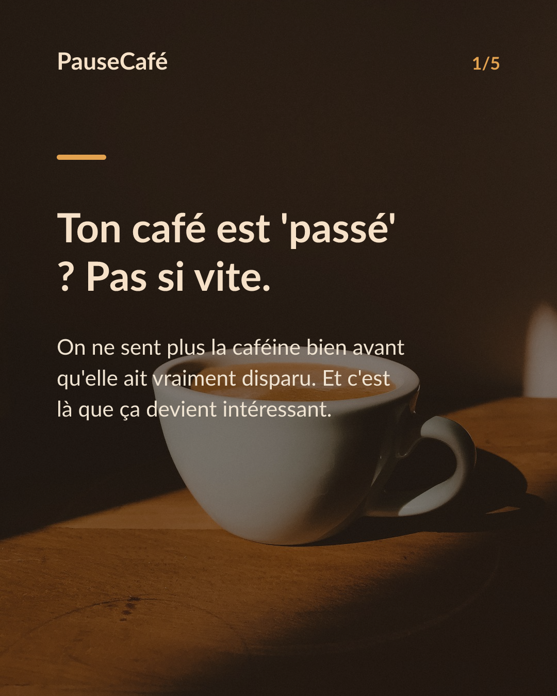
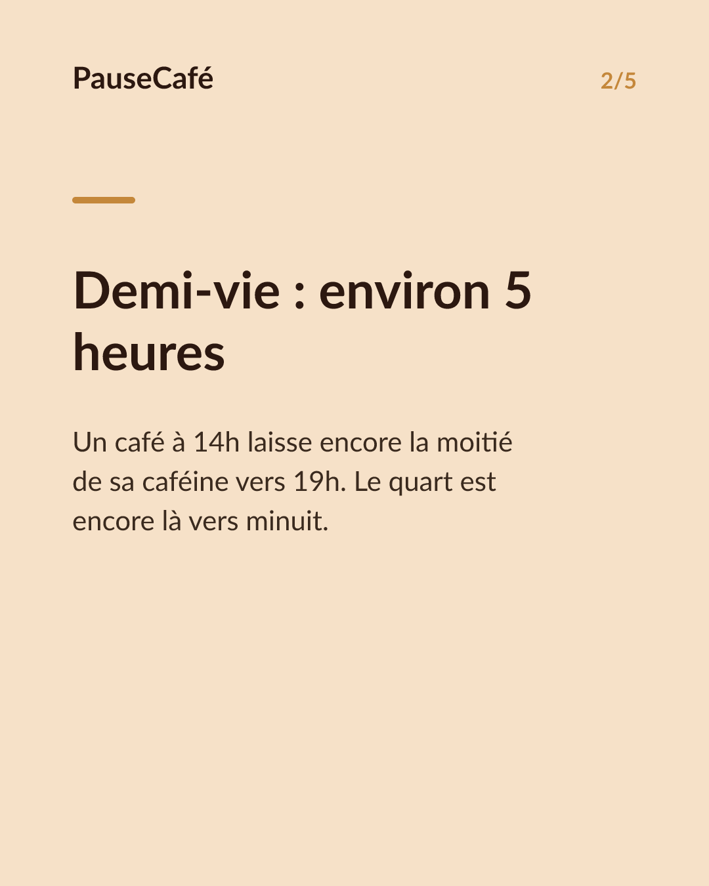
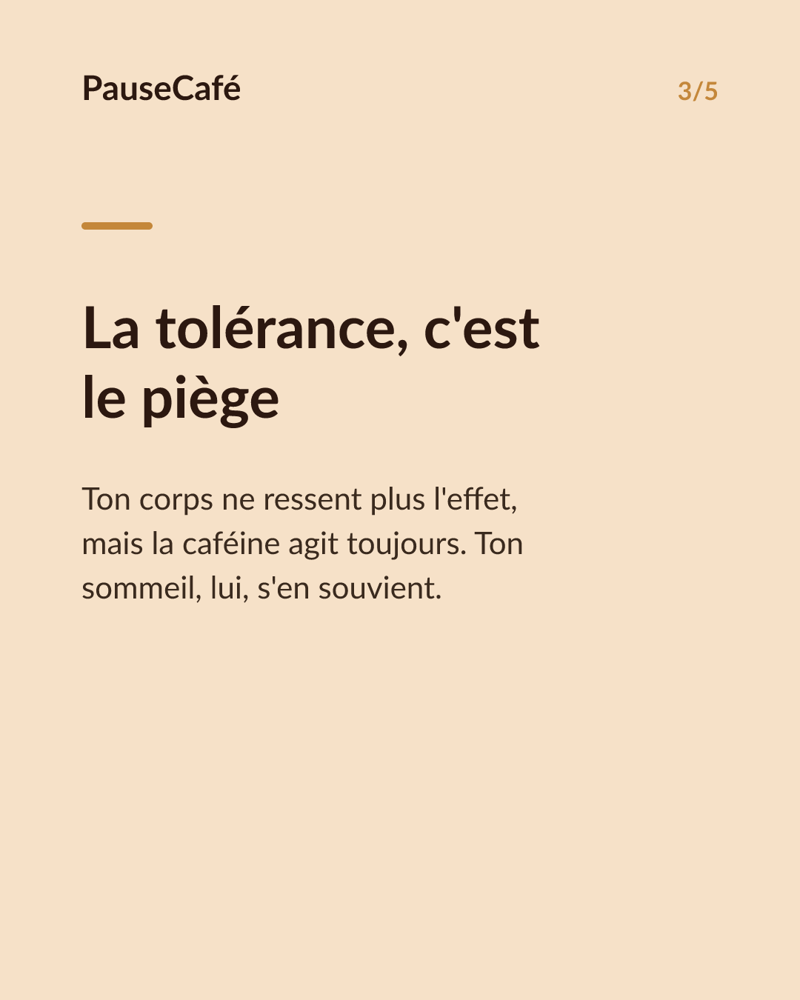
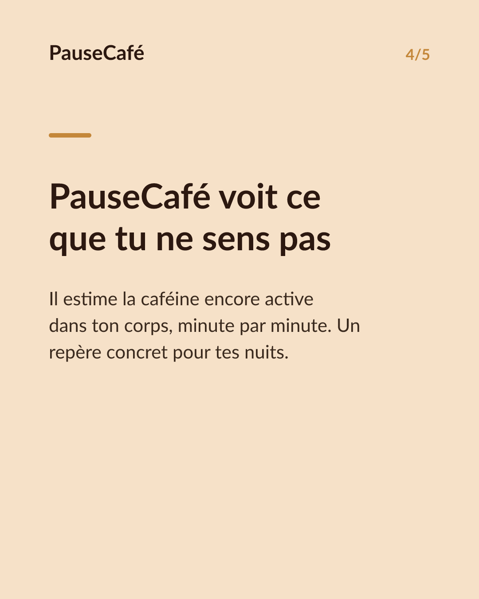

# Brouillon posts sociaux — cafeine-active-cest-quoi

- Archétype : Fait surprenant + app
- Angle : On croit le café 'passé' bien avant qu'il parte ; PauseCafé estime ce qu'il reste, minute par minute.
- Généré le : 2026-06-12

> À relire et ajuster avant publication. (Le lien App Store est déjà inséré.)

---

## X (thread)

1/ Tu te sens "reveillé normal" depuis 2h… mais ton café n'a pas disparu. Il est encore là. ☕

2/ La caféine a une demi-vie d'environ 5 h. Une tasse à 14h ? La moitié traîne encore vers 19h. Le quart vers minuit.

3/ Le piège : la tolérance masque l'effet. Tu ne "sens" plus le café bien avant qu'il soit éliminé. Ton corps s'y est habitué, pas ton sommeil.

4/ Résultat : tu t'endors plus tard, tu dors moins profondément — sans jamais faire le lien avec la tasse de l'après-midi.

5/ PauseCafé calcule la caféine encore active dans ton corps, minute par minute. Tu vois exactement ce qu'il t'en restera au coucher. Indicatif, bien-être.

6/ Pas besoin de te priver. Juste de savoir. Décale d'une heure, passe au déca le soir — et reprends la main sur tes nuits. 🌙

7/ Essaie PauseCafé gratuitement sur l'App Store 👉 https://apps.apple.com/app/id6761892198

## Instagram

**Légende :** On croit le café 'passé' depuis des heures… mais la caféine, elle, n'a pas dit son dernier mot. PauseCafé estime ce qu'il en reste dans ton corps, minute par minute. Indicatif, bien-être. 👉 lien en bio.

📷 Photos : L.D.I.A, Julia Solonina / Unsplash

**Hashtags :** #café #caféine #sommeil #bienêtre #habitudes #astuce #coffeelover #sleep #santé #routine

**Visuel du thread X :** Screenshot de la courbe de caféine active de PauseCafé (écran d'accueil), avec une flèche descendante visible vers le soir et la valeur restante affichée.

**Carrousel (images générées) :**

**Textes des slides :**

1. **Ton café est 'passé' ? Pas si vite.** — On ne sent plus la caféine bien avant qu'elle ait vraiment disparu. Et c'est là que ça devient intéressant.
2. **Demi-vie : environ 5 heures** — Un café à 14h laisse encore la moitié de sa caféine vers 19h. Le quart est encore là vers minuit.
3. **La tolérance, c'est le piège** — Ton corps ne ressent plus l'effet, mais la caféine agit toujours. Ton sommeil, lui, s'en souvient.
4. **PauseCafé voit ce que tu ne sens pas** — Il estime la caféine encore active dans ton corps, minute par minute. Un repère concret pour tes nuits.
5. **Reprends la main, sans te priver** — Décale, réduis ou passe au déca le soir. PauseCafé sur l'App Store — indicatif, bien-être.
