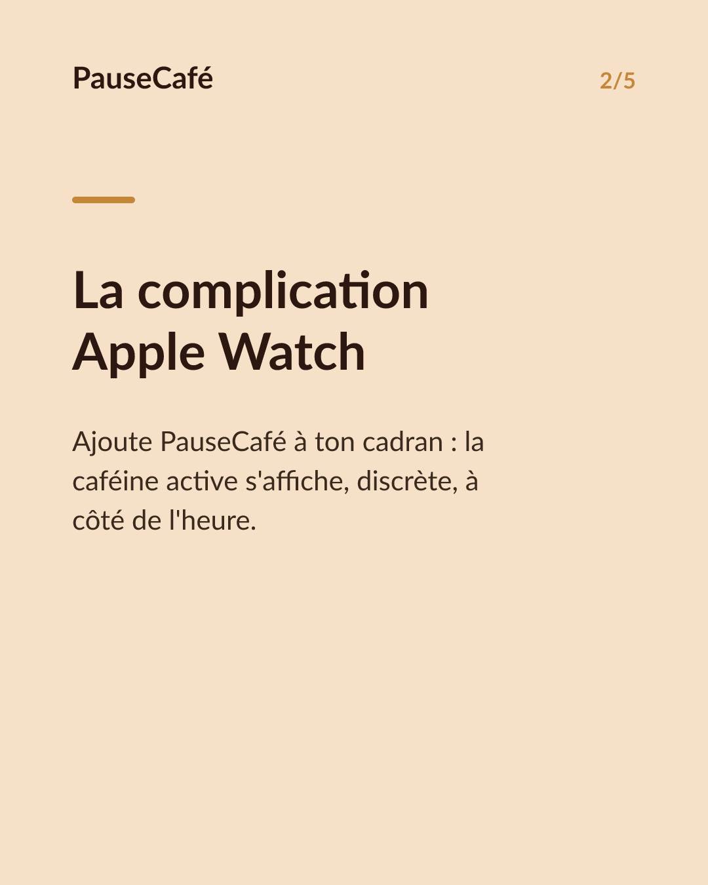
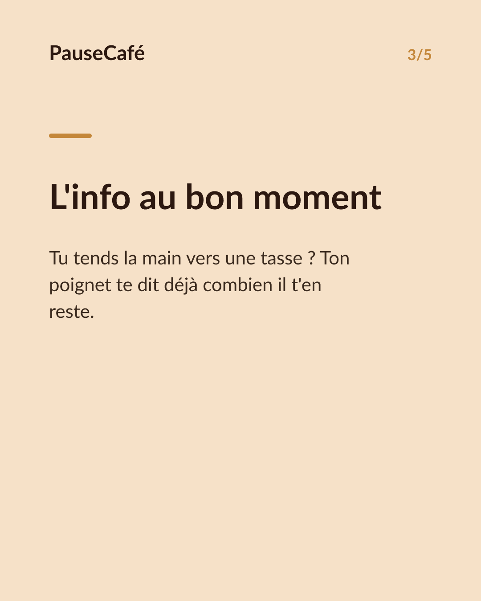
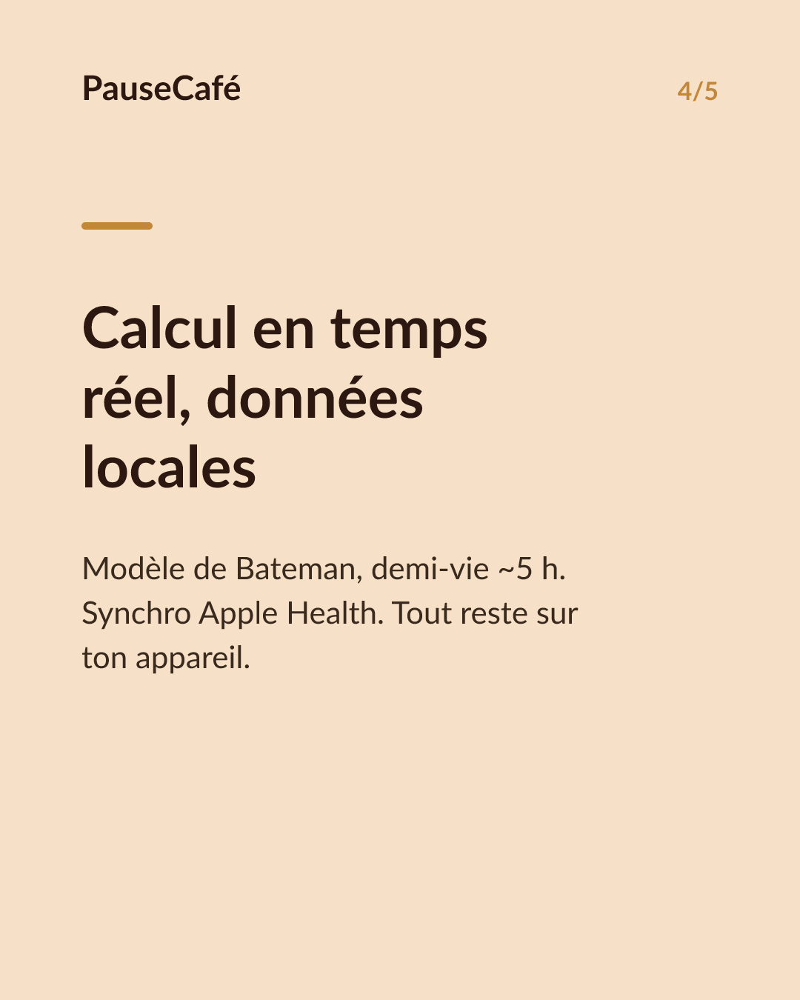

# Brouillon posts sociaux — complication-watch

- Archétype : Demo fonctionnalite
- Angle : Voir sa caféine active au poignet, en direct, sans ouvrir l'app.
- Généré le : 2026-06-15

> À relire et ajuster avant publication. (Le lien App Store est déjà inséré.)

---

## X (thread)

1/ Ton niveau de caféine sur l'écran de ta montre. Sans toucher ton iPhone. ⌚

2/ La complication PauseCafé s'affiche directement sur ton cadran Apple Watch. Un coup d'œil = tu sais où tu en es.

3/ Caféine encore active, estimée en temps réel. L'info est là, discrète, entre l'heure et ta météo.

4/ Pas besoin d'ouvrir l'app, pas besoin de sortir ton téléphone. Juste un regard au poignet au moment où tu tends la main vers une nouvelle tasse.

5/ PauseCafé calcule la caféine encore présente dans ton corps (modèle de Bateman, demi-vie ~5 h). La Watch l'affiche — toi tu décides. Indicatif, bien-être, pas médical.

6/ La synchro se fait aussi avec l'app Santé d'Apple. Tes données restent sur ton appareil, nulle part ailleurs. 🔒

7/ Ajoute la complication sur ton cadran et teste par toi-même 👉 https://apps.apple.com/app/id6761892198

## Instagram

**Légende :** Ta caféine active, visible au poignet sans ouvrir l'app. La complication Apple Watch de PauseCafé s'affiche directement sur ton cadran — discrète, en temps réel. Tes données restent sur ton appareil via l'app Santé. Indicatif, bien-être. 👉 lien en bio

📷 Photos : Clément Lauwaert, Klim Musalimov / Unsplash

**Hashtags :** #AppleWatch #caféine #café #bienêtre #applehealth #complication #watchface #habitudes #santé #coffeelover

**Visuel du thread X :** Screenshot du cadran Apple Watch avec la complication PauseCafé visible, affichant la valeur de caféine active en temps réel.

**Carrousel (images générées) :**

**Textes des slides :**

1. **Ta caféine, au poignet, en direct** — Plus besoin de sortir ton iPhone. Un coup d'œil à ta montre suffit.
2. **La complication Apple Watch** — Ajoute PauseCafé à ton cadran : la caféine active s'affiche, discrète, à côté de l'heure.
3. **L'info au bon moment** — Tu tends la main vers une tasse ? Ton poignet te dit déjà combien il t'en reste.
4. **Calcul en temps réel, données locales** — Modèle de Bateman, demi-vie ~5 h. Synchro Apple Health. Tout reste sur ton appareil. 🔒
5. **Un regard. Tu décides.** — Ajoute la complication PauseCafé sur ton cadran. Indicatif, bien-être. 👉 lien en bio
