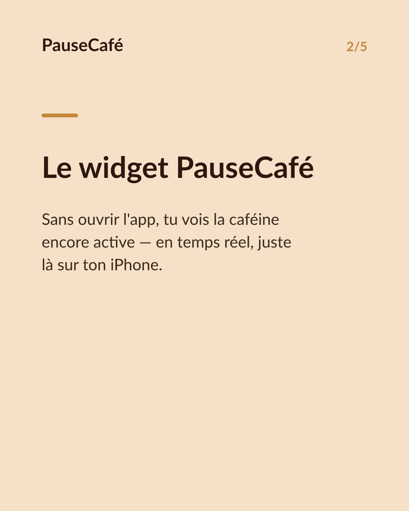
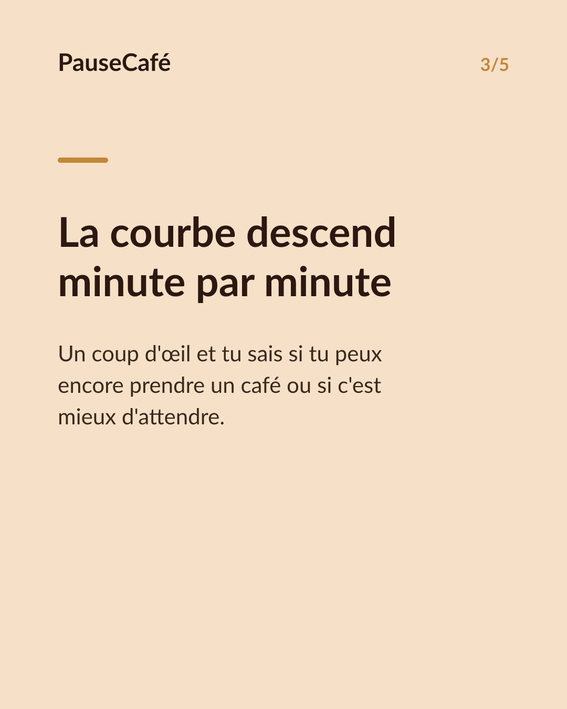
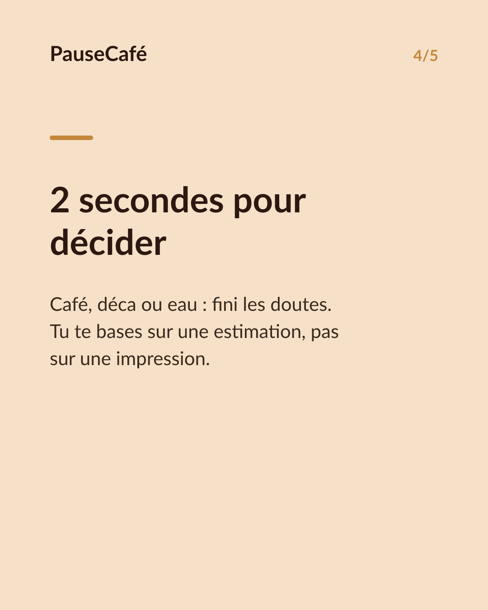
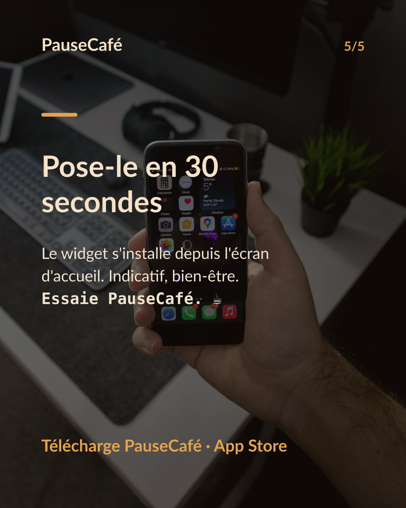

# Brouillon posts sociaux — widget-cafeine

- Archétype : Demo fonctionnalite
- Angle : Le widget caféine active sur l'écran d'accueil : la tendance d'un coup d'œil.
- Généré le : 2026-06-17

> À relire et ajuster avant publication. (Le lien App Store est déjà inséré.)

---

## X (thread)

1/ Ton écran d'accueil te dit l'heure, la météo… mais pas combien de caféine tourne encore dans ton corps. ☕

2/ Pourtant c'est l'info qui change tout en fin de journée : est-ce que je peux encore prendre un café, ou pas ?

3/ PauseCafé a un widget pour ça. Tu poses les yeux sur ton iPhone, tu vois la caféine encore active — sans ouvrir l'app.

4/ La courbe descend en temps réel. Un coup d'œil suffit pour savoir si tu es en train de passer sous ton seuil de confort ou pas encore.

5/ Résultat : tu décides en 2 secondes — café, déca ou eau — au lieu de te fier à une vague impression. Indicatif, bien-être.

6/ Le widget se pose en 30 secondes depuis l'écran d'accueil. C'est la fonctionnalité dont tu ne voudras plus te passer. 📲

7/ Essaie PauseCafé gratuitement sur l'App Store 👉 https://apps.apple.com/app/id6761892198

## Instagram

**Légende :** Et si ton écran d'accueil te montrait la caféine encore active dans ton corps ? Le widget PauseCafé fait exactement ça — en temps réel, sans ouvrir l'app. Indicatif, bien-être. 👉 lien en bio.

📷 Photos : Szabo Viktor, Mohammadreza alidoost / Unsplash

**Hashtags :** #café #caféine #widget #iPhone #bienêtre #habitudes #coffeelover #iOS #santé #productivity

**Visuel du thread X :** Screenshot de l'écran d'accueil iPhone avec le widget PauseCafé visible, affichant la courbe de caféine active en temps réel.

**Carrousel (images générées) :**

**Textes des slides :**

1. **La caféine, d'un seul coup d'œil** — Et si ton écran d'accueil te disait combien de caféine tourne encore dans ton corps ?
2. **Le widget PauseCafé** — Sans ouvrir l'app, tu vois la caféine encore active — en temps réel, juste là sur ton iPhone.
3. **La courbe descend minute par minute** — Un coup d'œil et tu sais si tu peux encore prendre un café ou si c'est mieux d'attendre.
4. **2 secondes pour décider** — Café, déca ou eau : fini les doutes. Tu te bases sur une estimation, pas sur une impression.
5. **Pose-le en 30 secondes** — Le widget s'installe depuis l'écran d'accueil. Indicatif, bien-être. Essaie PauseCafé. ☕
