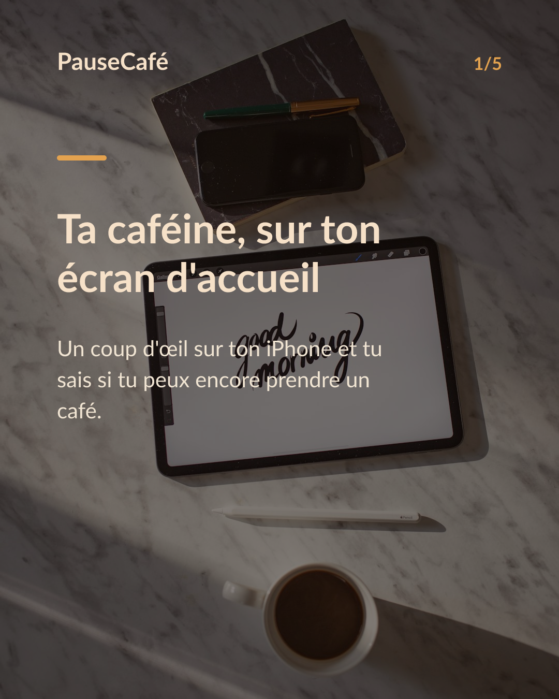
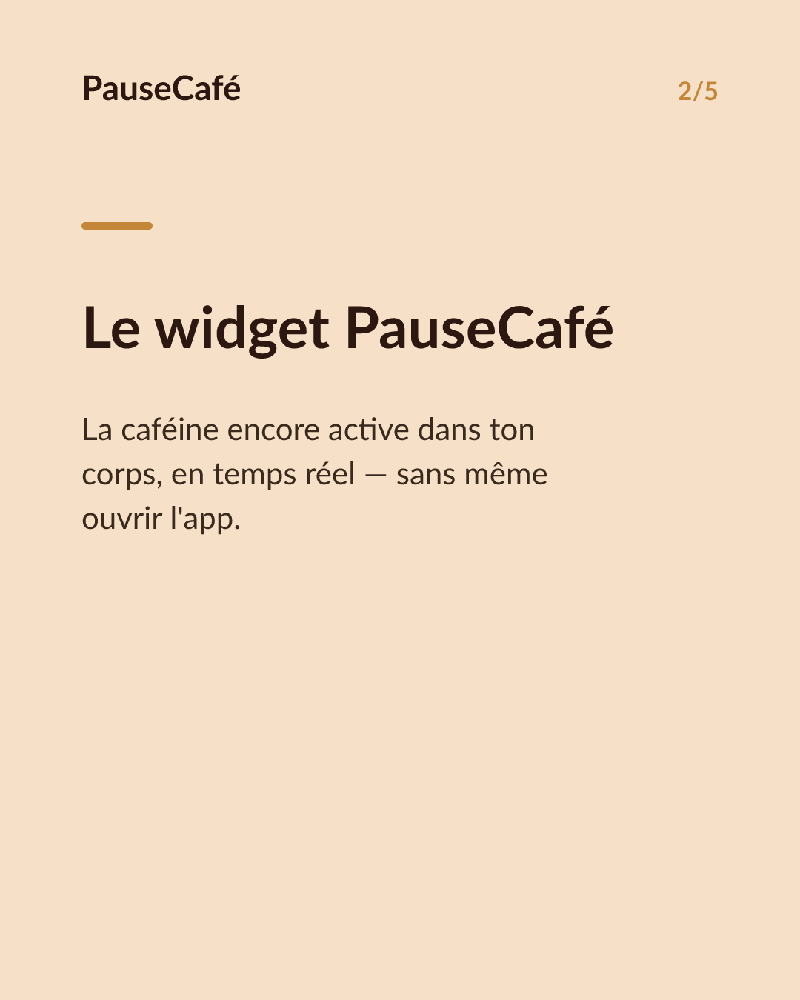
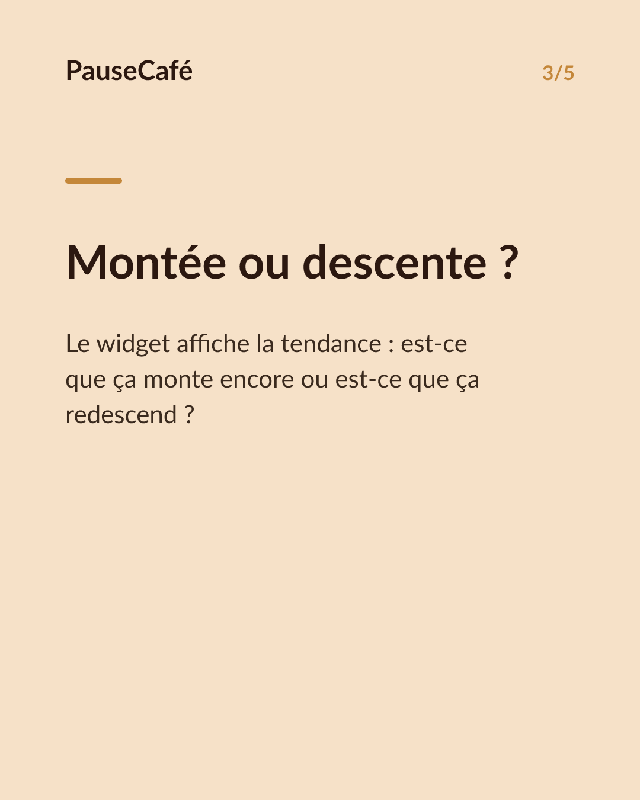
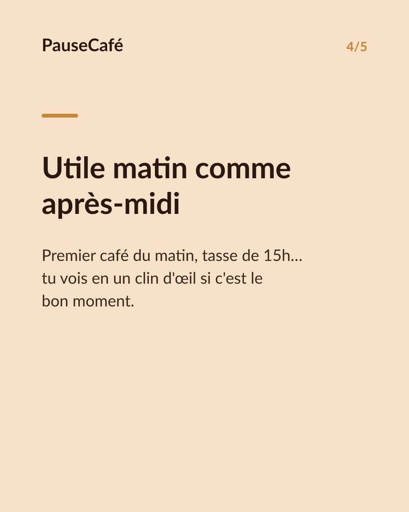
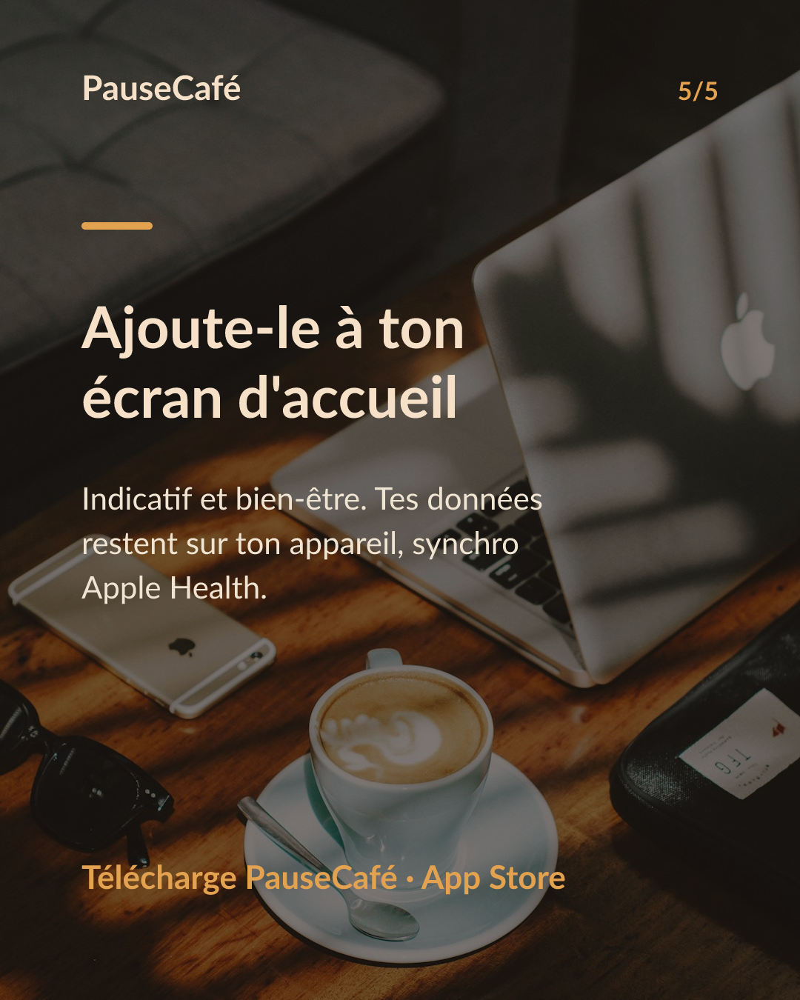

# Brouillon posts sociaux — widget-cafeine

- Archétype : Demo fonctionnalite
- Angle : Le widget caféine active sur l'écran d'accueil : la tendance d'un coup d'œil.
- Généré le : 2026-06-19

> À relire et ajuster avant publication. (Le lien App Store est déjà inséré.)

---

## X (thread)

1/ Tu poses ton iPhone sur la table. En une seconde, tu sais si tu peux encore prendre un café. Pas besoin d'ouvrir quoi que ce soit. ☕

2/ PauseCafé a un widget pour l'écran d'accueil. Il affiche la caféine encore active dans ton corps, en temps réel, sans ouvrir l'app.

3/ Ce que tu vois d'un coup d'œil : la quantité estimée de caféine encore présente, et sa tendance — est-elle en train de monter ou de descendre ?

4/ Utile le matin pour savoir si le premier café a fini son effet. Utile l'après-midi pour éviter la tasse de trop qui décale le coucher.

5/ Toutes tes données restent sur ton appareil. PauseCafé écrit dans l'app Santé d'Apple — caféine et eau — en local, sans cloud.

6/ C'est indicatif, c'est du bien-être. Mais avoir le chiffre sous les yeux, ça change vraiment la décision du moment. 🎯

7/ Essaie le widget gratuitement sur l'App Store 👉 https://apps.apple.com/app/id6761892198

## Instagram

**Légende :** Ta caféine active, visible d'un coup d'œil sans ouvrir l'app. Le widget PauseCafé s'installe sur ton écran d'accueil et te montre la tendance en temps réel. Indicatif, bien-être. Tes données restent sur ton appareil. 👉 lien en bio.

📷 Photos : Milada Vigerova, Roman Bintang / Unsplash

**Hashtags :** #café #caféine #widget #iPhone #bienêtre #astuceiPhone #coffeelover #applesante #habitudes #productivité

**Visuel du thread X :** Screenshot de l'écran d'accueil iPhone avec le widget PauseCafé visible, affichant la caféine active et sa tendance (flèche montante ou descendante).

**Carrousel (images générées) :**

**Textes des slides :**

1. **Ta caféine, sur ton écran d'accueil** — Un coup d'œil sur ton iPhone et tu sais si tu peux encore prendre un café.
2. **Le widget PauseCafé** — La caféine encore active dans ton corps, en temps réel — sans même ouvrir l'app.
3. **Montée ou descente ?** — Le widget affiche la tendance : est-ce que ça monte encore ou est-ce que ça redescend ?
4. **Utile matin comme après-midi** — Premier café du matin, tasse de 15h… tu vois en un clin d'œil si c'est le bon moment.
5. **Ajoute-le à ton écran d'accueil** — Indicatif et bien-être. Tes données restent sur ton appareil, synchro Apple Health.
