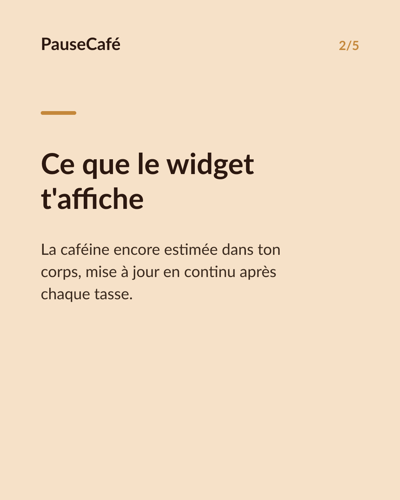
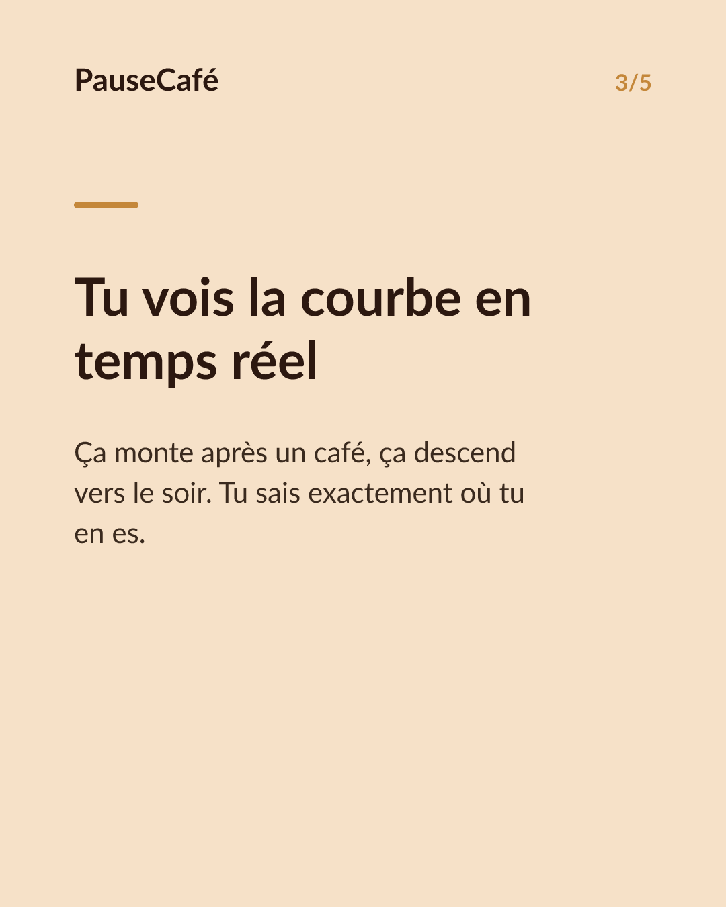
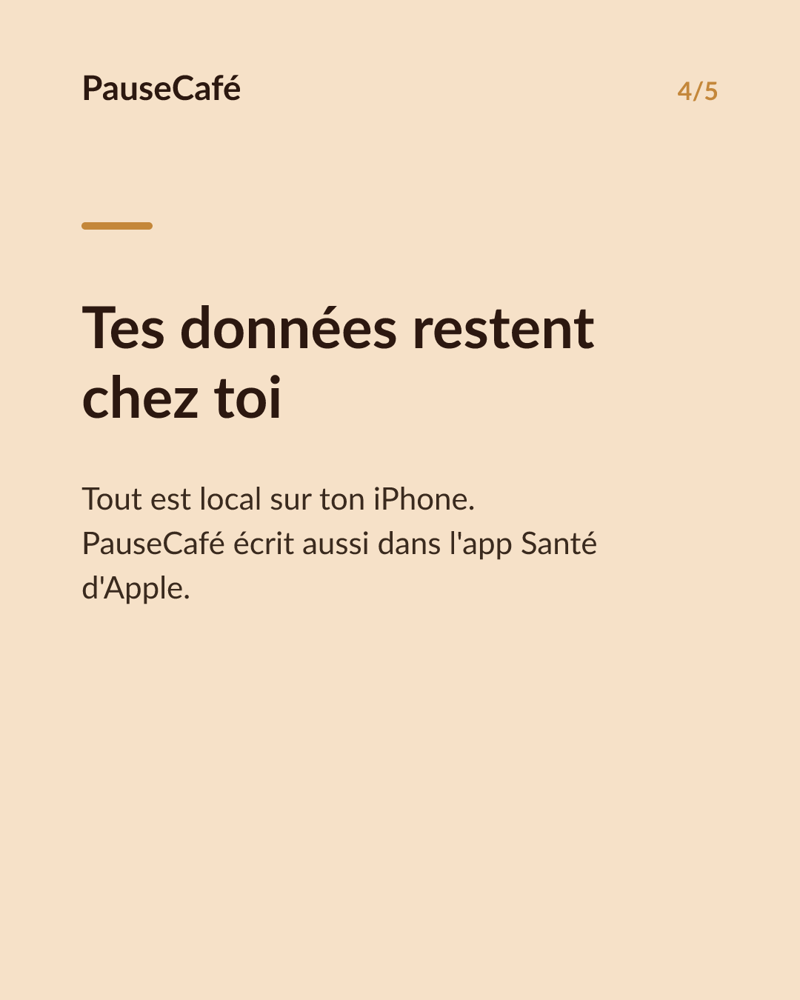
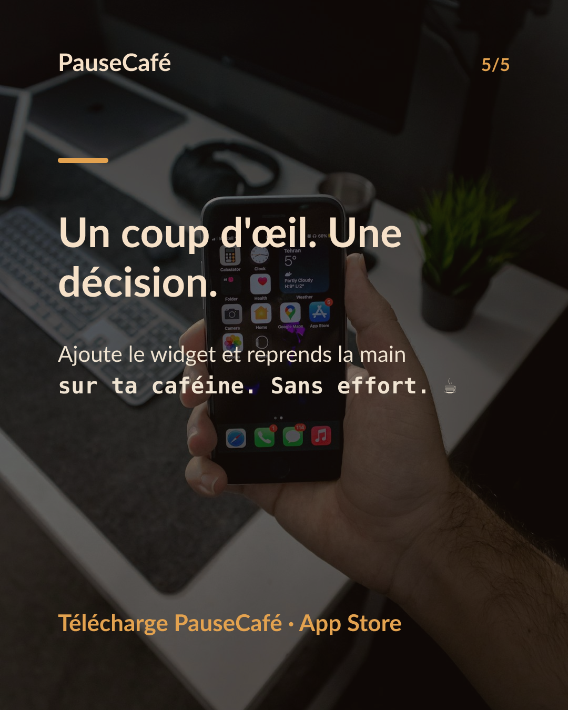

# Brouillon posts sociaux — widget-cafeine

- Archétype : Demo fonctionnalite
- Angle : Le widget caféine active sur l'écran d'accueil : la tendance d'un coup d'œil.
- Généré le : 2026-06-22

> À relire et ajuster avant publication. (Le lien App Store est déjà inséré.)

---

## X (thread)

1/ Ton iPhone sait combien de caféine est encore active dans ton corps. Tu n'as même pas besoin d'ouvrir l'app. ☕

2/ PauseCafé propose un widget à poser directement sur ton écran d'accueil. D'un coup d'œil : la caféine encore active estimée dans ton corps, à l'instant.

3/ Pas besoin de faire le calcul de tête. La demi-vie de la caféine, les heures écoulées, les tasses accumulées — le widget fait tout ça en continu.

4/ Tu vois la tendance : ça monte après une tasse, ça descend vers le soir. Tu sais si ton prochain café est raisonnable… ou si tu vas le regretter cette nuit.

5/ Les données restent sur ton appareil. PauseCafé écrit aussi dans l'app Santé d'Apple — zéro cloud, zéro partage. 🔒

6/ Un widget, une info, zéro friction. C'est le genre de truc qui change une petite habitude sans effort.

7/ Essaie PauseCafé sur l'App Store 👉 https://apps.apple.com/app/id6761892198

## Instagram

**Légende :** Et si ton écran d'accueil te disait combien de caféine est encore active dans ton corps ? Le widget PauseCafé fait exactement ça — en continu, sans ouvrir l'app. Tes données restent sur ton iPhone, synchro avec l'app Santé d'Apple. Indicatif et bien-être. 👉 lien en bio.

📷 Photos : Szabo Viktor, Mohammadreza alidoost / Unsplash

**Hashtags :** #café #caféine #widget #iPhone #bienêtre #appsanté #AppleHealth #habitudes #coffeelover #productivité

**Visuel du thread X :** Screenshot du widget PauseCafé posé sur l'écran d'accueil iPhone, affichant la caféine active estimée avec la courbe de tendance.

**Carrousel (images générées) :**

**Textes des slides :**

1. **Ta caféine active, sur ton écran.** — Plus besoin d'ouvrir une app. Le widget PauseCafé t'affiche tout d'un coup d'œil.
2. **Ce que le widget t'affiche** — La caféine encore estimée dans ton corps, mise à jour en continu après chaque tasse.
3. **Tu vois la courbe en temps réel** — Ça monte après un café, ça descend vers le soir. Tu sais exactement où tu en es.
4. **Tes données restent chez toi** — Tout est local sur ton iPhone. PauseCafé écrit aussi dans l'app Santé d'Apple.
5. **Un coup d'œil. Une décision.** — Ajoute le widget et reprends la main sur ta caféine. Sans effort. ☕
