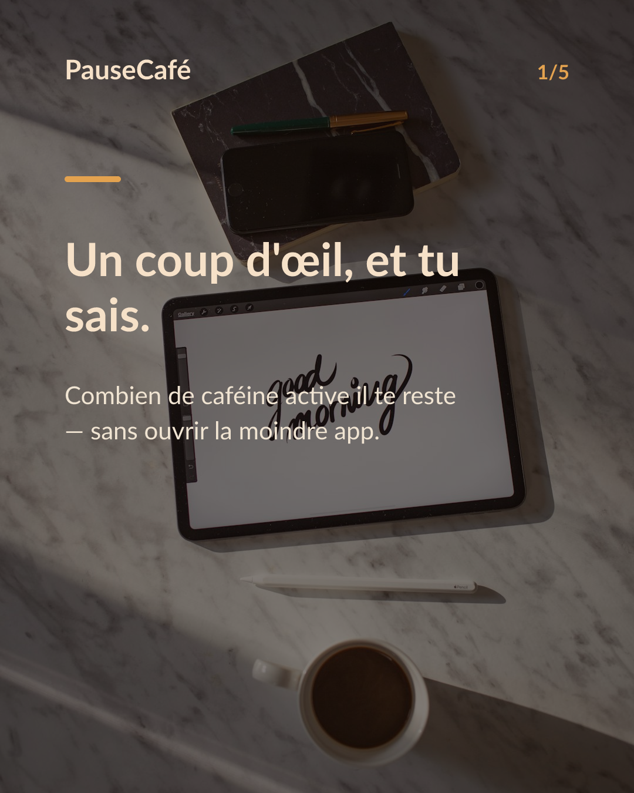
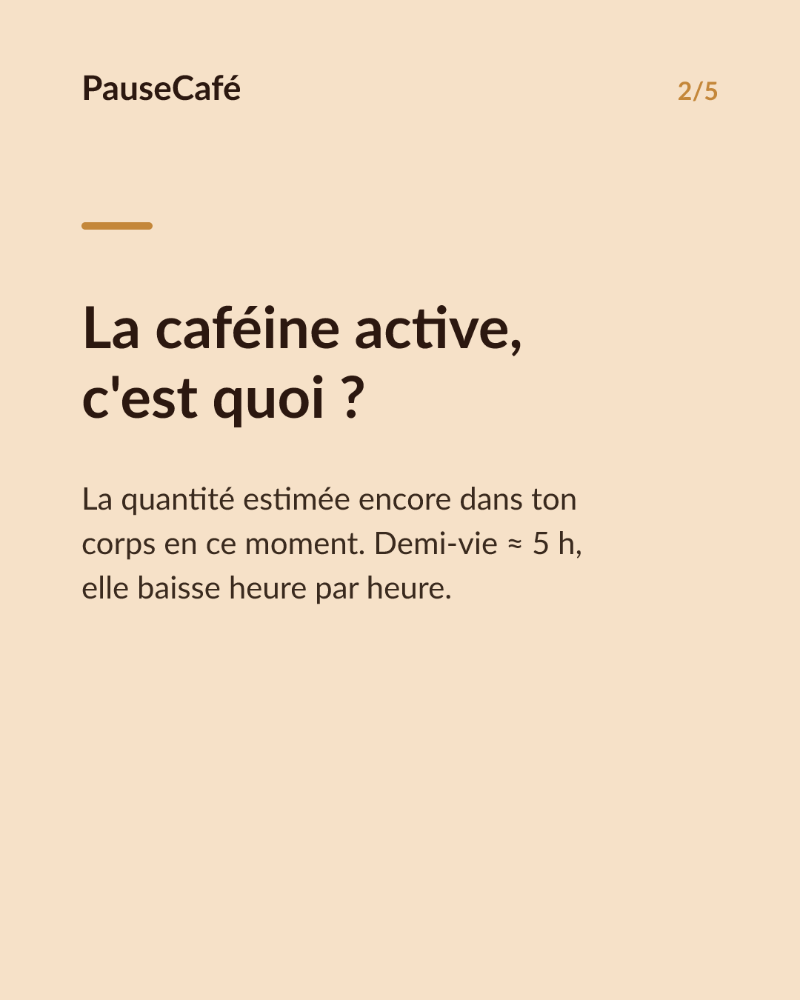
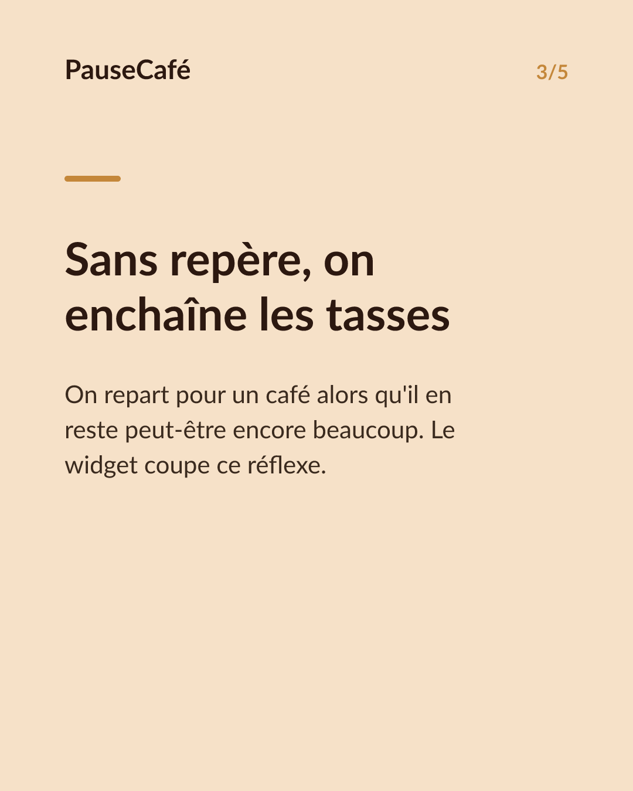
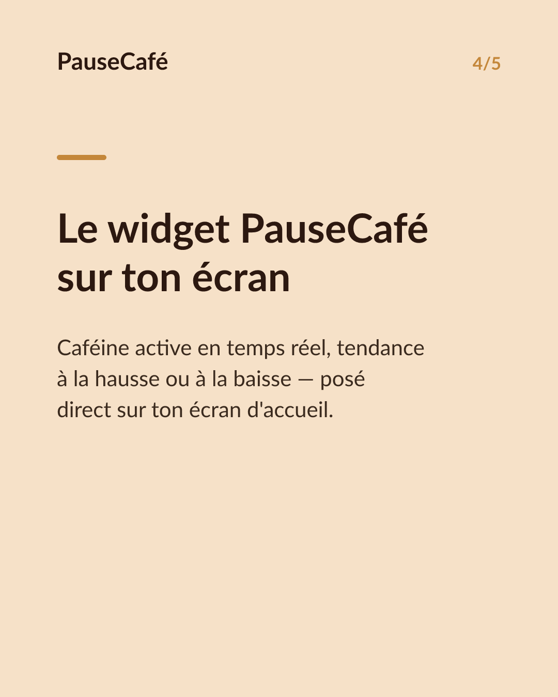
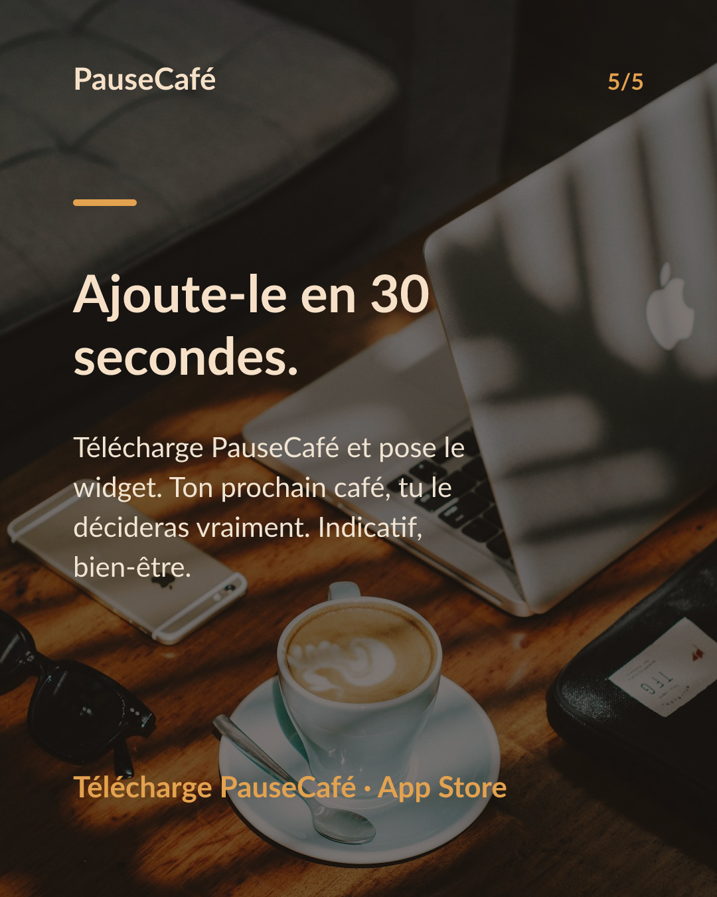

# Brouillon posts sociaux — widget-cafeine

- Archétype : Demo fonctionnalite
- Angle : Le widget caféine active sur l'écran d'accueil : la tendance d'un coup d'œil.
- Généré le : 2026-06-24

> À relire et ajuster avant publication. (Le lien App Store est déjà inséré.)

---

## X (thread)

1/ Ton écran d'accueil peut te dire si ton prochain café est une bonne idée. ☕
2/ La caféine active, c'est la quantité estimée encore présente dans ton corps en ce moment. Elle baisse à mesure que les heures passent — demi-vie d'environ 5 h.
3/ Le problème : sans repère, on enchaîne les tasses "par habitude" alors qu'il en reste peut-être encore beaucoup.
4/ PauseCafé a un widget pour l'écran d'accueil. D'un coup d'œil, tu vois ta caféine active actuelle — sans même ouvrir l'app.
5/ La tendance compte autant que le chiffre : elle monte ? Elle descend vers ta zone de confort pour le soir ? Tu ajustes en 2 secondes.
6/ Indicatif, bien-être — pas médical. Mais avoir ce repère sous les yeux change vraiment les réflexes. 🎯
7/ Essaie le widget PauseCafé 👉 https://apps.apple.com/app/id6761892198

## Instagram

**Légende :** Et si ton écran d'accueil te disait si ton prochain café est une bonne idée ? 👀 Le widget PauseCafé affiche ta caféine active en temps réel — la tendance d'un coup d'œil, sans ouvrir l'app. Indicatif, bien-être. 👉 lien en bio.

📷 Photos : Milada Vigerova, Roman Bintang / Unsplash

**Hashtags :** #café #caféine #widget #iPhone #bienêtre #habitudes #coffeelover #productivité #applesanté #santé

**Visuel du thread X :** Screenshot du widget PauseCafé sur un écran d'accueil iPhone, affichant la caféine active actuelle et sa courbe de tendance.

**Carrousel (images générées) :**

**Textes des slides :**

1. **Un coup d'œil, et tu sais.** — Combien de caféine active il te reste — sans ouvrir la moindre app.
2. **La caféine active, c'est quoi ?** — La quantité estimée encore dans ton corps en ce moment. Demi-vie ≈ 5 h, elle baisse heure par heure.
3. **Sans repère, on enchaîne les tasses** — On repart pour un café alors qu'il en reste peut-être encore beaucoup. Le widget coupe ce réflexe.
4. **Le widget PauseCafé sur ton écran** — Caféine active en temps réel, tendance à la hausse ou à la baisse — posé direct sur ton écran d'accueil.
5. **Ajoute-le en 30 secondes.** — Télécharge PauseCafé et pose le widget. Ton prochain café, tu le décideras vraiment. Indicatif, bien-être.
