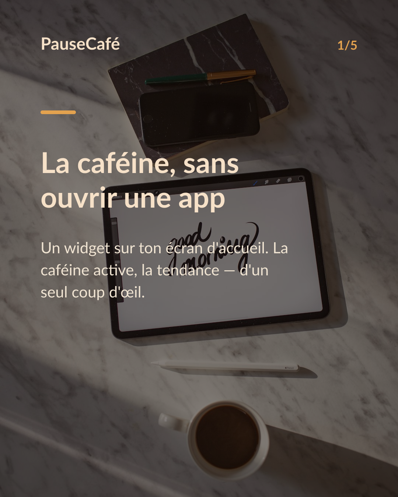
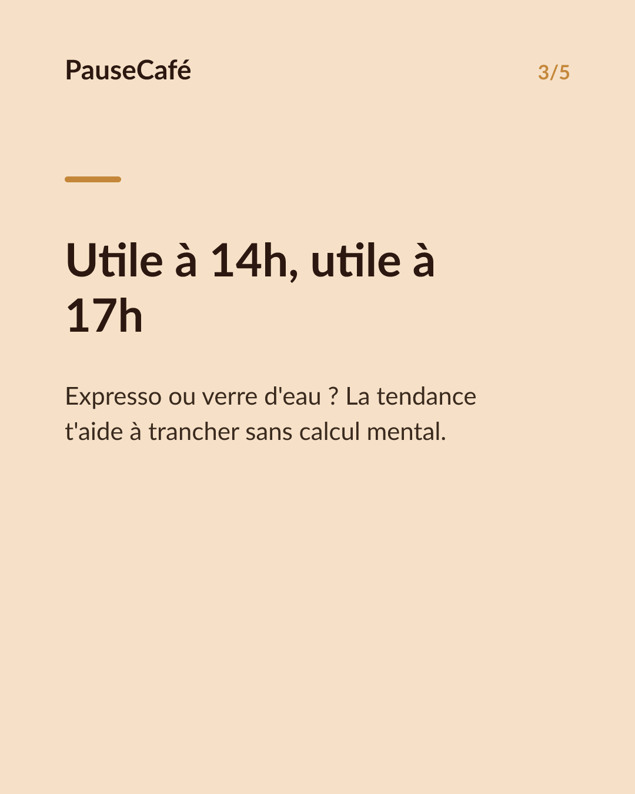
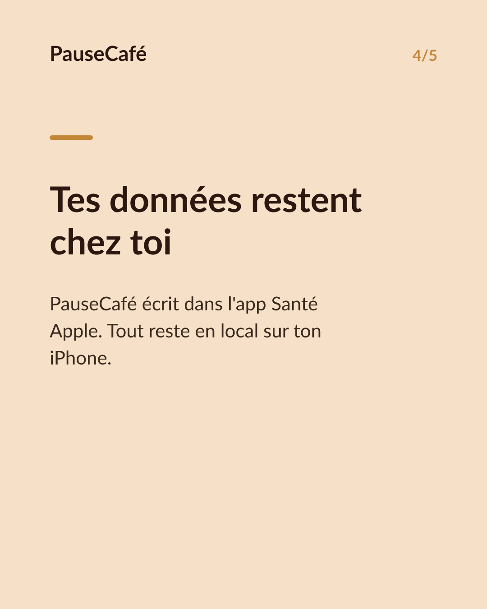

# Brouillon posts sociaux — widget-cafeine

- Archétype : Demo fonctionnalite
- Angle : Le widget caféine active sur l'écran d'accueil : la tendance d'un coup d'œil.
- Généré le : 2026-06-26

> À relire et ajuster avant publication. (Le lien App Store est déjà inséré.)

---

## X (thread)

1/ Tu déverrouilles ton iPhone et tu sais déjà. Sans ouvrir la moindre app. ☕

2/ PauseCafé a un widget pour ton écran d'accueil. Il affiche la caféine encore active dans ton corps, en temps réel. Un chiffre. Une tendance. Un coup d'œil.

3/ La tendance, c'est la clé : tu vois si la caféine monte encore, plafonne ou descend. Pas besoin de calculer — tu lis la situation d'un seul regard.

4/ Pratique à 14h quand tu hésites entre un expresso et un verre d'eau. Ou à 17h pour savoir si cette dernière tasse est vraiment une bonne idée.

5/ Les données restent sur ton appareil. PauseCafé écrit dans l'app Santé Apple, rien ne quitte ton iPhone. 🔒

6/ Indicatif, bien-être, jamais médical. Mais avoir le chiffre sous les yeux change vraiment le réflexe.

7/ Widget dispo sur l'App Store 👉 https://apps.apple.com/app/id6761892198

## Instagram

**Légende :** La caféine encore active dans ton corps, visible en un coup d'œil sur ton écran d'accueil. Le widget PauseCafé te montre le chiffre et la tendance — sans ouvrir la moindre app. Indicatif, bien-être. 👉 lien en bio.

📷 Photos : Milada Vigerova, Roman Bintang / Unsplash

**Hashtags :** #café #caféine #widget #iPhone #bienêtre #habitudes #AppleHealth #coffeelover #santé #astuceiPhone

**Visuel du thread X :** Screenshot du widget PauseCafé sur un écran d'accueil iPhone, affichant le chiffre de caféine active et la flèche de tendance.

**Carrousel (images générées) :**

**Textes des slides :**

1. **La caféine, sans ouvrir une app** — Un widget sur ton écran d'accueil. La caféine active, la tendance — d'un seul coup d'œil.
2. **Un chiffre. Une flèche. C'est tout.** — Monte encore ? Plafonne ? Descend ? Tu lis la situation avant même de déverrouiller.
3. **Utile à 14h, utile à 17h** — Expresso ou verre d'eau ? La tendance t'aide à trancher sans calcul mental.
4. **Tes données restent chez toi** — PauseCafé écrit dans l'app Santé Apple. Tout reste en local sur ton iPhone.
5. **Ajoute le widget aujourd'hui** — Télécharge PauseCafé et place le widget sur ton écran d'accueil. Indicatif, bien-être.
