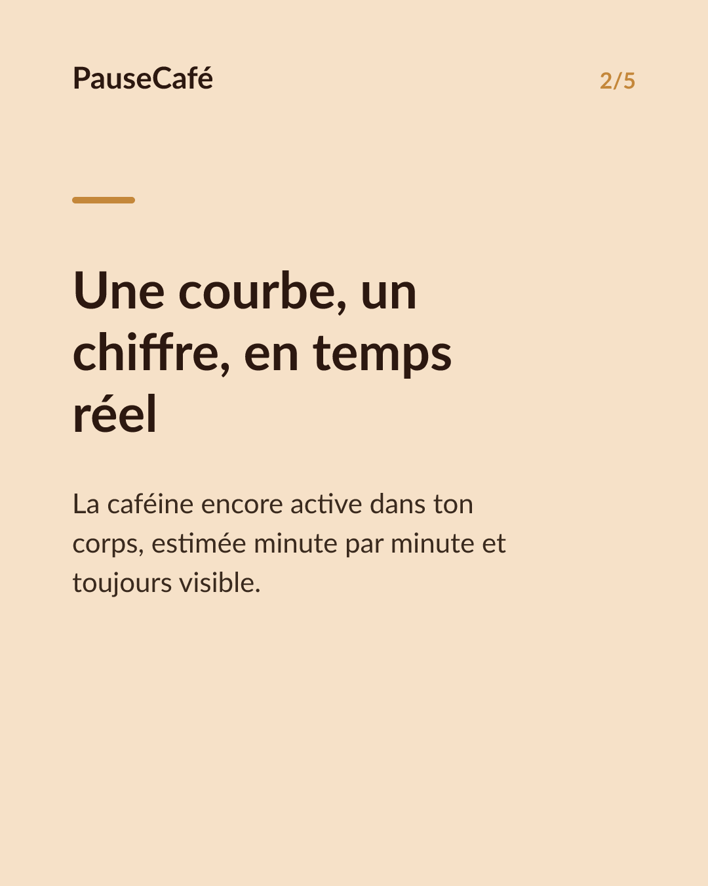
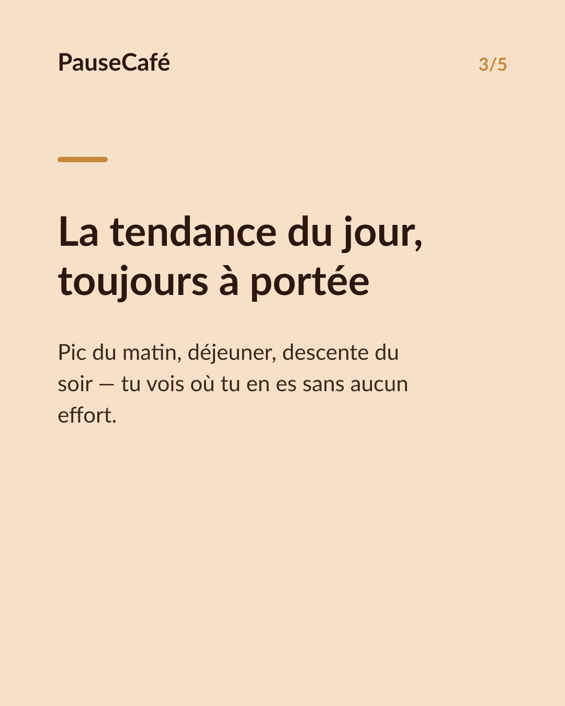
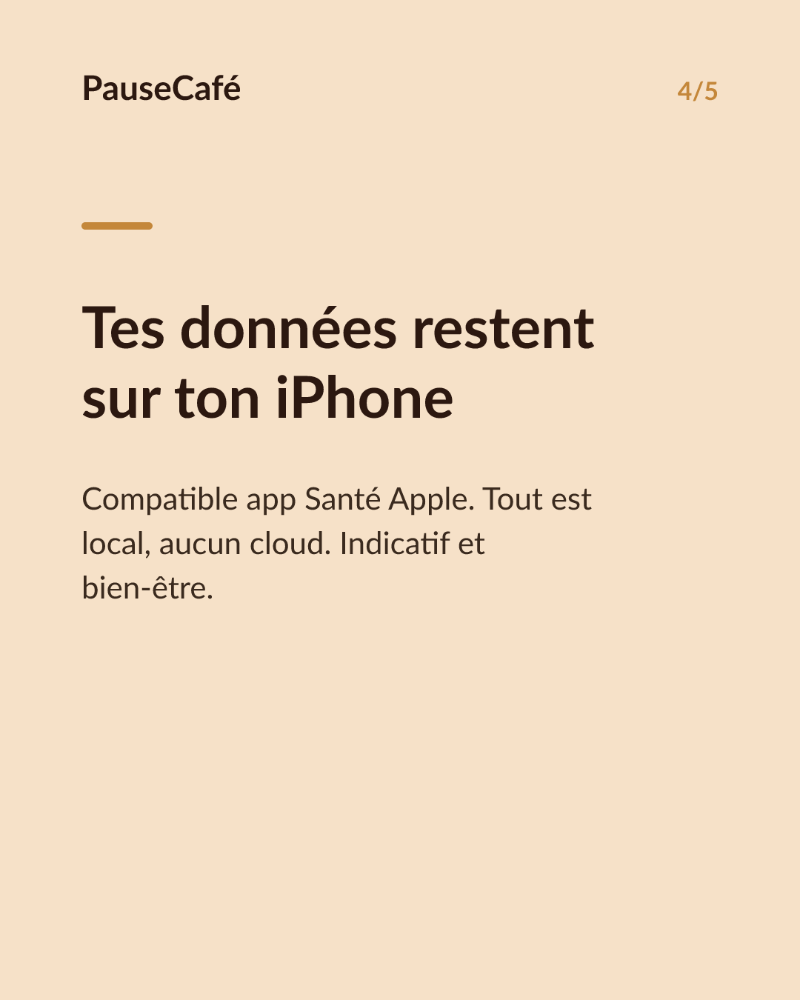

# Brouillon posts sociaux — widget-cafeine

- Archétype : Demo fonctionnalite
- Angle : Le widget caféine active sur l'écran d'accueil : la tendance d'un coup d'œil.
- Généré le : 2026-06-29

> À relire et ajuster avant publication. (Le lien App Store est déjà inséré.)

---

## X (thread)

1/ Tu baisses les yeux sur ton écran d'accueil. En une seconde, tu sais si tu peux prendre un autre café. ☕

2/ PauseCafé a un widget : la caféine encore active dans ton corps, visible sans même ouvrir l'app. Une courbe, un chiffre, un coup d'œil.

3/ Le widget s'actualise en continu. Matin calme, pic d'après-déjeuner, descente vers le soir — la tendance du jour, toujours là sur ton écran.

4/ Pas besoin de « se souvenir » de l'heure de la dernière tasse. Le widget fait le calcul à ta place, en temps réel, à partir de ce que tu as enregistré.

5/ Et si tu utilises l'app Santé d'Apple, tout reste sur ton appareil. Aucun compte, aucun cloud. Juste ton iPhone, discret et précis. 🔒

6/ Pose le widget sur ton écran d'accueil, ajoute tes cafés au fil de la journée, et laisse PauseCafé gérer la courbe. Indicatif, bien-être — jamais médical.

7/ Essaie le widget dès aujourd'hui 👉 https://apps.apple.com/app/id6761892198

## Instagram

**Légende :** Plus besoin d'ouvrir une app pour savoir où en est ta caféine. Le widget PauseCafé affiche la tendance en direct sur ton écran d'accueil — compatible app Santé Apple, tout reste sur ton appareil. Indicatif, bien-être. 👉 lien en bio.

📷 Photos : Szabo Viktor, Mohammadreza alidoost / Unsplash

**Hashtags :** #widget #iPhone #caféine #café #bienêtre #AppStore #coffeelover #AppleHealth #habitudes #santé

**Visuel du thread X :** Screenshot de l'écran d'accueil iPhone avec le widget PauseCafé visible — courbe de caféine active et chiffre en temps réel bien lisibles.

**Carrousel (images générées) :**

**Textes des slides :**

1. **Ton niveau de caféine d'un coup d'œil** — Même pas besoin d'ouvrir l'app. Le widget PauseCafé est là, sur ton écran d'accueil.
2. **Une courbe, un chiffre, en temps réel** — La caféine encore active dans ton corps, estimée minute par minute et toujours visible.
3. **La tendance du jour, toujours à portée** — Pic du matin, déjeuner, descente du soir — tu vois où tu en es sans aucun effort.
4. **Tes données restent sur ton iPhone** — Compatible app Santé Apple. Tout est local, aucun cloud. Indicatif et bien-être.
5. **Pose le widget, reprends la main** — Ajoute tes cafés, regarde la courbe. Simple, discret, efficace. 👉 lien en bio.
