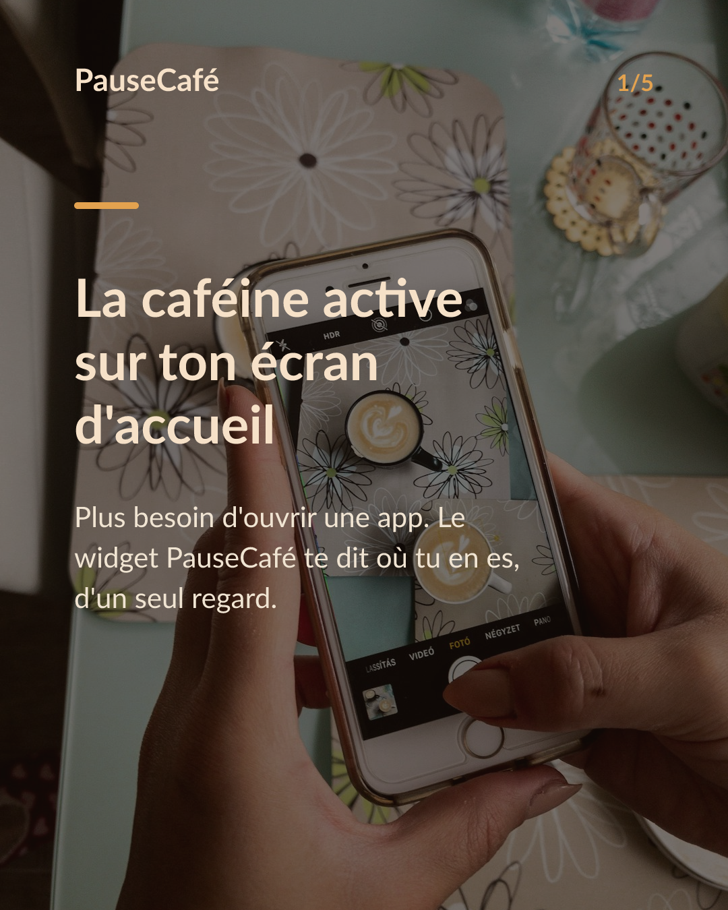
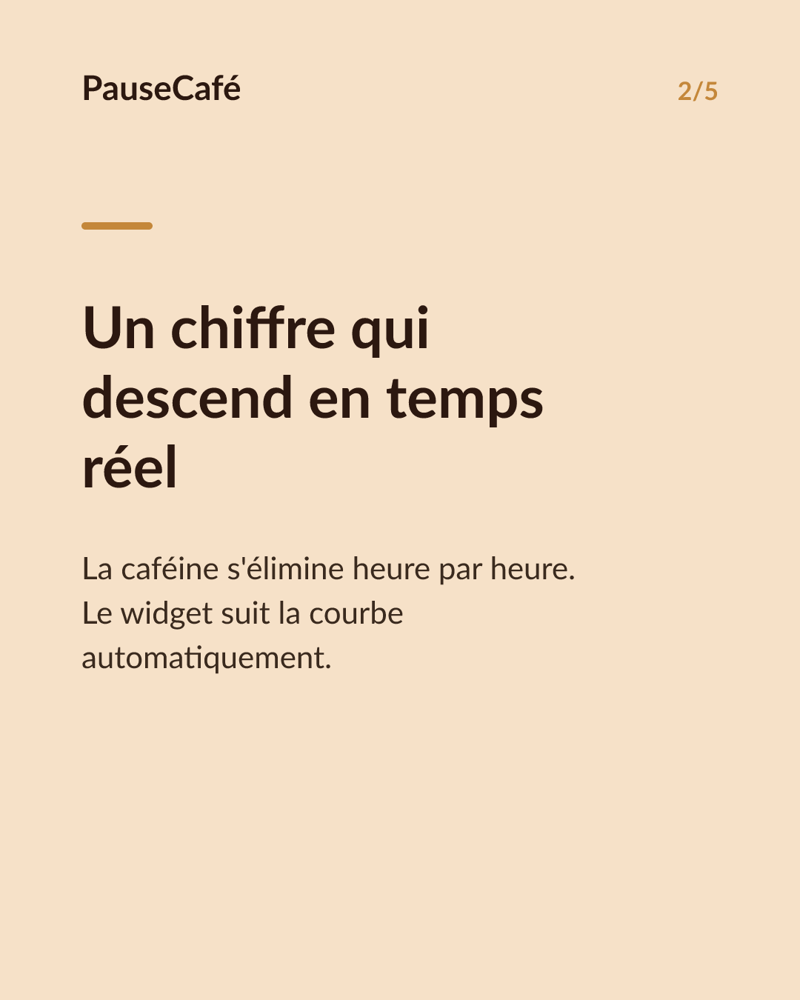
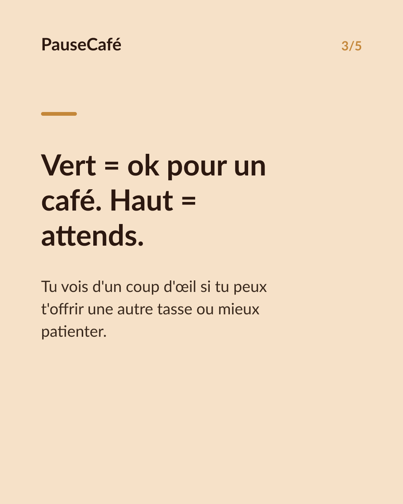
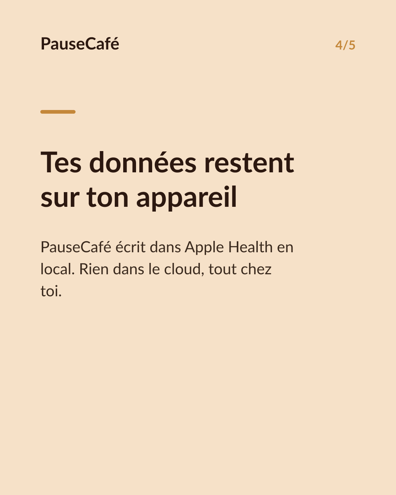

# Brouillon posts sociaux — widget-cafeine

- Archétype : Demo fonctionnalite
- Angle : Le widget caféine active sur l'écran d'accueil : la tendance d'un coup d'œil.
- Généré le : 2026-07-01

> À relire et ajuster avant publication. (Le lien App Store est déjà inséré.)

---

## X (thread)

1/ Ton écran d'accueil te dit combien de caféine il te reste dans le corps ? Le mien, oui. ☕

2/ PauseCafé a un widget iPhone : pose-le sur ton écran d'accueil et tu vois ta caféine active en temps réel — sans ouvrir l'app.

3/ La courbe descend au fil des heures. D'un coup d'œil tu sais si tu es dans le vert pour un autre café… ou si tu approches de la limite du soir.

4/ Pas besoin de calculer ni de te souvenir de chaque tasse. Le widget fait le suivi en continu, à partir de ce que tu as enregistré.

5/ La caféine active est une estimation (modèle Bateman, demi-vie ~5 h). Repère bien-être, pas un résultat médical — mais largement suffisant pour décider.

6/ Compatible Apple Health : tes données restent sur ton appareil. Rien dans le cloud, tout en local. 🔒

7/ Essaie le widget aujourd'hui 👉 https://apps.apple.com/app/id6761892198

## Instagram

**Légende :** Et si ton écran d'accueil te disait combien de caféine tu as encore dans le corps ? Le widget PauseCafé le fait — en temps réel, sans ouvrir l'app. Compatible Apple Health, données en local sur ton appareil. 👉 lien en bio.

📷 Photos : Szabo Viktor, Mohammadreza alidoost / Unsplash

**Hashtags :** #café #caféine #widget #iPhone #bienêtre #AppleHealth #coffeelover #habitudes #santé #astuceiPhone

**Visuel du thread X :** Screenshot de l'écran d'accueil iPhone avec le widget PauseCafé visible, affichant la caféine active en cours de descente.

**Carrousel (images générées) :**

**Textes des slides :**

1. **La caféine active sur ton écran d'accueil** — Plus besoin d'ouvrir une app. Le widget PauseCafé te dit où tu en es, d'un seul regard.
2. **Un chiffre qui descend en temps réel** — La caféine s'élimine heure par heure. Le widget suit la courbe automatiquement.
3. **Vert = ok pour un café. Haut = attends.** — Tu vois d'un coup d'œil si tu peux t'offrir une autre tasse ou mieux patienter.
4. **Tes données restent sur ton appareil** — PauseCafé écrit dans Apple Health en local. Rien dans le cloud, tout chez toi.
5. **Pose le widget, reprends la main** — Télécharge PauseCafé et ajoute le widget en 30 secondes. Indicatif, bien-être.
