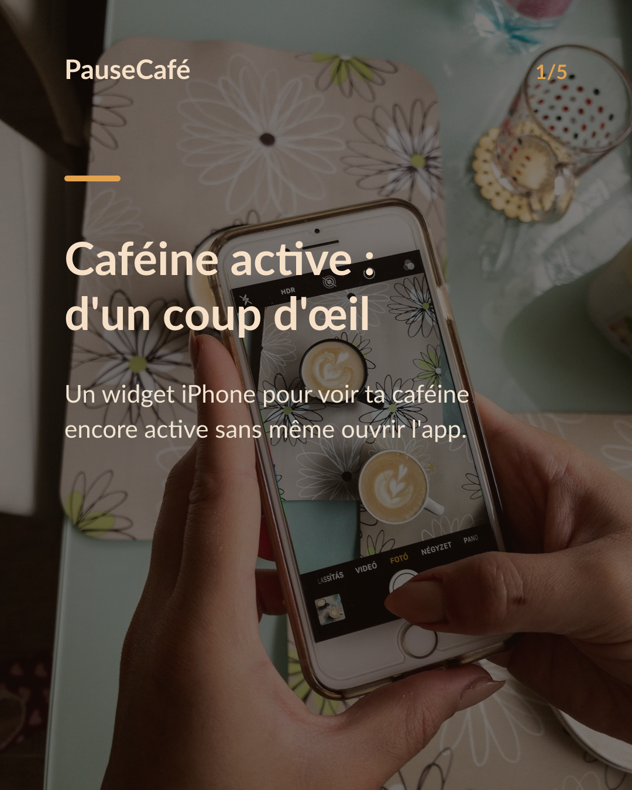
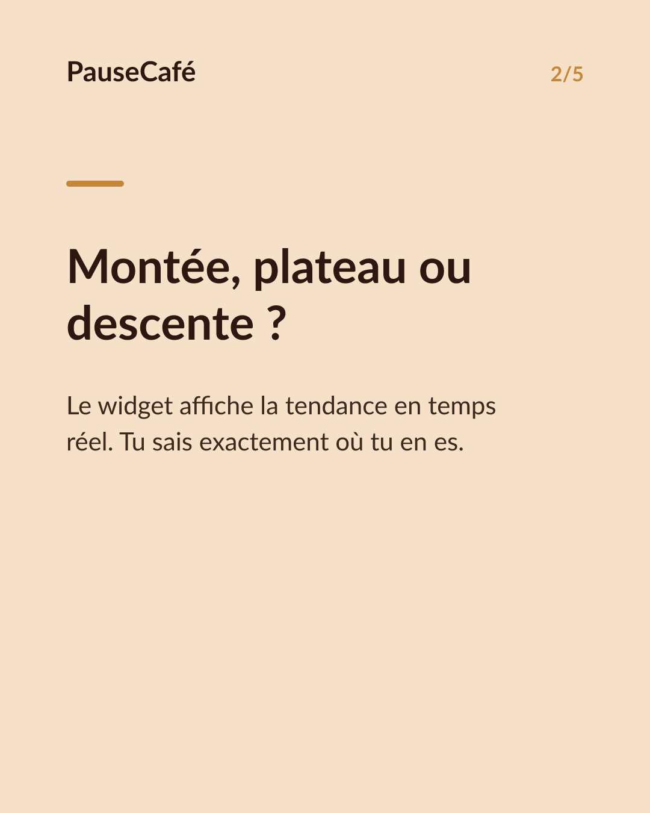
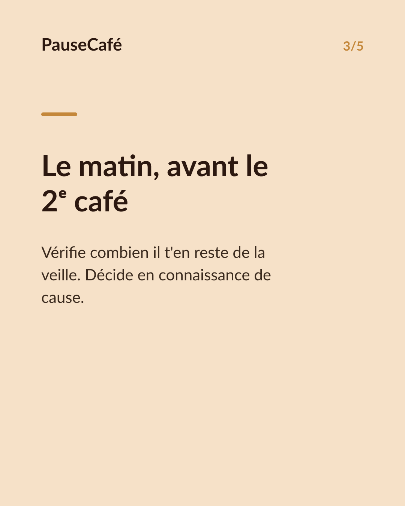
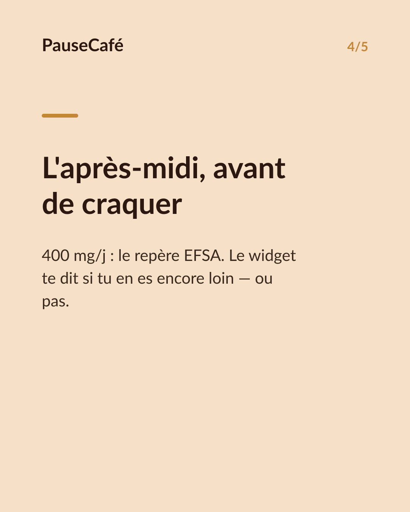
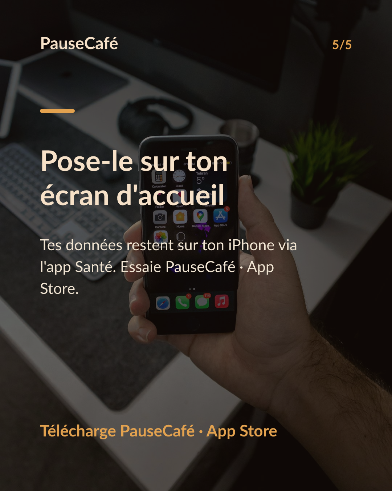

# Brouillon posts sociaux — widget-cafeine

- Archétype : Demo fonctionnalite
- Angle : Le widget caféine active sur l'écran d'accueil : la tendance d'un coup d'œil.
- Généré le : 2026-07-03

> À relire et ajuster avant publication. (Le lien App Store est déjà inséré.)

---

## X (thread)

1/ Ton écran d'accueil te dit l'heure, la météo… mais pas si tu peux encore prendre un café. ☕
2/ PauseCafé a un widget iPhone : la caféine encore active dans ton corps, visible sans même ouvrir l'app.
3/ Un chiffre, une tendance, un coup d'œil. Tu sais si tu es en train de monter, de plafonner ou de descendre.
4/ Pratique le matin : tu vois combien il t'en reste du soir avant de commander un double espresso.
5/ Pratique l'après-midi : tu vois si une nouvelle tasse te ferait dépasser ton repère (400 mg/j selon l'EFSA).
6/ Tout vient de l'app Santé — tes données restent sur ton iPhone. Aucun cloud, aucun compte. 🔒
7/ Ajoute le widget en 10 secondes. PauseCafé, sur l'App Store 👉 https://apps.apple.com/app/id6761892198

## Instagram

**Légende :** Et si ton écran d'accueil te disait aussi combien de caféine est encore active dans ton corps ? Le widget PauseCafé, c'est exactement ça : chiffre + tendance, d'un seul regard. Indicatif, bien-être. 👉 lien en bio.

📷 Photos : Szabo Viktor, Mohammadreza alidoost / Unsplash

**Hashtags :** #caféine #café #widget #iPhone #bienêtre #habitudes #coffeelover #AppStore #santé #astuce

**Visuel du thread X :** Screenshot du widget PauseCafé sur un écran d'accueil iPhone, affichant le chiffre de caféine active et la courbe de tendance.

**Carrousel (images générées) :**

**Textes des slides :**

1. **Caféine active : d'un coup d'œil** — Un widget iPhone pour voir ta caféine encore active sans même ouvrir l'app.
2. **Montée, plateau ou descente ?** — Le widget affiche la tendance en temps réel. Tu sais exactement où tu en es.
3. **Le matin, avant le 2ᵉ café** — Vérifie combien il t'en reste de la veille. Décide en connaissance de cause.
4. **L'après-midi, avant de craquer** — 400 mg/j : le repère EFSA. Le widget te dit si tu en es encore loin — ou pas.
5. **Pose-le sur ton écran d'accueil** — Tes données restent sur ton iPhone via l'app Santé. Essaie PauseCafé · App Store.
