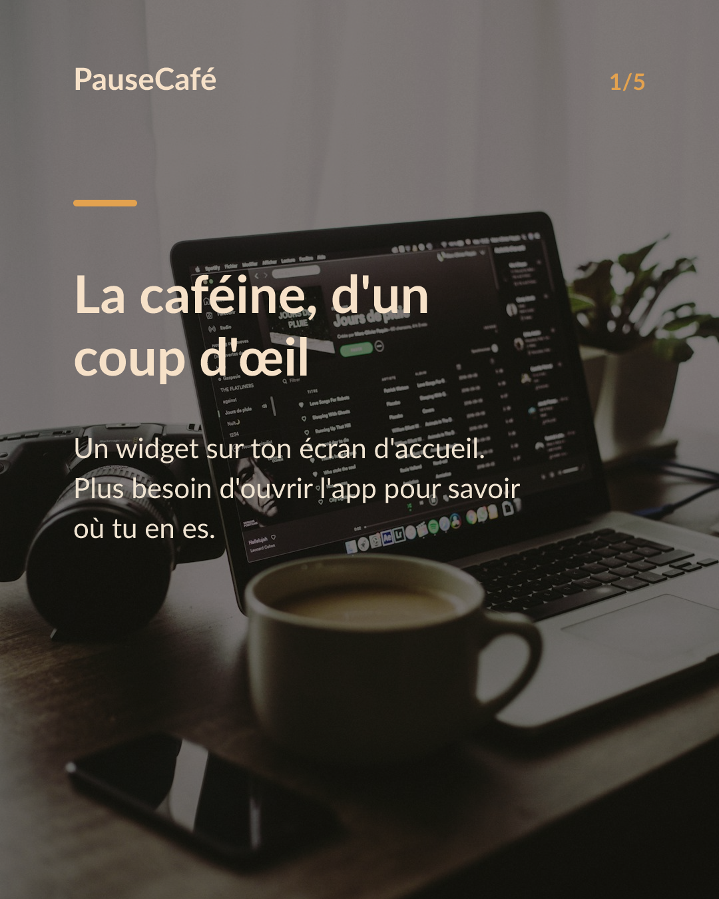
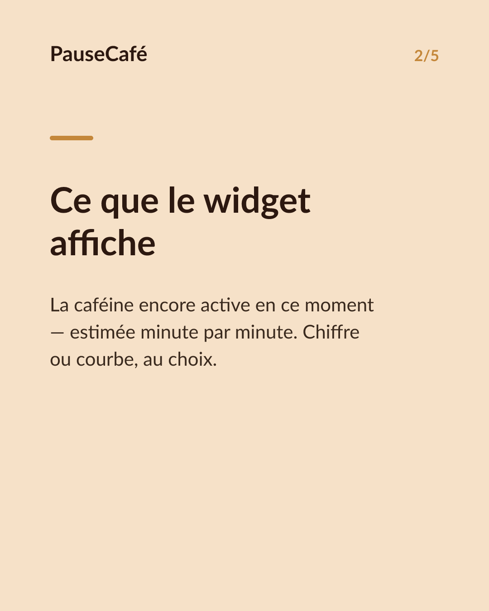
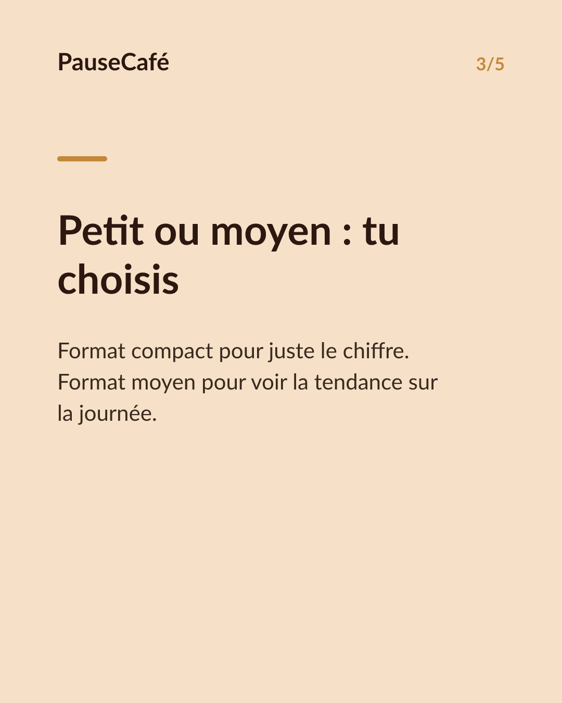
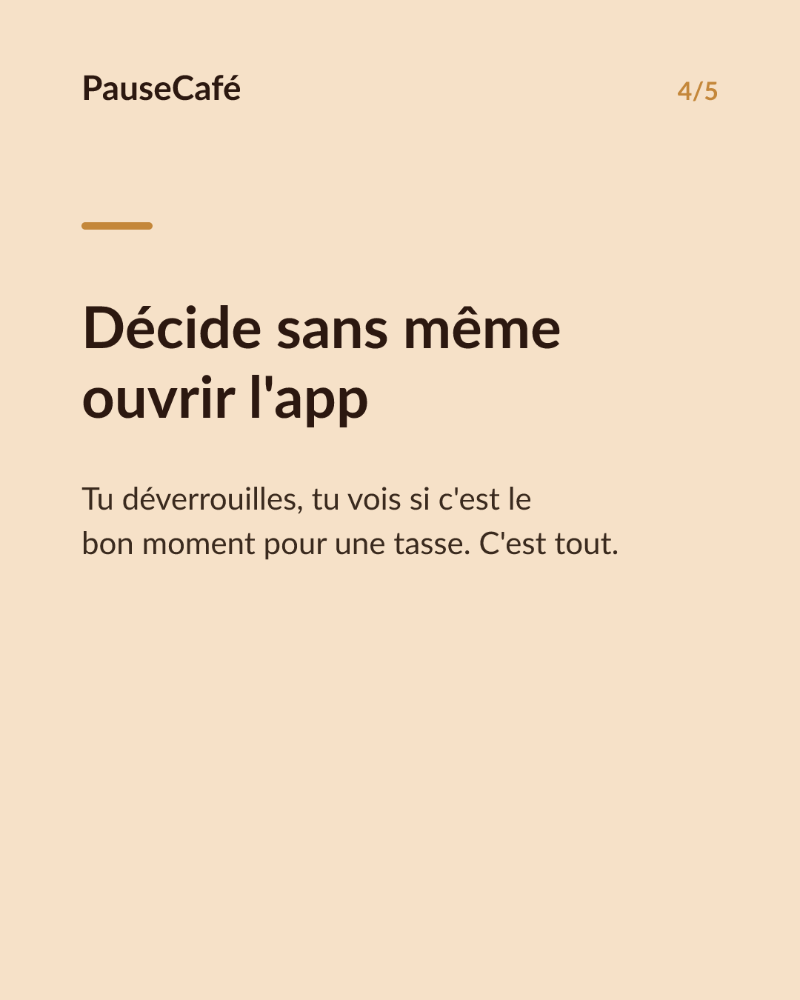

# Brouillon posts sociaux — widget-cafeine

- Archétype : Demo fonctionnalite
- Angle : Le widget caféine active sur l'écran d'accueil : la tendance d'un coup d'œil.
- Généré le : 2026-07-06

> À relire et ajuster avant publication. (Le lien App Store est déjà inséré.)

---

## X (thread)

1/ Ton téléphone tu le regardes 100 fois par jour. Autant qu'il te dise quelque chose d'utile. ☕

2/ PauseCafé a un widget pour l'écran d'accueil de ton iPhone. En un coup d'œil : la caféine encore active dans ton corps, en ce moment.

3/ Plus besoin d'ouvrir l'app. Le chiffre est là, entre tes applis. Tu vois d'un regard si tu peux te resservir ou si c'est déjà trop.

4/ La caféine active, c'est une estimation minute par minute (modèle de Bateman, demi-vie ~5 h). Indicatif, bien-être — mais ça change la façon dont tu gères tes tasses.

5/ Tu peux choisir la taille du widget : petit pour juste le chiffre, moyen pour la tendance en courbe. L'info s'adapte à ton écran.

6/ Aucun geste inutile. Tu déverrouilles, tu vois, tu décides. C'est tout. 🎯

7/ Widget dispo sur l'App Store 👉 https://apps.apple.com/app/id6761892198

## Instagram

**Légende :** Un widget sur ton écran d'accueil, et la caféine encore active dans ton corps est toujours visible. Plus besoin d'y penser — PauseCafé le fait pour toi. Indicatif, bien-être. 👉 lien en bio.

📷 Photos : Marc-Olivier Paquin / Unsplash

**Hashtags :** #widget #iPhone #caféine #café #bienêtre #habitudes #coffeelover #santé #astuceiPhone #productivity

**Visuel du thread X :** Screenshot de l'écran d'accueil iPhone avec le widget PauseCafé visible, affichant la caféine active en cours de journée.

**Carrousel (images générées) :**

**Textes des slides :**

1. **La caféine, d'un coup d'œil 👀** — Un widget sur ton écran d'accueil. Plus besoin d'ouvrir l'app pour savoir où tu en es.
2. **Ce que le widget affiche** — La caféine encore active en ce moment — estimée minute par minute. Chiffre ou courbe, au choix.
3. **Petit ou moyen : tu choisis** — Format compact pour juste le chiffre. Format moyen pour voir la tendance sur la journée.
4. **Décide sans même ouvrir l'app** — Tu déverrouilles, tu vois si c'est le bon moment pour une tasse. C'est tout.
5. **Installe le widget maintenant** — PauseCafé · App Store. Indicatif et bien-être — mais ça change vraiment tes habitudes.
