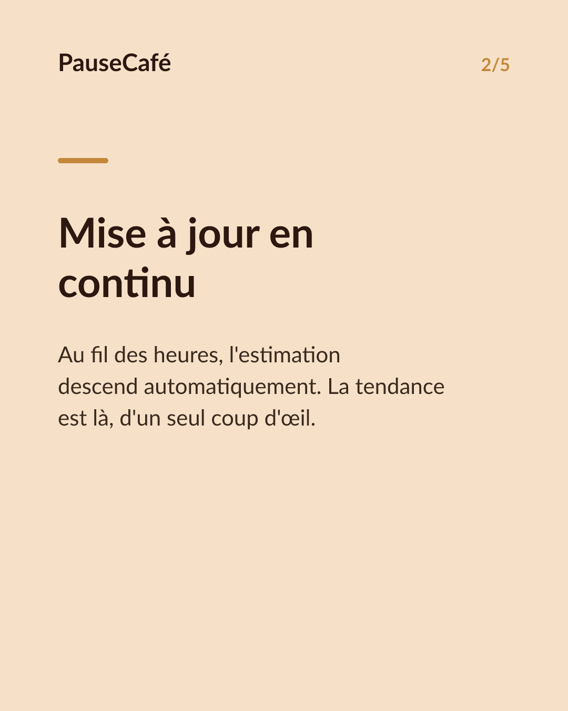
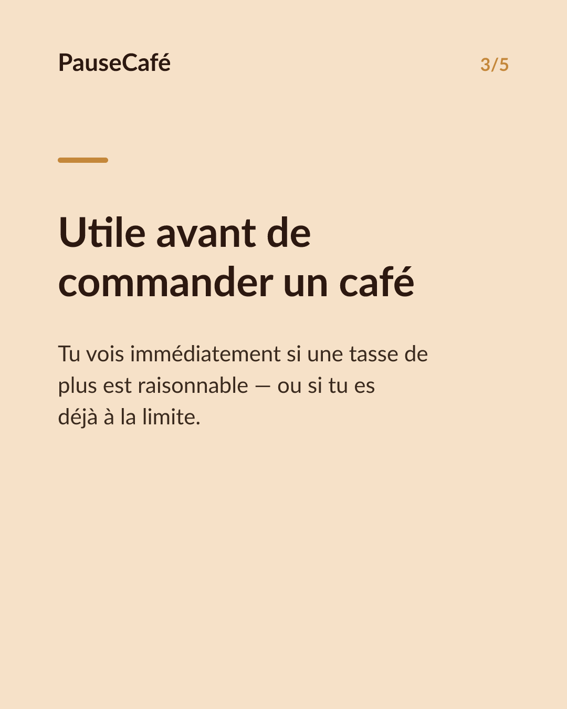
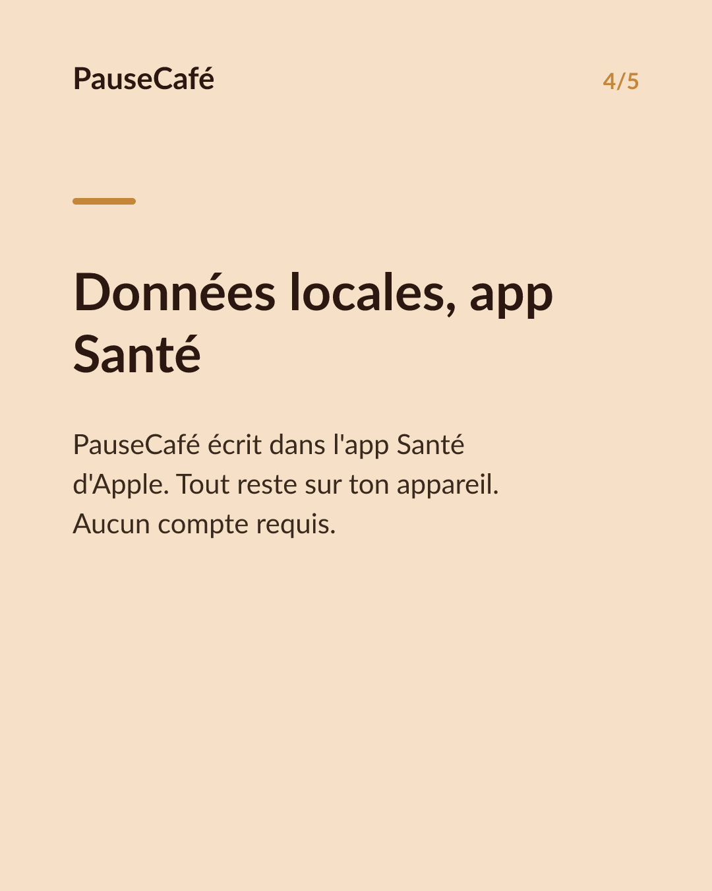

# Brouillon posts sociaux — widget-cafeine

- Archétype : Demo fonctionnalite
- Angle : Le widget caféine active sur l'écran d'accueil : la tendance d'un coup d'œil.
- Généré le : 2026-07-08

> À relire et ajuster avant publication. (Le lien App Store est déjà inséré.)

---

## X (thread)

1/ Ton iPhone peut t'afficher ta caféine restante en permanence. Sans ouvrir aucune app. 📱

2/ PauseCafé a un widget pour l'écran d'accueil. En un coup d'œil : la quantité estimée de caféine encore active dans ton corps, là, maintenant.

3/ Pas besoin de « se souvenir » de ses cafés ou de recalculer. Le widget se met à jour tout seul au fil des heures. La tendance descend, tu la vois descendre.

4/ C'est utile avant une réunion tardive : tu sais si une tasse de plus est raisonnable. Ou le soir : tu vois combien il t'en reste avant de dormir.

5/ Le widget lit les données de PauseCafé et écrit dans l'app Santé d'Apple. Tes données restent sur ton appareil. Aucun cloud, aucun compte requis.

6/ Installation : appui long sur l'écran d'accueil → « + » → PauseCafé. Vingt secondes, et la caféine active est toujours visible. ⚡

7/ Essaie le widget, c'est gratuit sur l'App Store 👉 https://apps.apple.com/app/id6761892198

## Instagram

**Légende :** La caféine encore active dans ton corps, visible en permanence sur ton écran d'accueil. Le widget PauseCafé se met à jour tout seul — plus besoin de recalculer quoi que ce soit. Données locales, compatibles avec l'app Santé d'Apple. Indicatif, bien-être. 👉 lien en bio.

📷 Photos : Szabo Viktor, Mohammadreza alidoost / Unsplash

**Hashtags :** #widget #iPhone #caféine #café #bienêtre #applesante #habitudes #coffeelover #AppleHealth #santé

**Visuel du thread X :** Screenshot du widget PauseCafé sur un écran d'accueil iPhone, affichant la caféine active en temps réel avec la jauge ou courbe visible.

**Carrousel (images générées) :**

**Textes des slides :**

1. **Ta caféine, toujours visible 👀** — Un widget sur ton écran d'accueil : la caféine encore active dans ton corps, sans ouvrir l'app.
2. **Mise à jour en continu** — Au fil des heures, l'estimation descend automatiquement. La tendance est là, d'un seul coup d'œil.
3. **Utile avant de commander un café** — Tu vois immédiatement si une tasse de plus est raisonnable — ou si tu es déjà à la limite.
4. **Données locales, app Santé** — PauseCafé écrit dans l'app Santé d'Apple. Tout reste sur ton appareil. Aucun compte requis.
5. **20 secondes pour l'installer** — Appui long → « + » → PauseCafé. Le widget est là. Télécharge sur l'App Store. 👉 lien en bio
