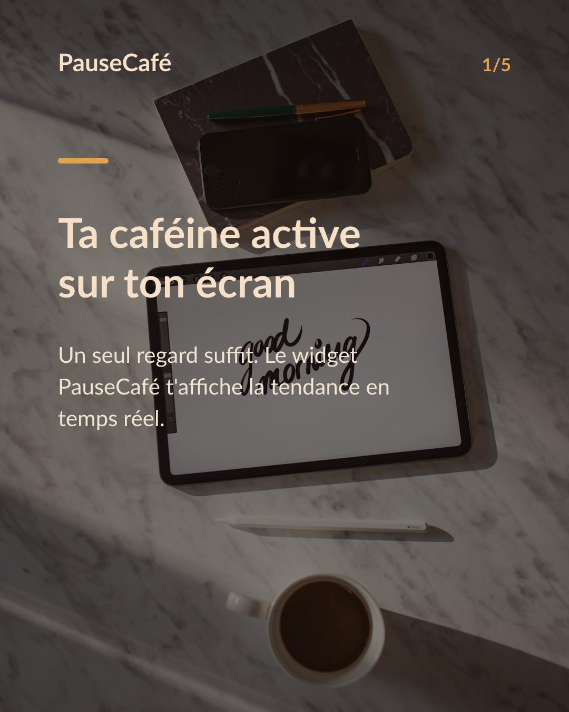
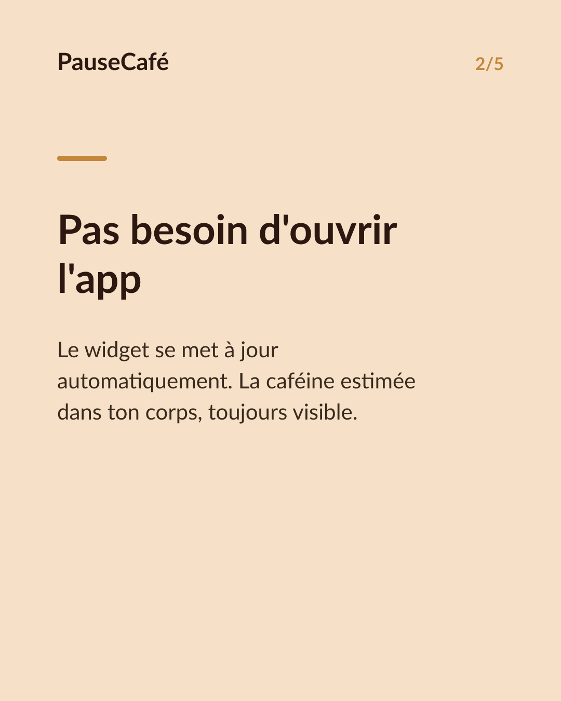
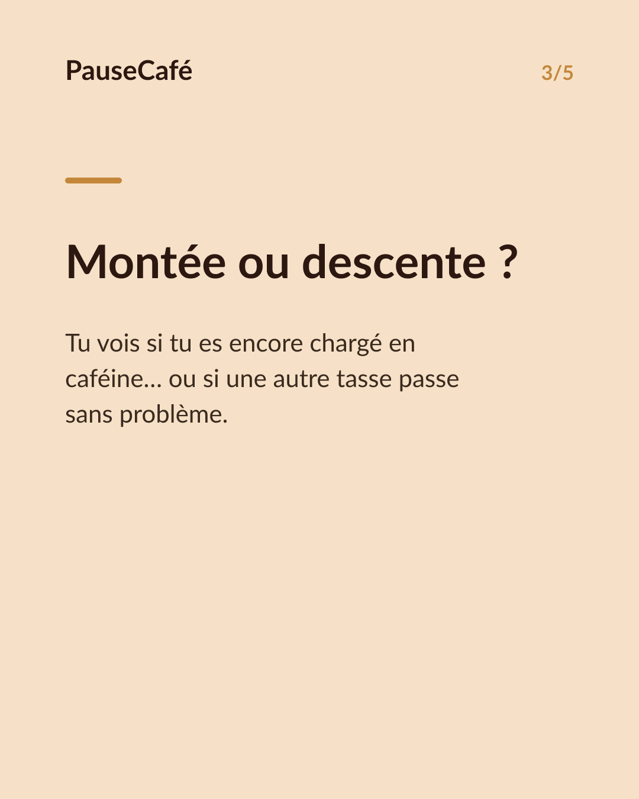
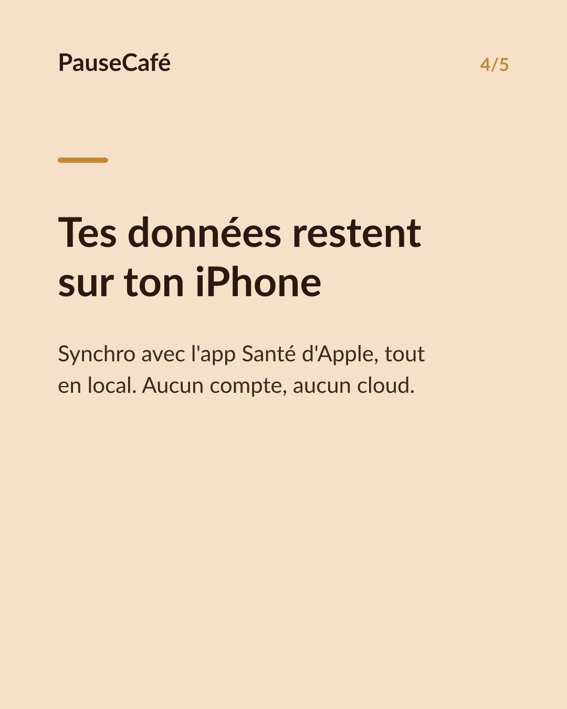

# Brouillon posts sociaux — widget-cafeine

- Archétype : Demo fonctionnalite
- Angle : Le widget caféine active sur l'écran d'accueil : la tendance d'un coup d'œil.
- Généré le : 2026-07-10

> À relire et ajuster avant publication. (Le lien App Store est déjà inséré.)

---

## X (thread)

1/ Ton iPhone peut t'afficher ta caféine active en temps réel. Sans ouvrir une seule app. 📲

2/ PauseCafé propose un widget pour l'écran d'accueil : tu vois d'un coup d'œil la caféine encore estimée dans ton corps, mise à jour automatiquement.

3/ Plus besoin de te souvenir de ta dernière tasse ou de calculer mentalement. La tendance est là, directement sur ton écran.

4/ En montée après un café, en descente vers le soir — tu repères instantanément si c'est le bon moment pour une autre tasse… ou pas.

5/ Le widget lit aussi tes données depuis l'app Santé d'Apple. Tout reste sur ton appareil, en local. Aucun compte, aucun cloud. 🔒

6/ C'est indicatif, bien-être — pas médical. Mais avoir ce repère sous les yeux change vraiment les habitudes.

7/ Ajoute le widget en quelques secondes. PauseCafé sur l'App Store 👉 https://apps.apple.com/app/id6761892198

## Instagram

**Légende :** Ta caféine active, d'un coup d'œil sur ton écran d'accueil. Le widget PauseCafé se met à jour en temps réel — sans ouvrir l'app, sans calcul mental. Tes données restent sur ton iPhone via l'app Santé d'Apple. Indicatif, bien-être. 👉 lien en bio.

📷 Photos : Milada Vigerova, Roman Bintang / Unsplash

**Hashtags :** #widget #iPhone #caféine #café #bienêtre #astuceiPhone #coffeelover #santé #applehealth #habitudes

**Visuel du thread X :** Screenshot de l'écran d'accueil iPhone avec le widget PauseCafé visible, affichant la courbe ou la valeur de caféine active en temps réel.

**Carrousel (images générées) :**

**Textes des slides :**

1. **Ta caféine active sur ton écran** — Un seul regard suffit. Le widget PauseCafé t'affiche la tendance en temps réel.
2. **Pas besoin d'ouvrir l'app** — Le widget se met à jour automatiquement. La caféine estimée dans ton corps, toujours visible.
3. **Montée ou descente ?** — Tu vois si tu es encore chargé en caféine… ou si une autre tasse passe sans problème.
4. **Tes données restent sur ton iPhone** — Synchro avec l'app Santé d'Apple, tout en local. Aucun compte, aucun cloud. 🔒
5. **Ajoute-le en quelques secondes** — Télécharge PauseCafé et place le widget sur ton écran. Indicatif, bien-être.
