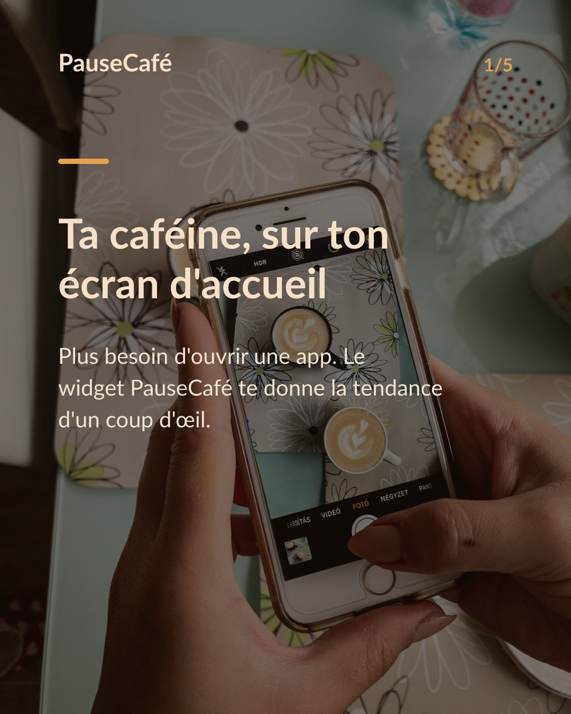
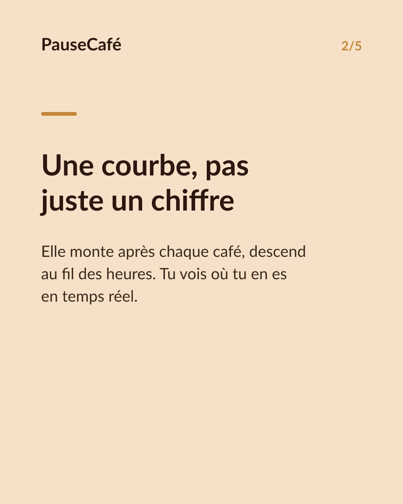
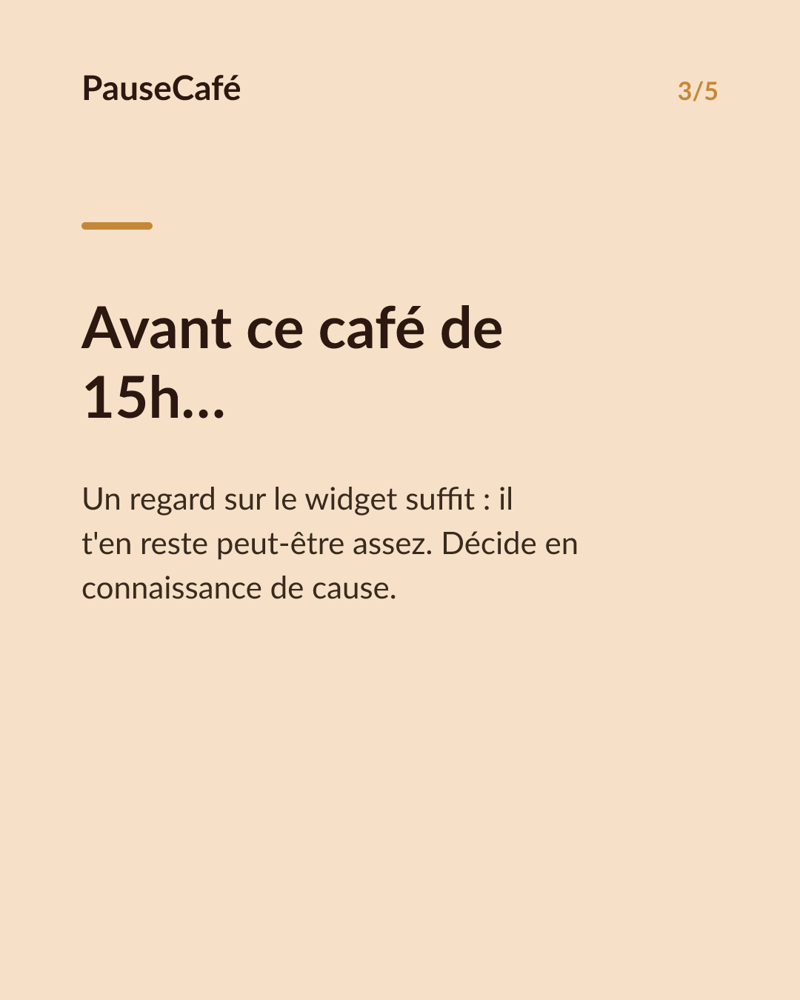
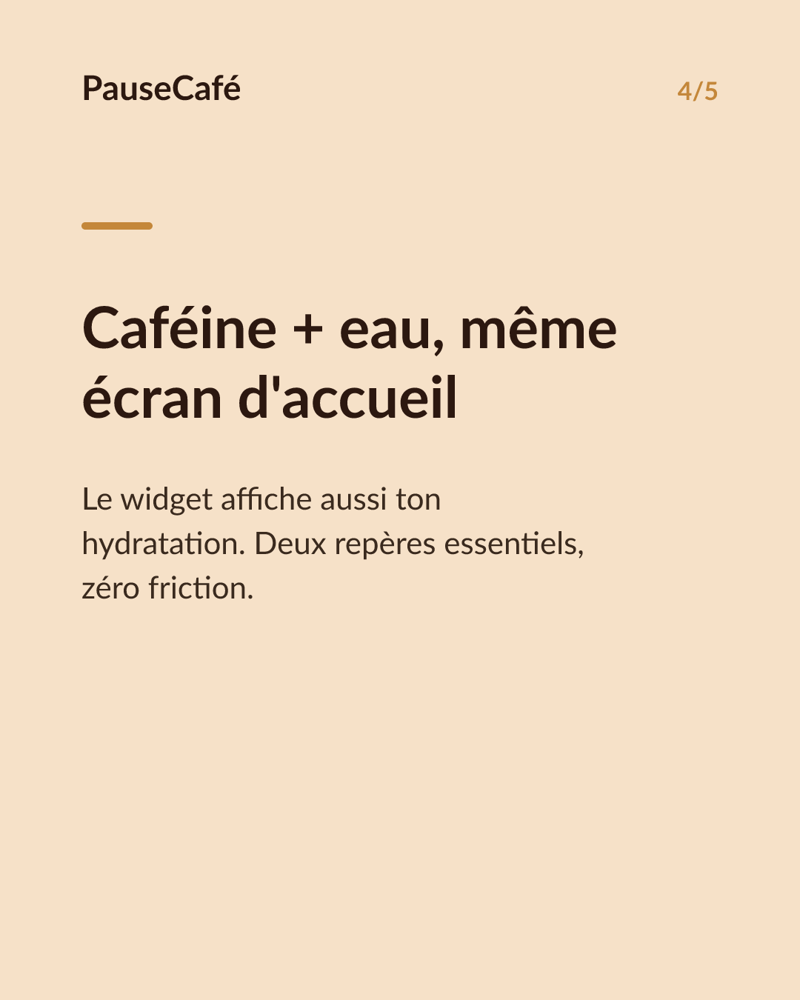

# Brouillon posts sociaux — widget-cafeine

- Archétype : Demo fonctionnalite
- Angle : Le widget caféine active sur l'écran d'accueil : la tendance d'un coup d'œil.
- Généré le : 2026-07-13

> À relire et ajuster avant publication. (Le lien App Store est déjà inséré.)

---

## X (thread)

1/ Tu déverrouilles ton iPhone et tu sais déjà. Pas besoin d'ouvrir une app. ☕
2/ PauseCafé a un widget pour ton écran d'accueil. Ta caféine active : visible en un coup d'œil, à tout moment de la journée.
3/ La courbe monte après chaque café, descend au fil des heures. Tu vois la tendance — pas juste un chiffre figé.
4/ Utile avant un café de l'après-midi : est-ce que j'en ai vraiment besoin, ou il m'en reste encore assez ?
5/ Le widget lit aussi ta consommation d'eau. Caféine + hydratation sur le même écran d'accueil. Deux repères, zéro friction.
6/ Tout est calculé sur ton appareil, synchronisé avec l'app Santé d'Apple. Tes données ne quittent pas ton iPhone. 🔒
7/ Widget PauseCafé, disponible sur l'App Store 👉 https://apps.apple.com/app/id6761892198

## Instagram

**Légende :** Ta caféine active, visible sans même ouvrir l'app. Le widget PauseCafé s'installe sur ton écran d'accueil et te donne la tendance en un coup d'œil — avec ton hydratation en prime. Calculé en local, synchro avec l'app Santé d'Apple. Indicatif, bien-être. 👉 lien en bio.

📷 Photos : Szabo Viktor, Mohammadreza alidoost / Unsplash

**Hashtags :** #widget #iPhone #caféine #café #bienêtre #habitudes #AppleHealth #coffeelover #santé #productivité

**Visuel du thread X :** Screenshot de l'écran d'accueil iPhone avec le widget PauseCafé visible, affichant la courbe de caféine active et le niveau d'hydratation.

**Carrousel (images générées) :**

**Textes des slides :**

1. **Ta caféine, sur ton écran d'accueil** — Plus besoin d'ouvrir une app. Le widget PauseCafé te donne la tendance d'un coup d'œil.
2. **Une courbe, pas juste un chiffre** — Elle monte après chaque café, descend au fil des heures. Tu vois où tu en es en temps réel.
3. **Avant ce café de 15h…** — Un regard sur le widget suffit : il t'en reste peut-être assez. Décide en connaissance de cause.
4. **Caféine + eau, même écran d'accueil** — Le widget affiche aussi ton hydratation. Deux repères essentiels, zéro friction.
5. **Installe le widget, reprends la main** — Calculé sur ton appareil, synchro avec l'app Santé. Indicatif et bien-être. ☕
