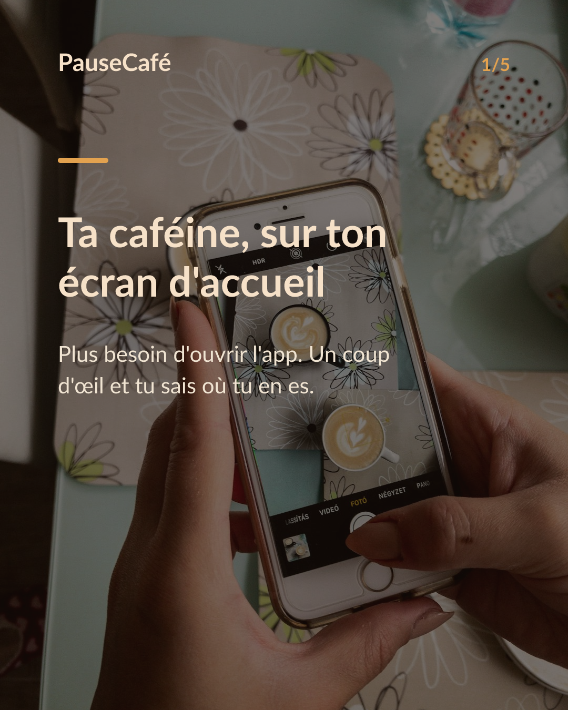
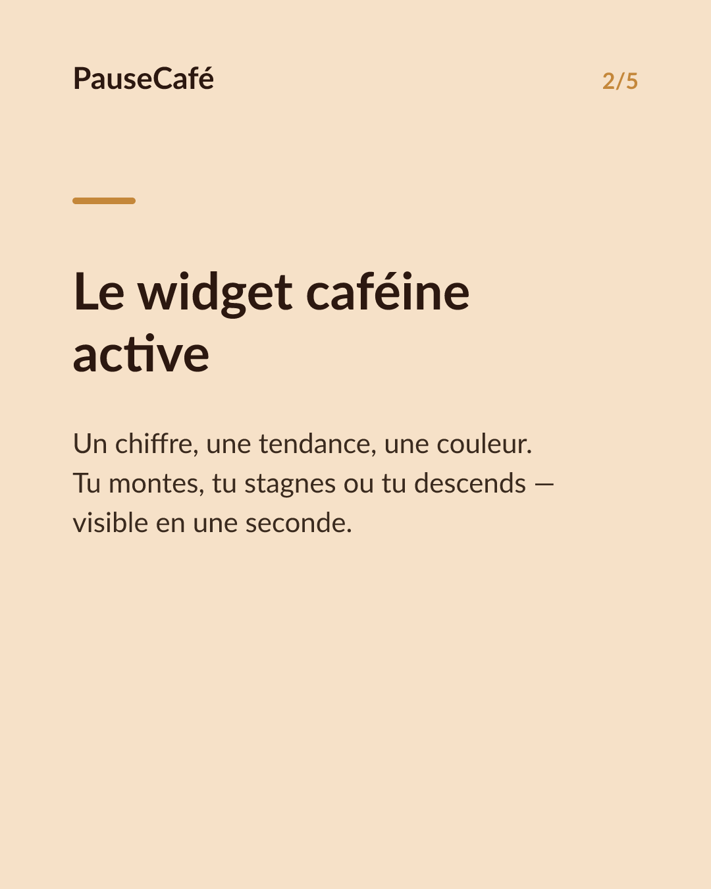
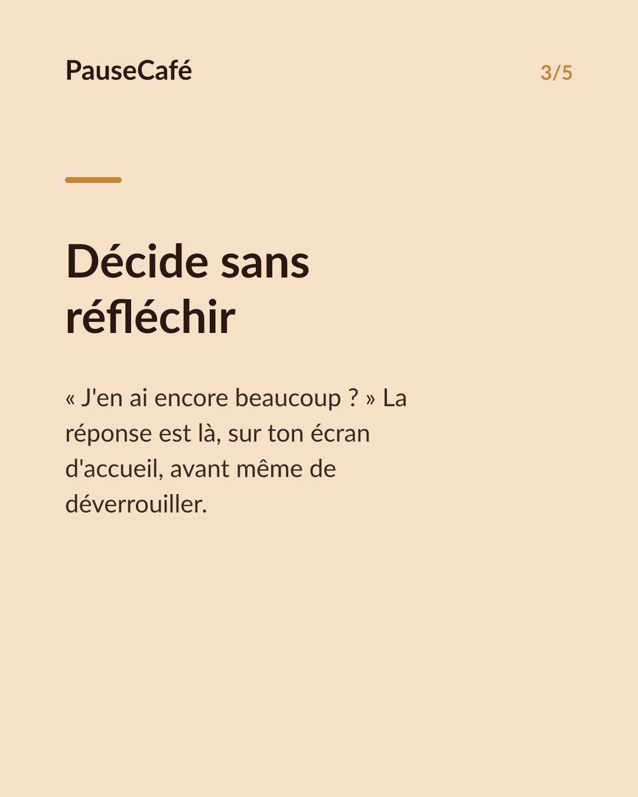
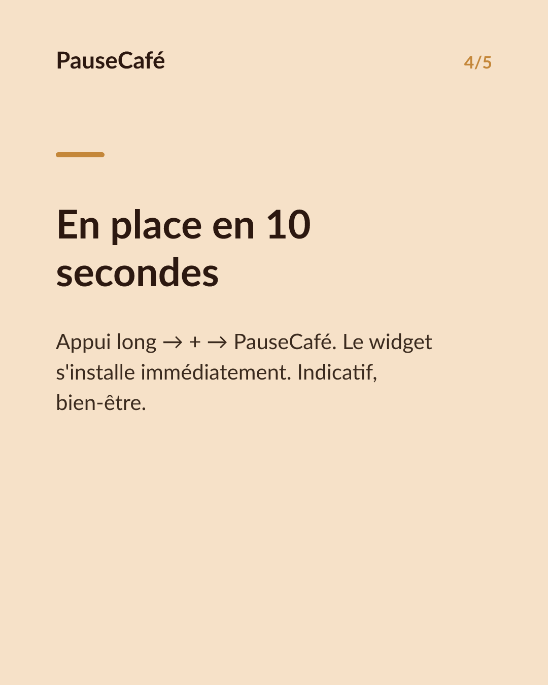

# Brouillon posts sociaux — widget-cafeine

- Archétype : Demo fonctionnalite
- Angle : Le widget caféine active sur l'écran d'accueil : la tendance d'un coup d'œil.
- Généré le : 2026-07-15

> À relire et ajuster avant publication. (Le lien App Store est déjà inséré.)

---

## X (thread)

1/ Tu check ton téléphone le matin — et tu sais déjà si tu peux prendre ce café. Sans ouvrir une seule appli. ☕
2/ PauseCafé a un widget pour ton écran d'accueil. Il affiche ta caféine active en temps réel, directement là où tu regardes déjà.
3/ Un chiffre, une tendance, une couleur. D'un coup d'œil tu vois si tu montes, tu stagnes ou tu descends — et tu décides en conséquence.
4/ Plus besoin d'ouvrir l'app pour savoir « est-ce que j'en ai encore beaucoup dans le corps ? ». La réponse t'attend sur ton écran d'accueil.
5/ C'est une estimation basée sur un modèle pharmacocinétique (demi-vie ~5 h). Indicatif, bien-être — mais ça change vraiment la façon de piloter sa journée.
6/ Le widget se place en 10 secondes. Appui long sur l'écran d'accueil → + → PauseCafé. C'est tout.
7/ Essaie PauseCafé gratuitement sur l'App Store 👉 https://apps.apple.com/app/id6761892198

## Instagram

**Légende :** Et si ton écran d'accueil te disait en un coup d'œil si tu peux prendre ce café ? Le widget PauseCafé affiche ta caféine active en temps réel — sans ouvrir l'app. Indicatif, bien-être. 👉 lien en bio.

📷 Photos : Szabo Viktor, Mohammadreza alidoost / Unsplash

**Hashtags :** #café #caféine #widget #iPhone #bienêtre #habitudes #coffeelover #astuceiPhone #santé #productivité

**Visuel du thread X :** Screenshot de l'écran d'accueil iPhone avec le widget PauseCafé visible, affichant la caféine active et la tendance (flèche montante ou descendante).

**Carrousel (images générées) :**

**Textes des slides :**

1. **Ta caféine, sur ton écran d'accueil** — Plus besoin d'ouvrir l'app. Un coup d'œil et tu sais où tu en es.
2. **Le widget caféine active** — Un chiffre, une tendance, une couleur. Tu montes, tu stagnes ou tu descends — visible en une seconde.
3. **Décide sans réfléchir** — « J'en ai encore beaucoup ? » La réponse est là, sur ton écran d'accueil, avant même de déverrouiller.
4. **En place en 10 secondes** — Appui long → + → PauseCafé. Le widget s'installe immédiatement. Indicatif, bien-être.
5. **Ton café du matin, mieux choisi** — Télécharge PauseCafé et ajoute le widget dès aujourd'hui. 👉 lien en bio
