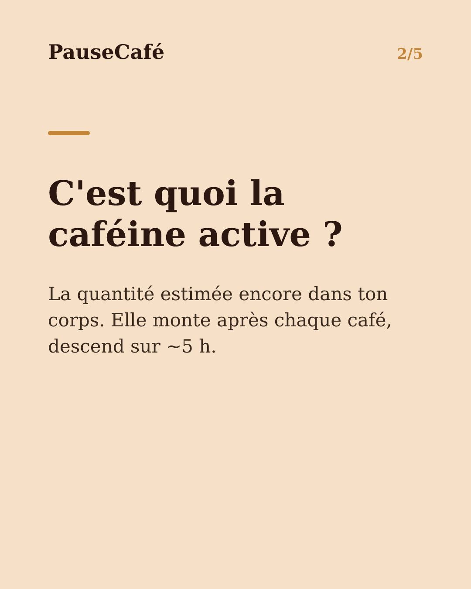
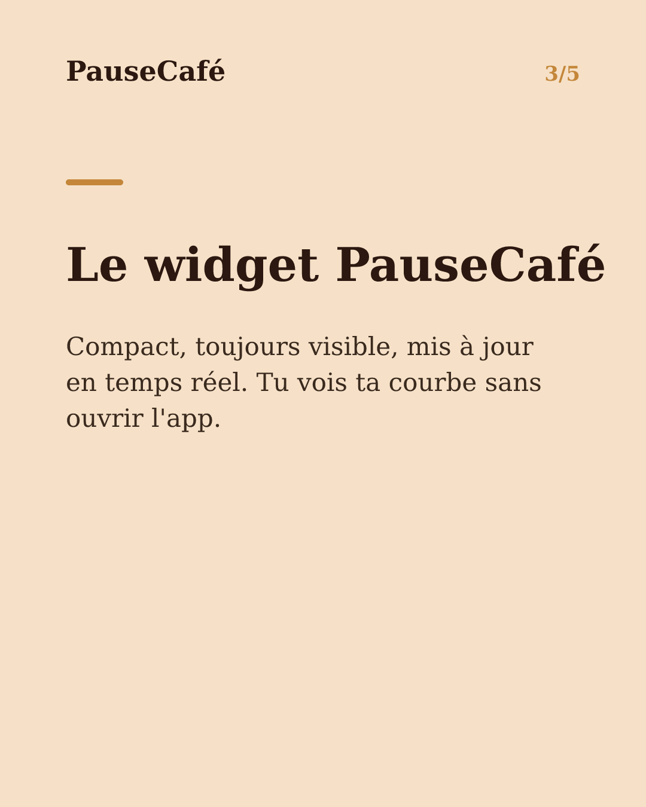
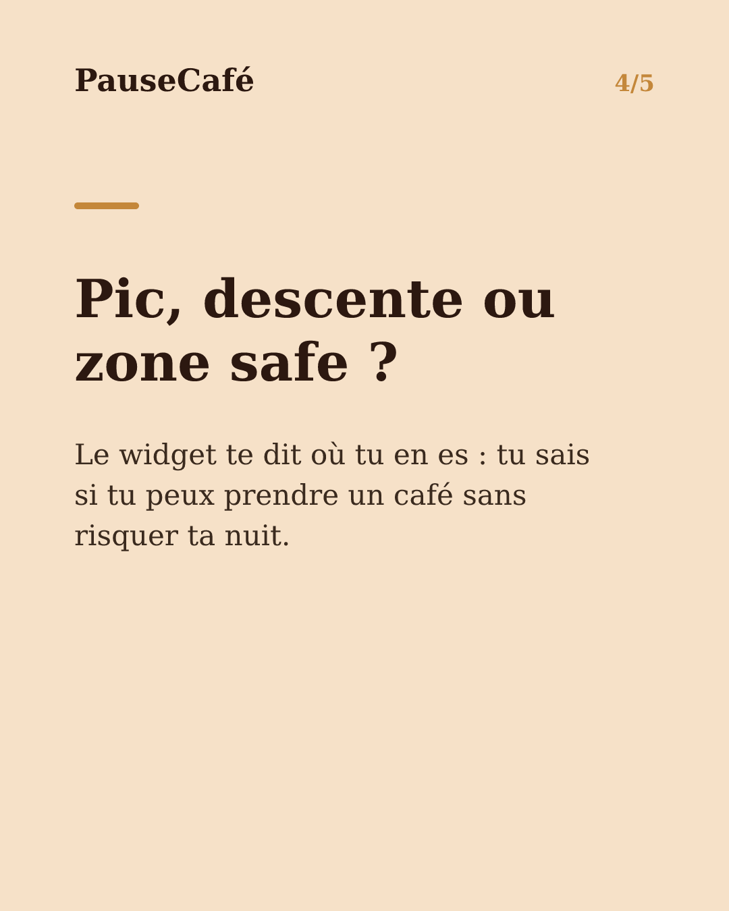

# Brouillon posts sociaux — widget-cafeine

- Archétype : Demo fonctionnalite
- Angle : Le widget caféine active sur l'écran d'accueil : la tendance d'un coup d'œil.
- Généré le : 2026-07-17

> À relire et ajuster avant publication. (Le lien App Store est déjà inséré.)

---

## X (thread)

1/ Ton écran d'accueil te dit déjà l'heure, la météo, tes événements. Et ta caféine ? ☕

2/ La caféine active, c'est la quantité estimée encore présente dans ton corps. Elle monte après chaque café, descend sur environ 5 h. Ça change tout pour savoir quand boire le prochain.

3/ PauseCafé a un widget iPhone : d'un coup d'œil depuis ton écran d'accueil, tu vois ta caféine active en ce moment — sans ouvrir l'app.

4/ La courbe est là, compacte. Tu vois si tu es en pic, en descente, ou si tu peux prendre un café sans risquer ta nuit.

5/ Pas besoin d'y penser : l'info est là quand tu déverrouilles. Le widget se met à jour en temps réel, estimation minute par minute.

6/ Indicatif et bien-être, jamais médical. Mais avoir ce repère visible change vraiment les habitudes. 👀

7/ Ajoute le widget dès aujourd'hui 👉 https://apps.apple.com/app/id6761892198

## Instagram

**Légende :** Ta caféine active, visible d'un coup d'œil depuis ton écran d'accueil. Le widget PauseCafé se met à jour en temps réel : pic, descente, zone safe — tu sais toujours où tu en es. Indicatif, bien-être. 👉 lien en bio.

📷 Photos : Szabo Viktor, Mohammadreza alidoost / Unsplash

**Hashtags :** #widget #iPhone #caféine #café #bienêtre #habitudes #iOS #coffeelover #santé #productivité

**Visuel du thread X :** Screenshot du widget PauseCafé sur un écran d'accueil iPhone, affichant la courbe de caféine active en format compact.

**Carrousel (images générées) :**

**Textes des slides :**

1. **Ta caféine, sur ton écran d'accueil** — Comme la météo ou l'heure — mais pour ta caféine active. D'un coup d'œil.
2. **C'est quoi la caféine active ?** — La quantité estimée encore dans ton corps. Elle monte après chaque café, descend sur ~5 h.
3. **Le widget PauseCafé** — Compact, toujours visible, mis à jour en temps réel. Tu vois ta courbe sans ouvrir l'app.
4. **Pic, descente ou zone safe ?** — Le widget te dit où tu en es : tu sais si tu peux prendre un café sans risquer ta nuit.
5. **Ajoute-le à ton écran d'accueil** — Télécharge PauseCafé et place le widget en quelques secondes. Indicatif et bien-être.
