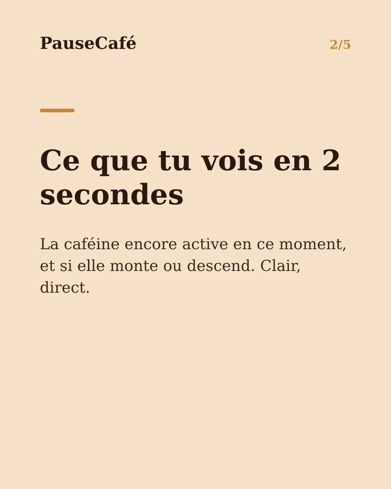
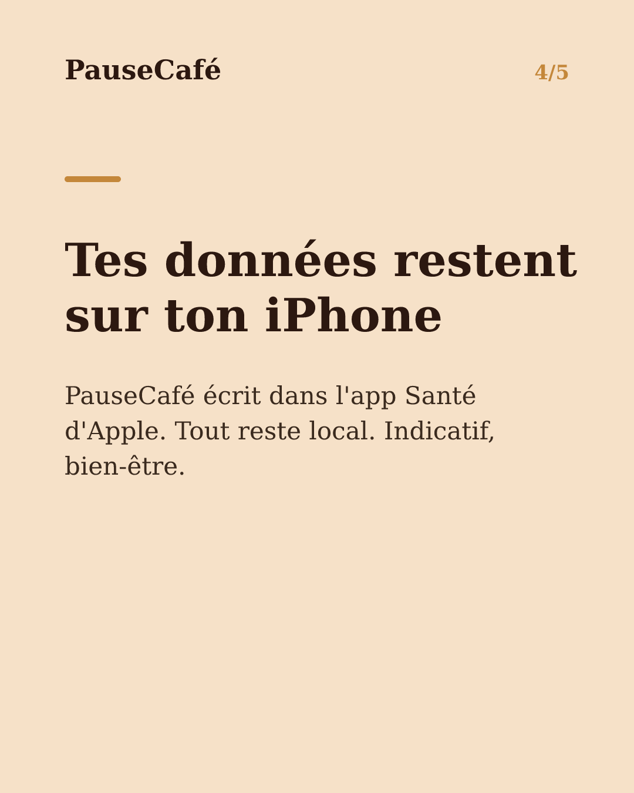

# Brouillon posts sociaux — widget-cafeine

- Archétype : Demo fonctionnalite
- Angle : Le widget caféine active sur l'écran d'accueil : la tendance d'un coup d'œil.
- Généré le : 2026-07-20

> À relire et ajuster avant publication. (Le lien App Store est déjà inséré.)

---

## X (thread)

1/ Ton téléphone tu le déverrouilles des dizaines de fois par jour. Et si chaque fois tu savais exactement où tu en es côté caféine ? ☕

2/ PauseCafé a un widget pour l'écran d'accueil. Un coup d'œil, et tu vois la caféine encore active dans ton corps — sans ouvrir l'app.

3/ Ce que le widget affiche : la quantité estimée en ce moment, et la tendance (elle monte encore ou elle descend ?). En deux secondes, tu sais.

4/ C'est utile avant une réunion : « Est-ce que j'ai besoin d'un café ? » Ou le soir : « Suis-je encore trop chargé pour dormir tôt ? »

5/ Les données restent sur ton appareil — PauseCafé écrit dans l'app Santé d'Apple, rien ne part ailleurs. Indicatif, bien-être, pas médical.

6/ Pour l'activer : maintiens l'écran d'accueil appuyé → « + » → cherche PauseCafé → choisis la taille → place-le. Moins d'une minute. 🎯

7/ Widget sur l'écran d'accueil, suivi minute par minute, synchro Apple Health. Tout ça dans PauseCafé 👉 https://apps.apple.com/app/id6761892198

## Instagram

**Légende :** Et si ton écran d'accueil te disait combien de caféine est encore active dans ton corps ? Le widget PauseCafé fait exactement ça — un coup d'œil suffit. Données locales, synchro app Santé. Indicatif, bien-être. 👉 lien en bio.

📷 Photos : Szabo Viktor, Mohammadreza alidoost / Unsplash

**Hashtags :** #widget #iPhone #caféine #café #bienêtre #AppleHealth #astuceiPhone #coffeelover #habitudes #santé

**Visuel du thread X :** Screenshot de l'écran d'accueil iPhone avec le widget PauseCafé visible, affichant la caféine active estimée et la tendance (flèche descendante vers le soir).

**Carrousel (images générées) :**

**Textes des slides :**

1. **La caféine, d'un coup d'œil** — Sans ouvrir d'app. Juste en regardant ton écran d'accueil. Le widget PauseCafé, c'est ça.
2. **Ce que tu vois en 2 secondes** — La caféine encore active en ce moment, et si elle monte ou descend. Clair, direct.
3. **Avant une réunion, avant de dormir** — "J'ai besoin d'un café ?" ou "Suis-je trop chargé ce soir ?" Le widget répond sans effort.
4. **Tes données restent sur ton iPhone** — PauseCafé écrit dans l'app Santé d'Apple. Tout reste local. Indicatif, bien-être.
5. **Ajoute-le en moins d'une minute** — Appui long → + → PauseCafé → choisir la taille → placer. Et c'est là, pour toujours. ☕
