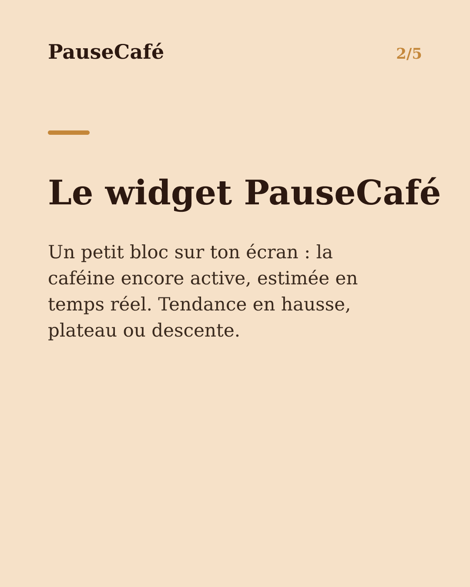
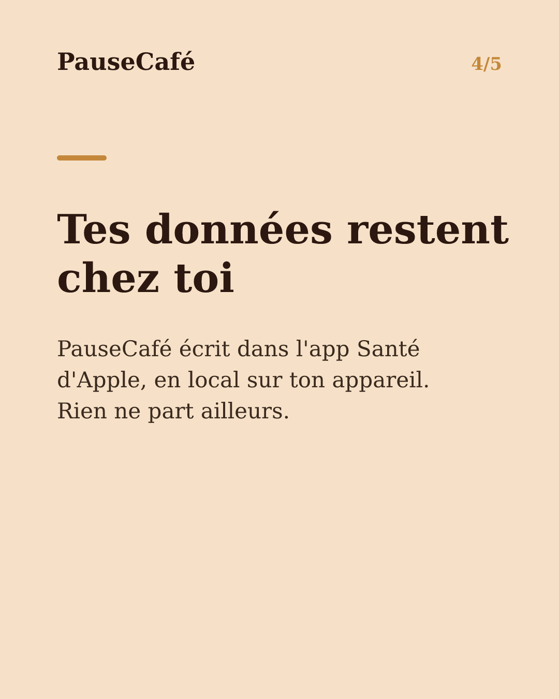

# Brouillon posts sociaux — widget-cafeine

- Archétype : Demo fonctionnalite
- Angle : Le widget caféine active sur l'écran d'accueil : la tendance d'un coup d'œil.
- Généré le : 2026-07-22

> À relire et ajuster avant publication. (Le lien App Store est déjà inséré.)

---

## X (thread)

1/ Ton téléphone tu le déverrouilles des dizaines de fois par jour. Et si chaque regard t'indiquait si c'est le bon moment pour un café ? ☕

2/ PauseCafé a un widget pour l'écran d'accueil. En un coup d'œil : la caféine encore active dans ton corps, estimée en temps réel.

3/ Pas besoin d'ouvrir l'app. La tendance est là, directement sur ton écran. En hausse, en plateau, en descente — tu sais où tu en es.

4/ C'est utile le matin pour voir si ton premier café commence à agir. Utile l'après-midi pour juger si une deuxième tasse est vraiment nécessaire.

5/ Les données restent sur ton appareil. PauseCafé écrit dans l'app Santé d'Apple, en local. Rien ne part ailleurs. 🔒

6/ Indicatif, bien-être, jamais médical. Mais avoir ce repère sous les yeux change vraiment la façon dont on gère sa journée.

7/ Installe le widget PauseCafé depuis l'App Store 👉 https://apps.apple.com/app/id6761892198

## Instagram

**Légende :** Ta caféine active, visible d'un coup d'œil sur l'écran d'accueil de ton iPhone. Le widget PauseCafé te montre la tendance en temps réel — sans ouvrir l'app. Indicatif, bien-être. 👉 lien en bio.

📷 Photos : Milada Vigerova, Roman Bintang / Unsplash

**Hashtags :** #widget #iPhone #caféine #café #bienêtre #astuceiPhone #coffeelover #santé #AppleHealth #habitudes

**Visuel du thread X :** Screenshot de l'écran d'accueil iPhone avec le widget PauseCafé visible, montrant la courbe ou valeur de caféine active en temps réel.

**Carrousel (images générées) :**

**Textes des slides :**

1. **Ta caféine, d'un coup d'œil** — Imagine voir ta caféine active directement sur l'écran d'accueil de ton iPhone, sans ouvrir aucune app.
2. **Le widget PauseCafé** — Un petit bloc sur ton écran : la caféine encore active, estimée en temps réel. Tendance en hausse, plateau ou descente.
3. **Le bon moment pour un café ?** — Le matin, l'après-midi, en soirée — un regard suffit pour décider sans hésiter ni se priver pour rien.
4. **Tes données restent chez toi** — PauseCafé écrit dans l'app Santé d'Apple, en local sur ton appareil. Rien ne part ailleurs.
5. **Pose le widget, reprends la main** — Télécharge PauseCafé et installe le widget en 30 secondes. Indicatif et bien-être. 👉 lien en bio
