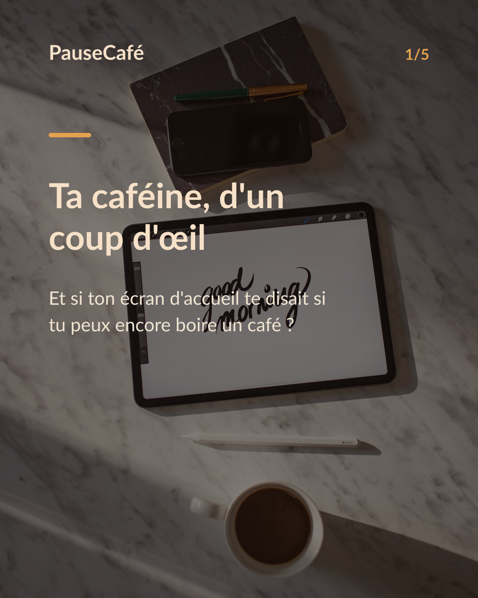
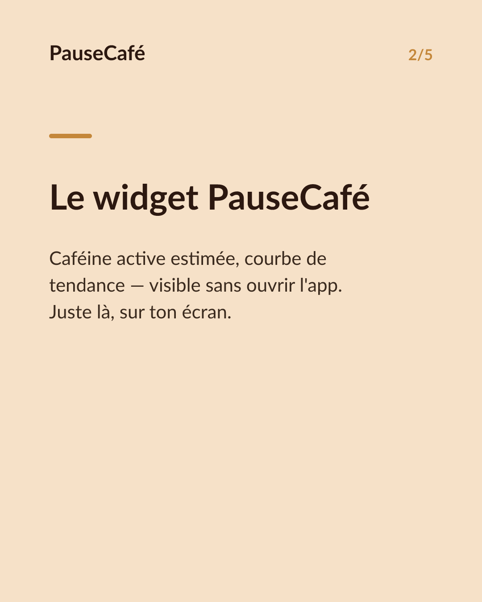
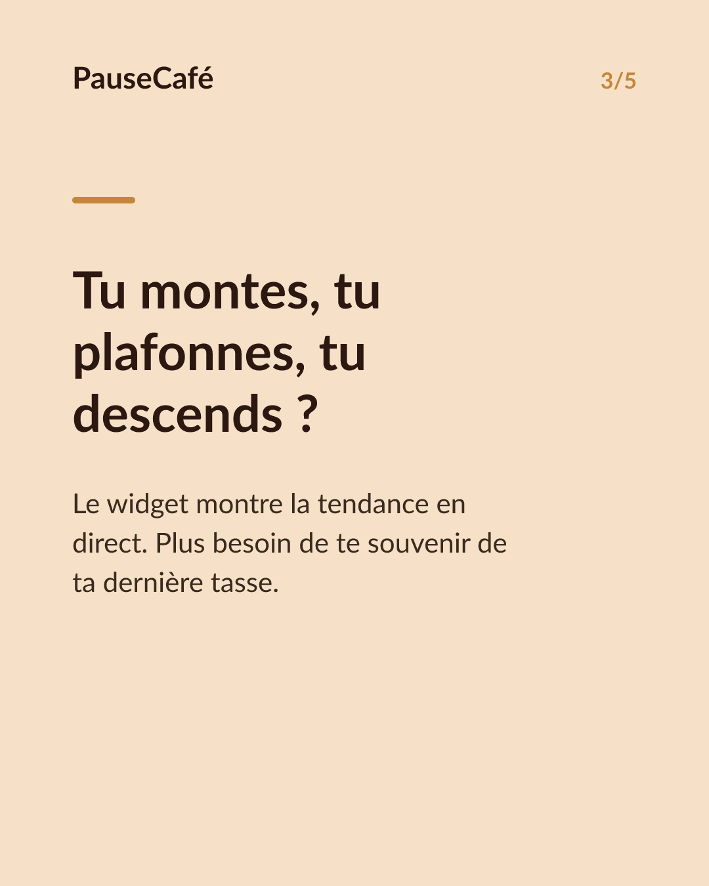
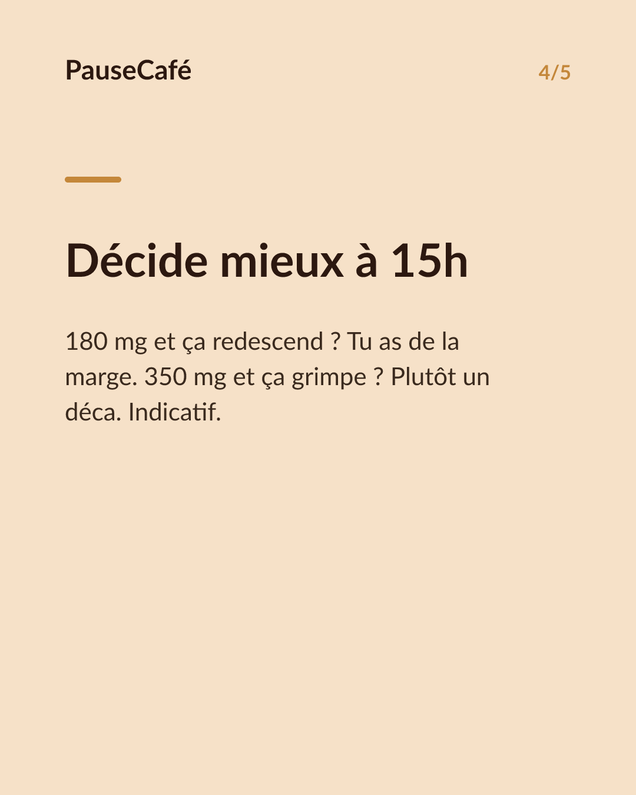

# Brouillon posts sociaux — widget-cafeine

- Archétype : Demo fonctionnalite
- Angle : Le widget caféine active sur l'écran d'accueil : la tendance d'un coup d'œil.
- Généré le : 2026-07-24

> À relire et ajuster avant publication. (Le lien App Store est déjà inséré.)

---

## X (thread)

1/ Ton écran d'accueil te dit l'heure, la météo… mais pas si tu peux encore boire un café. ☕

2/ Le widget PauseCafé affiche la caféine encore active dans ton corps — en ce moment — sans ouvrir l'app. Un chiffre, une courbe, un coup d'œil.

3/ Tu vois si tu es en train de monter, de plafonner ou de redescendre. Pas besoin de te souvenir de ta dernière tasse : le widget suit pour toi.

4/ Pratique à 15h quand tu hésites : « J'en suis à 180 mg estimés, je redescends — j'ai encore de la marge. » Ou l'inverse, et tu passes au déca.

5/ Les données restent sur ton iPhone, synchronisées avec l'app Santé d'Apple. Rien ne part ailleurs. 🔒

6/ Indicatif, bien-être. Mais avoir le chiffre sous les yeux change vraiment la façon dont on décide.

7/ PauseCafé, sur l'App Store 👉 https://apps.apple.com/app/id6761892198

## Instagram

**Légende :** Et si ton écran d'accueil te disait si tu peux encore boire un café ? Le widget PauseCafé affiche ta caféine active estimée en un coup d'œil — courbe, tendance, sans ouvrir l'app. Indicatif, bien-être, données sur ton iPhone via Apple Health. 👉 lien en bio.

📷 Photos : Milada Vigerova, Roman Bintang / Unsplash

**Hashtags :** #café #caféine #widget #iPhone #bienêtre #astuce #coffeelover #applesante #habitudes #productivité

**Visuel du thread X :** Screenshot du widget PauseCafé sur un écran d'accueil iPhone, affichant la caféine active estimée et la courbe de tendance.

**Carrousel (images générées) :**

**Textes des slides :**

1. **Ta caféine, d'un coup d'œil** — Et si ton écran d'accueil te disait si tu peux encore boire un café ?
2. **Le widget PauseCafé** — Caféine active estimée, courbe de tendance — visible sans ouvrir l'app. Juste là, sur ton écran.
3. **Tu montes, tu plafonnes, tu descends ?** — Le widget montre la tendance en direct. Plus besoin de te souvenir de ta dernière tasse.
4. **Décide mieux à 15h** — 180 mg et ça redescend ? Tu as de la marge. 350 mg et ça grimpe ? Plutôt un déca. Indicatif.
5. **Essaie le widget aujourd'hui** — PauseCafé sur l'App Store. Tes données restent sur ton iPhone, via l'app Santé. 👉 lien en bio
