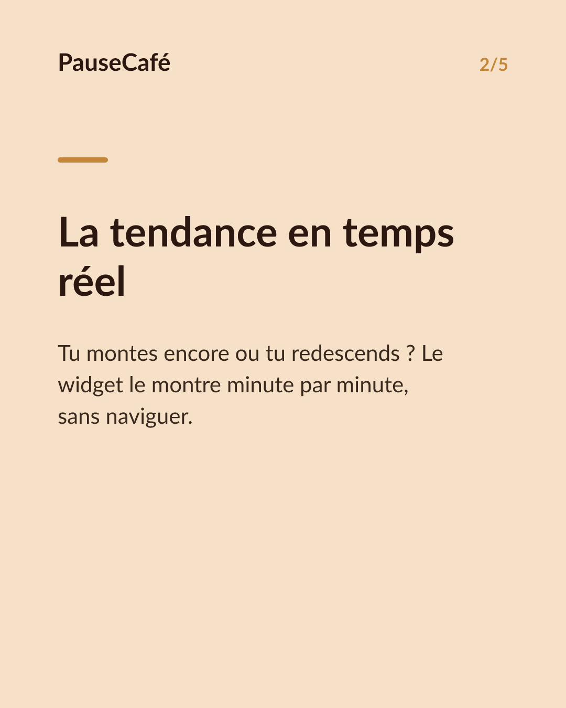
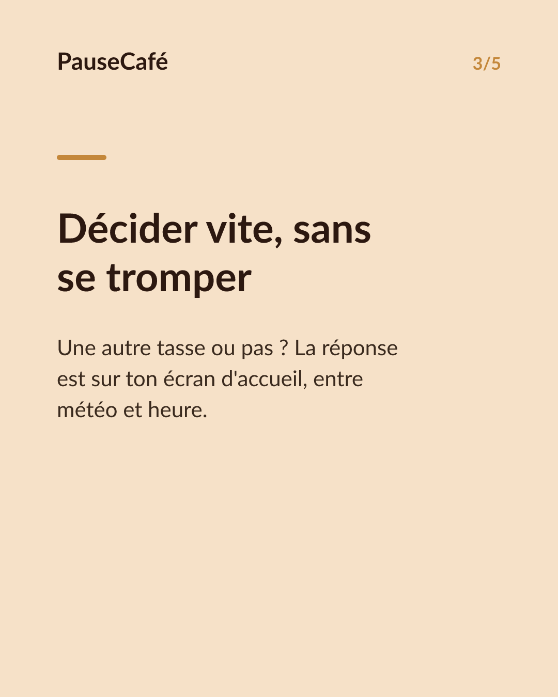
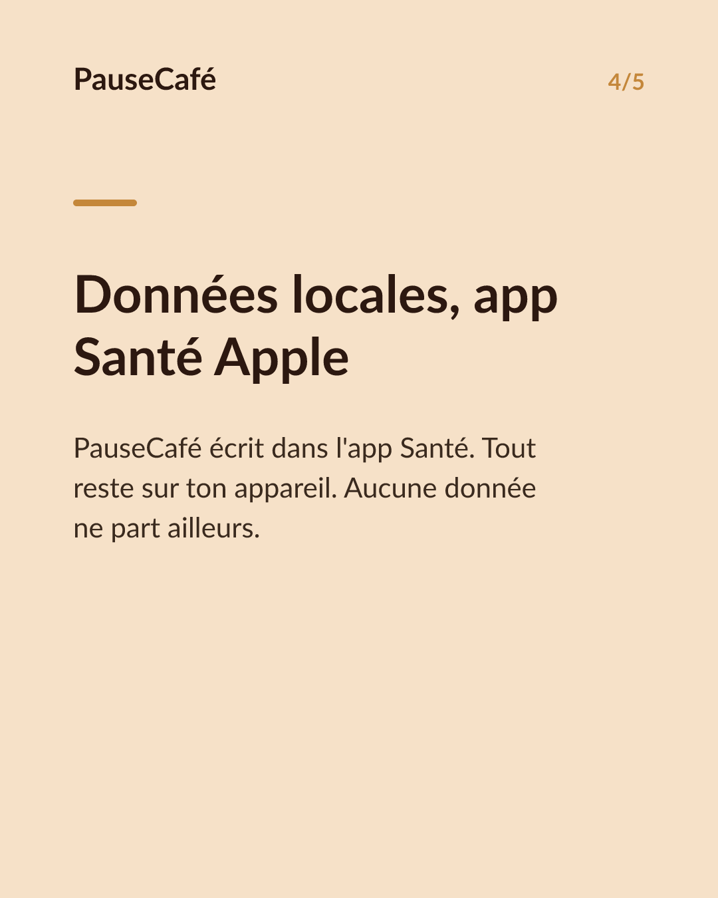
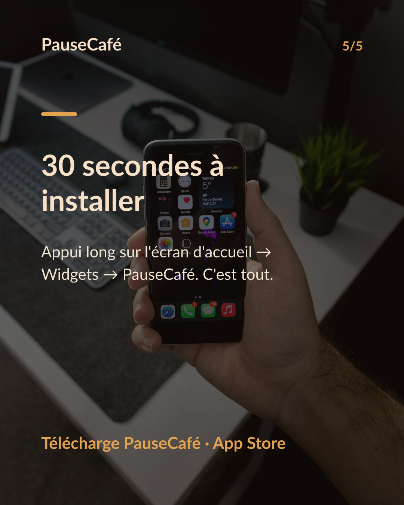

# Brouillon posts sociaux — widget-cafeine

- Archétype : Demo fonctionnalite
- Angle : Le widget caféine active sur l'écran d'accueil : la tendance d'un coup d'œil.
- Généré le : 2026-07-27

> À relire et ajuster avant publication. (Le lien App Store est déjà inséré.)

---

## X (thread)

1/ Ton iPhone sait combien de caféine il te reste. Et si tu n'avais même pas à ouvrir une app pour le voir ? ☕

2/ PauseCafé a un widget pour l'écran d'accueil. La caféine encore active dans ton corps, visible d'un coup d'œil, sans déverrouiller ni naviguer.

3/ Le widget affiche la tendance en temps réel : est-ce que tu montes encore, ou tu redescends vers zéro ? Parfait pour décider d'une prochaine tasse — ou de l'éviter.

4/ C'est une estimation basée sur un modèle scientifique (demi-vie ~5 h). Pas un dosage médical, mais un repère concret pour tes habitudes du quotidien.

5/ Plus besoin d'ouvrir l'app à chaque fois. Le widget est là, entre tes autres infos du matin, comme la météo ou la batterie.

6/ Toutes les données restent sur ton appareil — PauseCafé écrit dans l'app Santé Apple, rien ne sort. 🔒

7/ Installe le widget en 30 secondes. PauseCafé sur l'App Store 👉 https://apps.apple.com/app/id6761892198

## Instagram

**Légende :** Et si tu voyais ta caféine active directement sur ton écran d'accueil ? Le widget PauseCafé affiche la tendance en temps réel — sans ouvrir l'app. Indicatif, bien-être, données sur ton appareil via l'app Santé Apple. 👉 lien en bio.

📷 Photos : Szabo Viktor, Mohammadreza alidoost / Unsplash

**Hashtags :** #widget #iPhone #caféine #café #bienêtre #appsanté #AppleHealth #habitudes #coffeelover #productivité

**Visuel du thread X :** Screenshot de l'écran d'accueil iPhone avec le widget PauseCafé visible, affichant la courbe ou la valeur de caféine active en temps réel.

**Carrousel (images générées) :**

**Textes des slides :**

1. **Ta caféine, visible sans ouvrir d'app** — Le widget PauseCafé s'installe sur ton écran d'accueil. Un coup d'œil suffit.
2. **La tendance en temps réel** — Tu montes encore ou tu redescends ? Le widget le montre minute par minute, sans naviguer.
3. **Décider vite, sans se tromper** — Une autre tasse ou pas ? La réponse est sur ton écran d'accueil, entre météo et heure.
4. **Données locales, app Santé Apple** — PauseCafé écrit dans l'app Santé. Tout reste sur ton appareil. Aucune donnée ne part ailleurs.
5. **30 secondes à installer** — Appui long sur l'écran d'accueil → Widgets → PauseCafé. C'est tout. 👇
