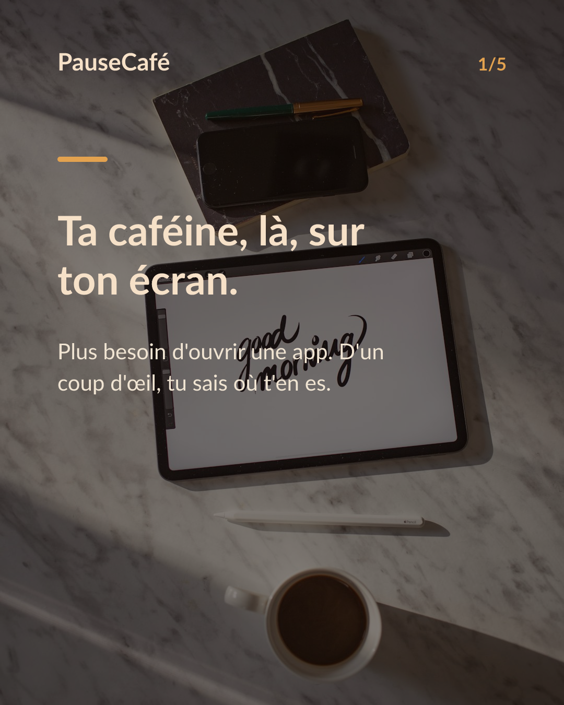
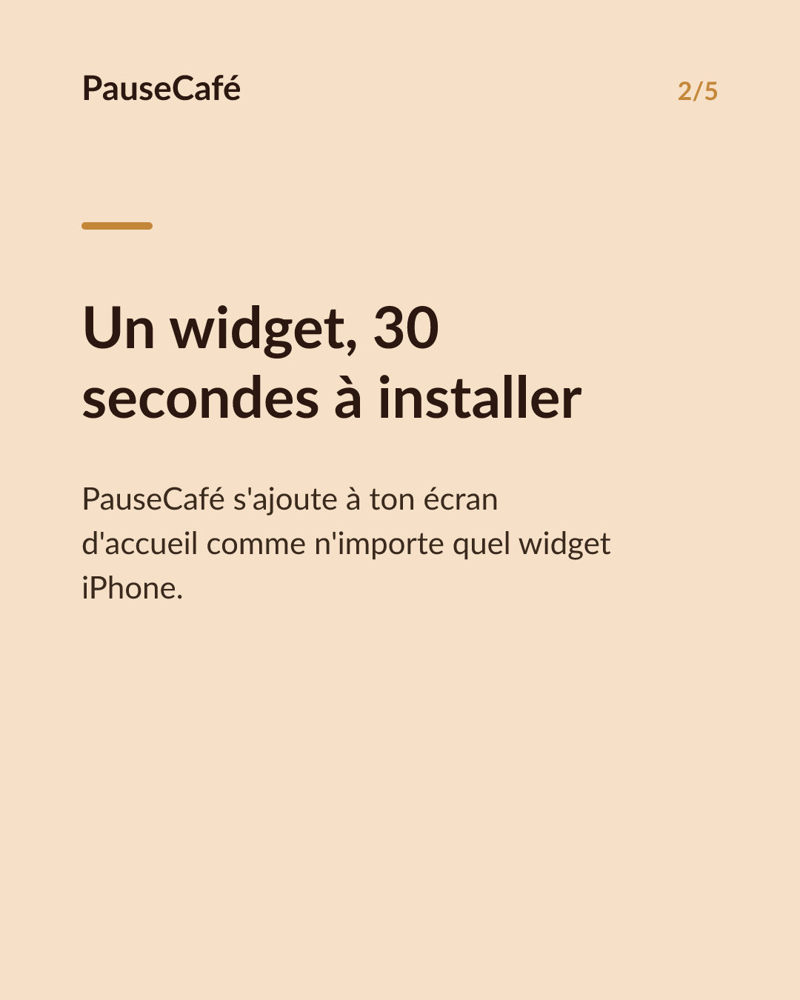
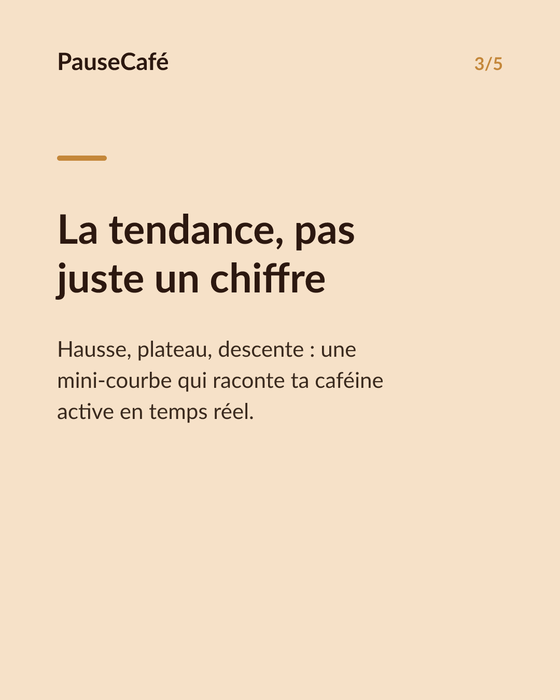
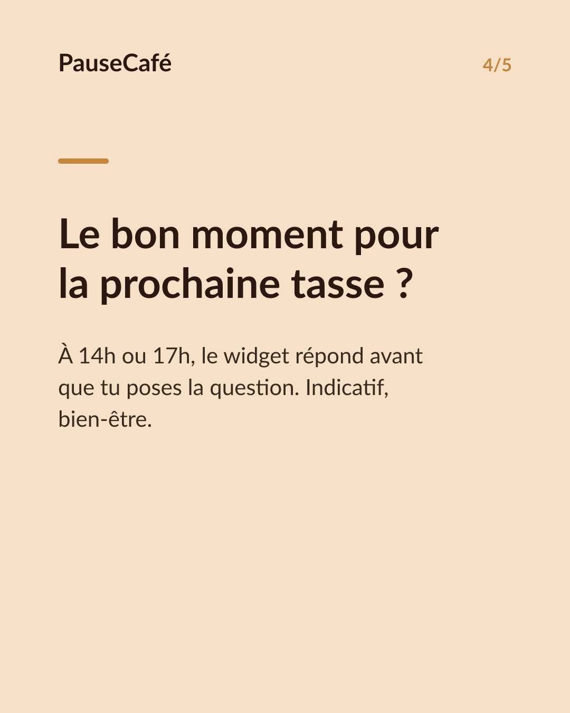

# Brouillon posts sociaux — widget-cafeine

- Archétype : Demo fonctionnalite
- Angle : Le widget caféine active sur l'écran d'accueil : la tendance d'un coup d'œil.
- Généré le : 2026-07-29

> À relire et ajuster avant publication. (Le lien App Store est déjà inséré.)

---

## X (thread)

1/ Ton téléphone tu le déverrouilles 80 fois par jour. Autant en profiter. ☕

2/ Le widget PauseCafé s'installe en 30 secondes sur ton écran d'accueil. La caféine encore active dans ton corps, visible sans ouvrir la moindre app.

3/ D'un coup d'œil tu vois si tu es encore haut, si tu descends, si c'est le bon moment pour une autre tasse — ou pour passer à l'eau.

4/ Le widget affiche la tendance : hausse, plateau, descente. Pas un chiffre brut sorti de nulle part, une courbe en miniature qui raconte où t'en es.

5/ Pratique à 14h quand tu hésites sur un deuxième café. Pratique à 17h quand tu veux pas ruiner ta nuit. Pas de calcul mental.

6/ C'est une estimation — modèle de Bateman, demi-vie ~5 h — pas une mesure médicale. Mais c'est suffisant pour prendre de meilleures décisions au quotidien. 🌿

7/ Installe le widget, teste 7 jours. PauseCafé sur l'App Store 👉 https://apps.apple.com/app/id6761892198

## Instagram

**Légende :** Ta caféine active, visible sur ton écran d'accueil sans ouvrir la moindre app. Le widget PauseCafé affiche la tendance minute par minute — pour savoir si c'est le bon moment pour une autre tasse, ou pas. Indicatif, bien-être. 👉 lien en bio.

📷 Photos : Milada Vigerova, Roman Bintang / Unsplash

**Hashtags :** #widget #iPhone #café #caféine #bienêtre #astuceiPhone #coffeelover #habitudes #santé #productivité

**Visuel du thread X :** Screenshot du widget PauseCafé sur un écran d'accueil iPhone, montrant la mini-courbe de caféine active avec une tendance en descente en fin d'après-midi.

**Carrousel (images générées) :**

**Textes des slides :**

1. **Ta caféine, là, sur ton écran.** — Plus besoin d'ouvrir une app. D'un coup d'œil, tu sais où t'en es.
2. **Un widget, 30 secondes à installer** — PauseCafé s'ajoute à ton écran d'accueil comme n'importe quel widget iPhone.
3. **La tendance, pas juste un chiffre** — Hausse, plateau, descente : une mini-courbe qui raconte ta caféine active en temps réel.
4. **Le bon moment pour la prochaine tasse ?** — À 14h ou 17h, le widget répond avant que tu poses la question. Indicatif, bien-être.
5. **Essaie 7 jours. Rien à perdre.** — Installe le widget PauseCafé dès aujourd'hui. Lien en bio. ☕
