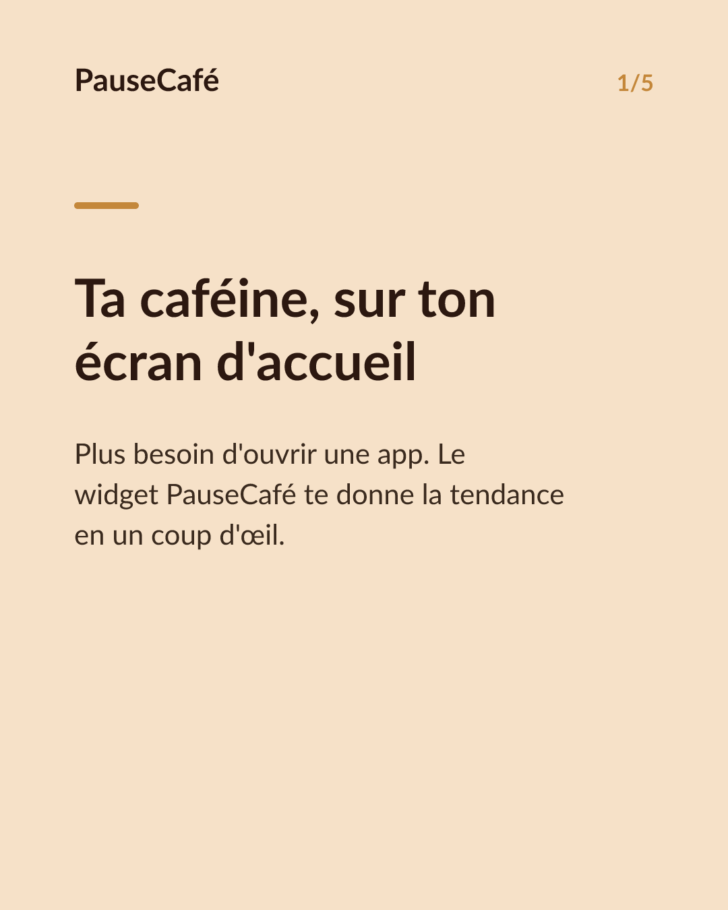
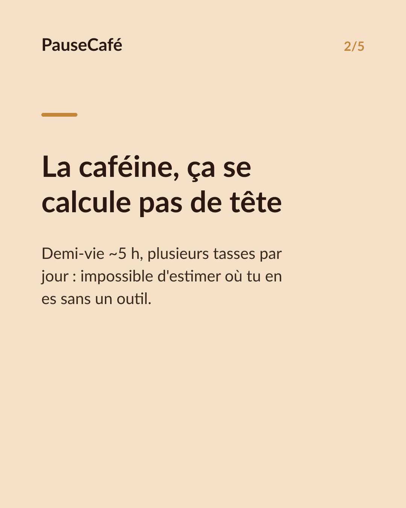
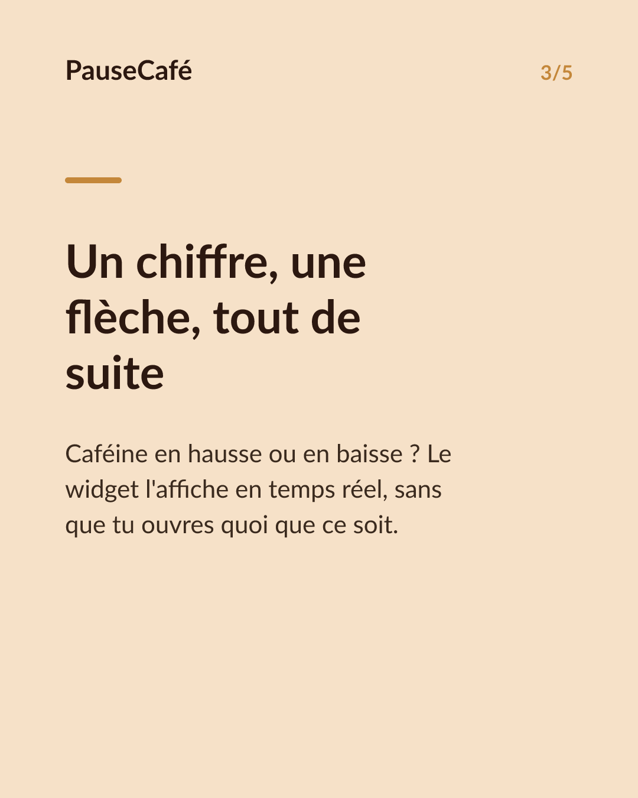
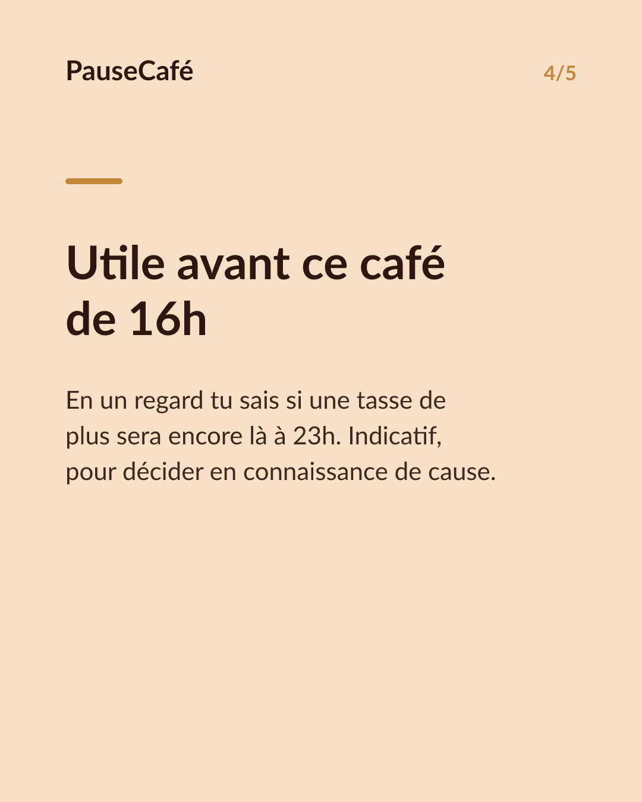
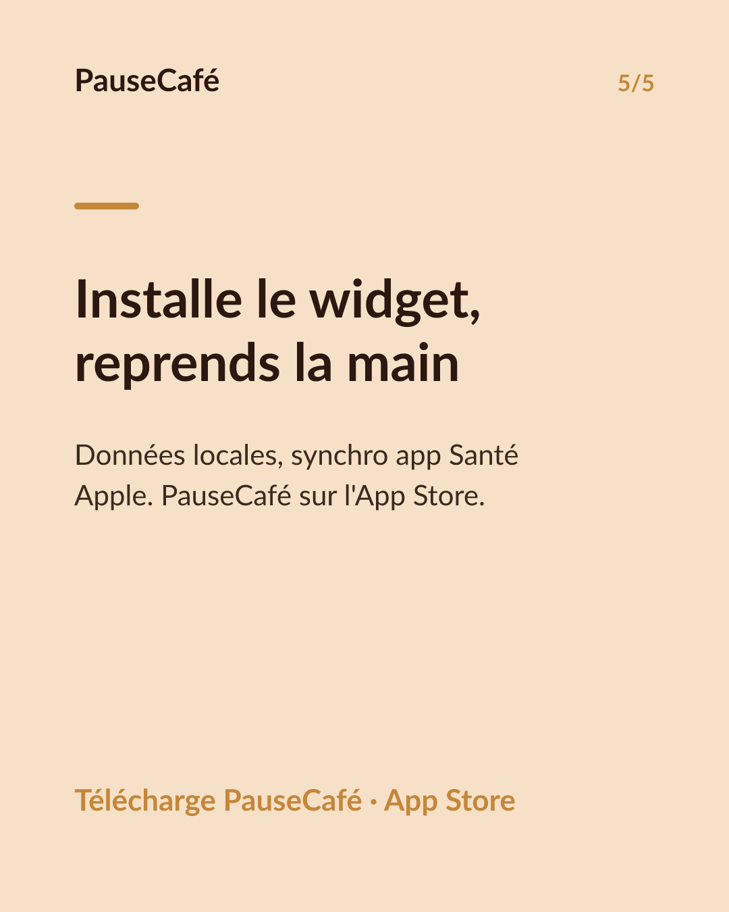

# Brouillon posts sociaux — widget-cafeine

- Archétype : Demo fonctionnalite
- Angle : Le widget caféine active sur l'écran d'accueil : la tendance d'un coup d'œil.
- Généré le : 2026-07-31

> À relire et ajuster avant publication. (Le lien App Store est déjà inséré.)

---

## X (thread)

1/ Ton écran d'accueil te dit l'heure, la météo… mais combien de caféine il te reste ? ☕
2/ La plupart des gens gèrent ça de tête. « Mon café date de 2 h, ça va. » Sauf que la demi-vie de la caféine est ~5 h. De tête, c'est approximatif.
3/ PauseCafé a un widget iPhone : tu vois la caféine encore active dans ton corps sans ouvrir l'app. Un chiffre, une tendance, un coup d'œil.
4/ En hausse = tu as bu récemment, la caféine monte encore. En descente = elle s'élimine. Tu sais où tu en es avant de commander une autre tasse.
5/ C'est utile surtout en fin d'après-midi : est-ce que ce café supplémentaire va encore être là à 23h ? Le widget te donne le contexte immédiat.
6/ Toutes les données restent sur ton appareil, synchronisées avec l'app Santé d'Apple. Rien sur un serveur. 🔒
7/ Essaie le widget PauseCafé — disponible sur l'App Store 👉 https://apps.apple.com/app/id6761892198

## Instagram

**Légende :** Et si ton écran d'accueil t'indiquait aussi ta caféine encore active ? Le widget PauseCafé affiche la tendance en temps réel — sans ouvrir l'app. Indicatif, bien-être, données sur ton appareil via l'app Santé Apple. 👉 lien en bio.

**Hashtags :** #widget #iPhone #caféine #café #bienêtre #sommeil #AppleHealth #habitudes #coffeelover #santé

**Visuel du thread X :** Screenshot de l'écran d'accueil iPhone avec le widget PauseCafé visible, affichant la caféine active et la flèche de tendance.

**Carrousel (images générées) :**

**Textes des slides :**

1. **Ta caféine, sur ton écran d'accueil** — Plus besoin d'ouvrir une app. Le widget PauseCafé te donne la tendance en un coup d'œil.
2. **La caféine, ça se calcule pas de tête** — Demi-vie ~5 h, plusieurs tasses par jour : impossible d'estimer où tu en es sans un outil.
3. **Un chiffre, une flèche, tout de suite** — Caféine en hausse ou en baisse ? Le widget l'affiche en temps réel, sans que tu ouvres quoi que ce soit.
4. **Utile avant ce café de 16h** — En un regard tu sais si une tasse de plus sera encore là à 23h. Indicatif, pour décider en connaissance de cause.
5. **Installe le widget, reprends la main** — Données locales, synchro app Santé Apple. PauseCafé sur l'App Store.
