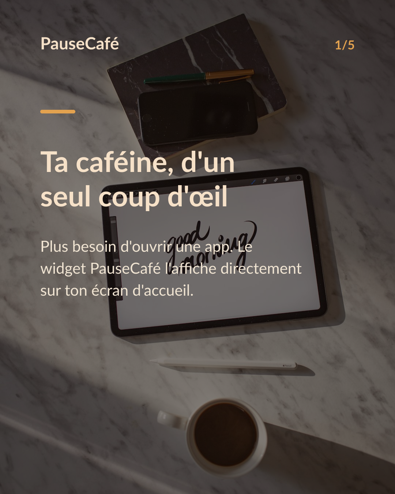
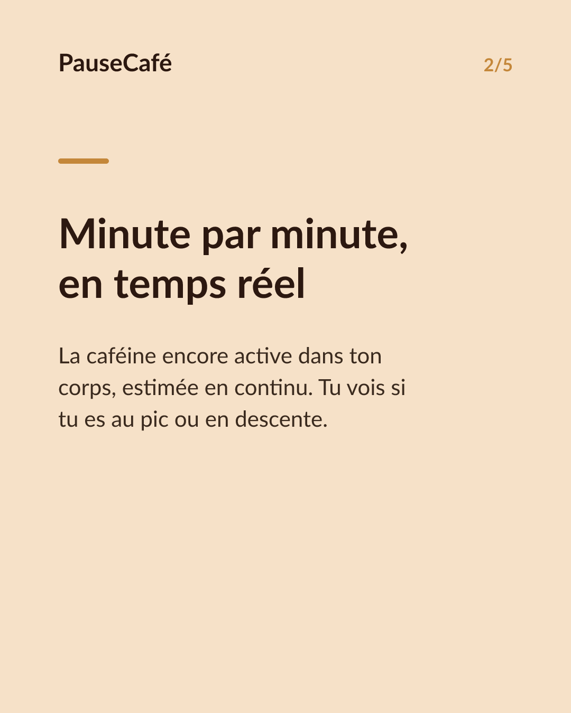
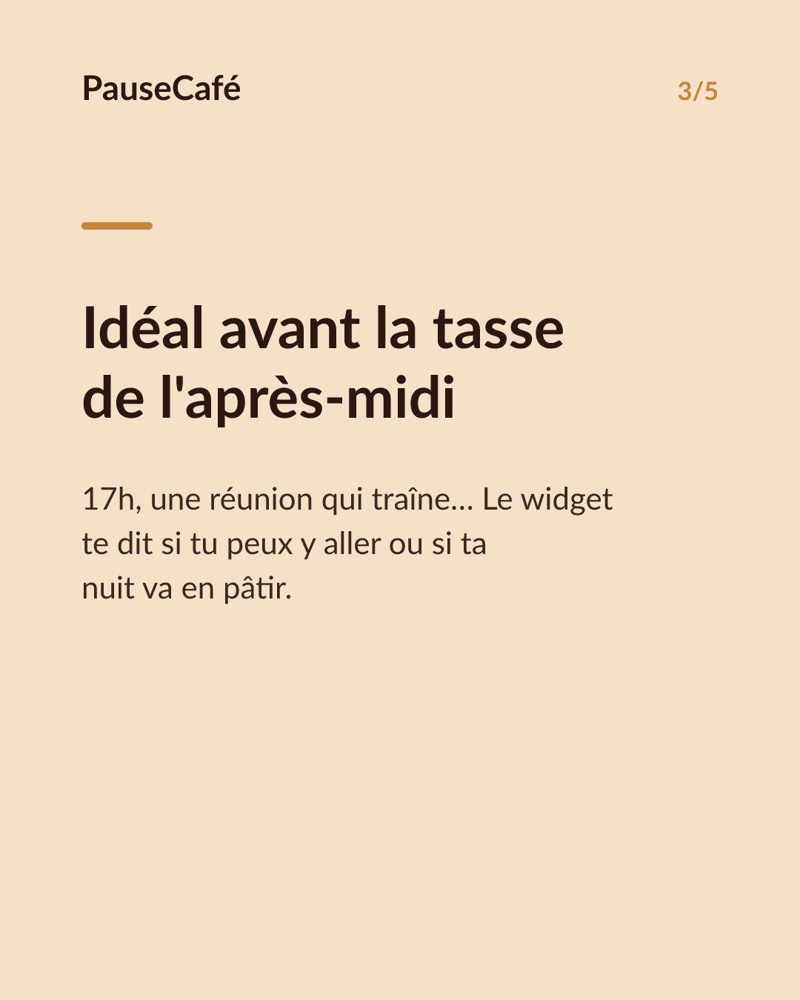
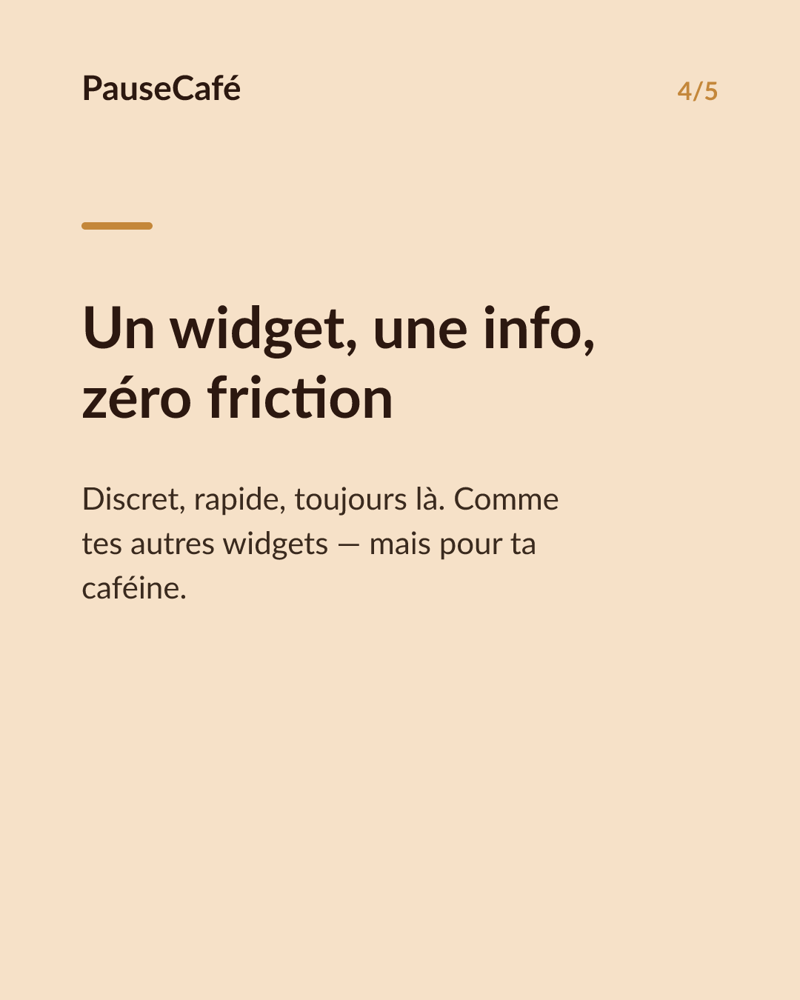

# Brouillon posts sociaux — widget-cafeine

- Archétype : Demo fonctionnalite
- Angle : Le widget caféine active sur l'écran d'accueil : la tendance d'un coup d'œil.
- Généré le : 2026-08-03

> À relire et ajuster avant publication. (Le lien App Store est déjà inséré.)

---

## X (thread)

1/ T'as déjà ouvert ton téléphone juste pour savoir si ton café était "passé" ? Il y a plus simple. ☕

2/ PauseCafé a un widget pour l'écran d'accueil. La caféine encore active dans ton corps, estimée minute par minute, visible sans même ouvrir l'app.

3/ D'un coup d'œil tu vois si tu es encore au pic, si la courbe descend, ou si tu peux te permettre une deuxième tasse sans risquer ta nuit.

4/ Pas besoin de fouiller dans des menus. L'info est là, sur ton écran d'accueil, entre tes autres widgets. Discret et direct.

5/ C'est utile surtout l'après-midi : tu vois exactement où tu en es avant de commander ce café "pour tenir la réunion de 17h".

6/ Indicatif, bien-être — pas médical. Mais avoir le chiffre sous les yeux change vraiment les réflexes. 👀

7/ Essaie le widget sur l'App Store 👉 https://apps.apple.com/app/id6761892198

## Instagram

**Légende :** Et si ta caféine était visible d'un seul coup d'œil, directement sur ton écran d'accueil ? Le widget PauseCafé t'affiche la caféine encore active dans ton corps, minute par minute. Indicatif, bien-être. 👉 lien en bio.

📷 Photos : Milada Vigerova, Roman Bintang / Unsplash

**Hashtags :** #café #caféine #widget #iPhone #bienêtre #habitudes #coffeelover #productivité #astuceiPhone #santé

**Visuel du thread X :** Screenshot de l'écran d'accueil iPhone avec le widget PauseCafé visible, affichant la courbe ou le niveau de caféine active en temps réel.

**Carrousel (images générées) :**

**Textes des slides :**

1. **Ta caféine, d'un seul coup d'œil** — Plus besoin d'ouvrir une app. Le widget PauseCafé l'affiche directement sur ton écran d'accueil.
2. **Minute par minute, en temps réel** — La caféine encore active dans ton corps, estimée en continu. Tu vois si tu es au pic ou en descente.
3. **Idéal avant la tasse de l'après-midi** — 17h, une réunion qui traîne… Le widget te dit si tu peux y aller ou si ta nuit va en pâtir.
4. **Un widget, une info, zéro friction** — Discret, rapide, toujours là. Comme tes autres widgets — mais pour ta caféine.
5. **Ajoute-le à ton écran d'accueil** — Télécharge PauseCafé et reprends la main sur ta caféine, en un regard. Indicatif et bien-être. ☕
