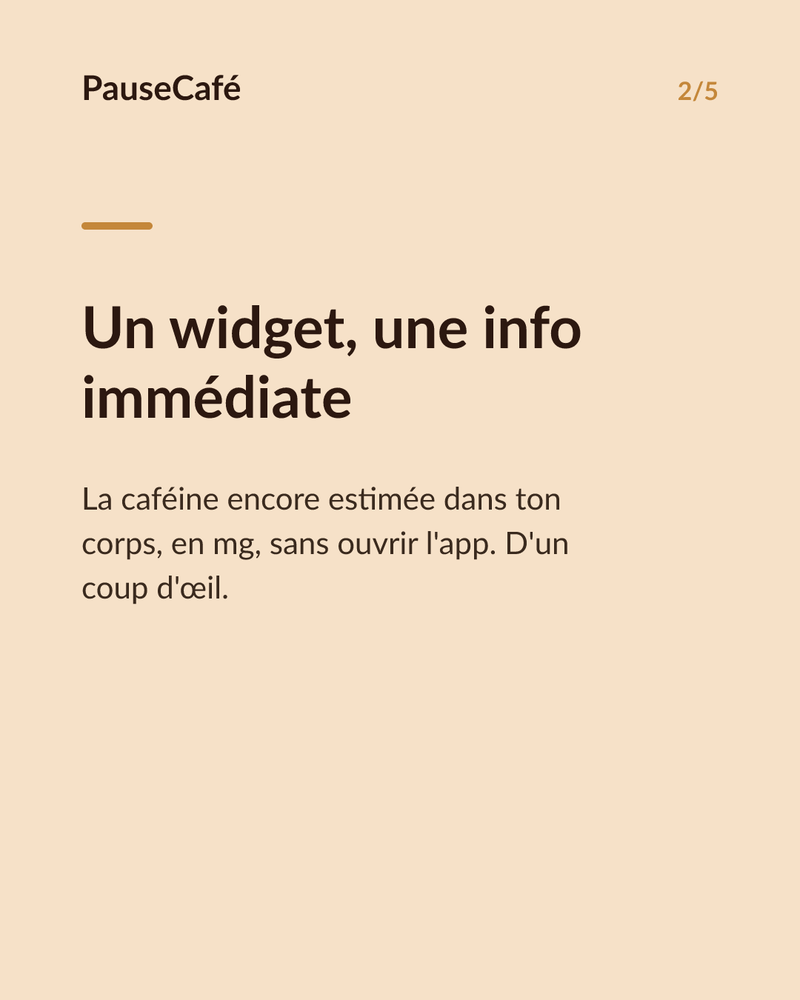
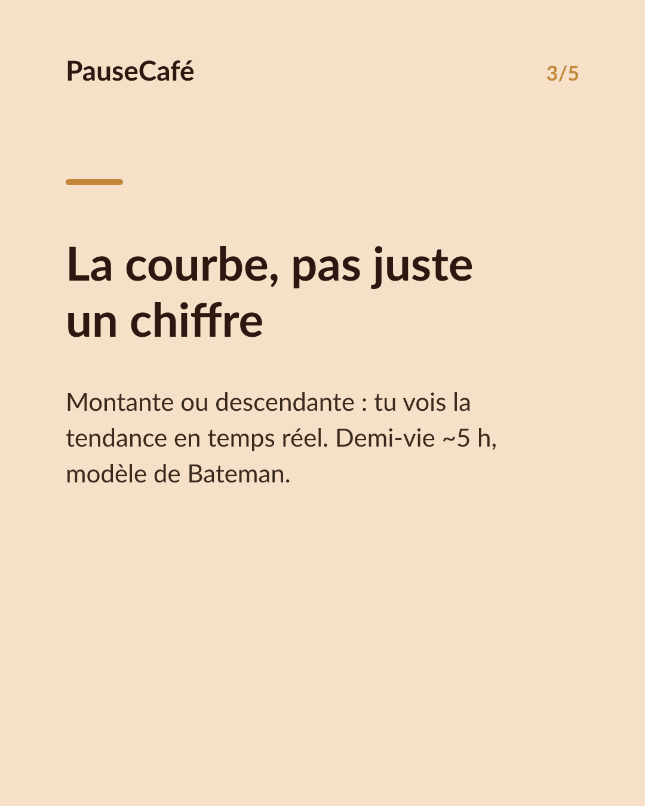
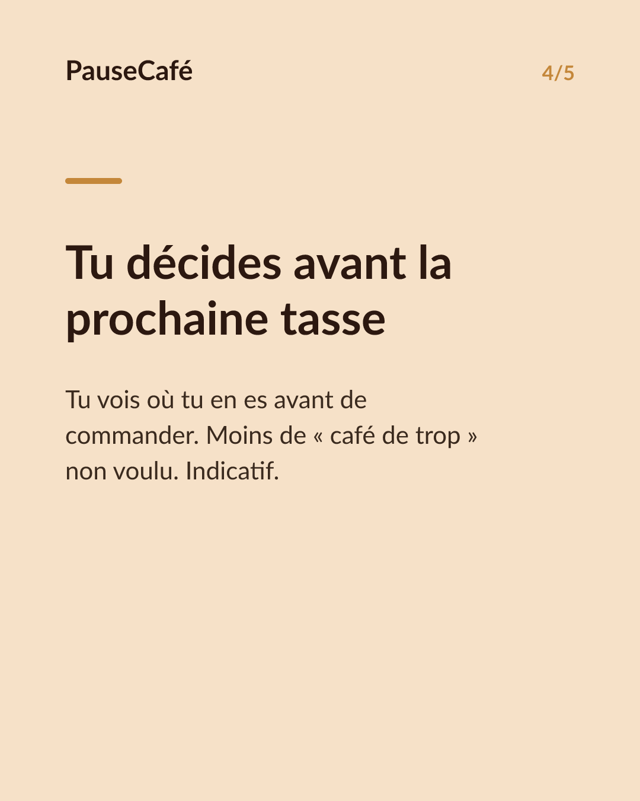

# Brouillon posts sociaux — widget-cafeine

- Archétype : Demo fonctionnalite
- Angle : Le widget caféine active sur l'écran d'accueil : la tendance d'un coup d'œil.
- Généré le : 2026-08-05

> À relire et ajuster avant publication. (Le lien App Store est déjà inséré.)

---

## X (thread)

1/ Ton iPhone t'affiche la météo, tes prochains RDV… mais pas la caféine encore active dans ton corps. Pourtant, c'est utile. ☕

2/ PauseCafé a un widget pour l'écran d'accueil. D'un coup d'œil : combien de mg de caféine il reste dans ton corps, estimés en temps réel.

3/ La caféine a une demi-vie d'environ 5 h. Le widget te montre la courbe en direct — montante ou descendante — sans ouvrir l'app.

4/ Résultat : avant de commander un autre café, tu sais déjà où tu en es. Tu décides, tu ne subis pas.

5/ Le widget lit les données de PauseCafé en local, sur ton appareil. Rien ne sort. Compatible avec l'app Santé d'Apple. 🔒

6/ Une info de plus sur ton écran d'accueil — celle qui manquait pour mieux doser ta journée. Indicatif, bien-être, jamais médical.

7/ Essaie PauseCafé gratuitement sur l'App Store 👉 https://apps.apple.com/app/id6761892198

## Instagram

**Légende :** La caféine encore active dans ton corps, visible depuis ton écran d'accueil. Le widget PauseCafé t'affiche l'estimation en temps réel — pour décider en un coup d'œil. Indicatif, bien-être. 👉 lien en bio.

📷 Photos : Szabo Viktor, Mohammadreza alidoost / Unsplash

**Hashtags :** #caféine #café #widget #iPhone #bienêtre #habitudes #AppleHealth #coffeelover #santé #productivité

**Visuel du thread X :** Screenshot de l'écran d'accueil iPhone avec le widget PauseCafé visible, affichant la courbe de caféine active et le chiffre en mg.

**Carrousel (images générées) :**

**Textes des slides :**

1. **Et si ton écran d'accueil savait ?** — Météo, agenda… mais jamais la caféine active dans ton corps. PauseCafé change ça.
2. **Un widget, une info immédiate** — La caféine encore estimée dans ton corps, en mg, sans ouvrir l'app. D'un coup d'œil.
3. **La courbe, pas juste un chiffre** — Montante ou descendante : tu vois la tendance en temps réel. Demi-vie ~5 h, modèle de Bateman.
4. **Tu décides avant la prochaine tasse** — Tu vois où tu en es avant de commander. Moins de « café de trop » non voulu. Indicatif.
5. **Ajoute le widget aujourd'hui** — Gratuit sur l'App Store. Tes données restent sur ton iPhone. Compatible app Santé Apple.
