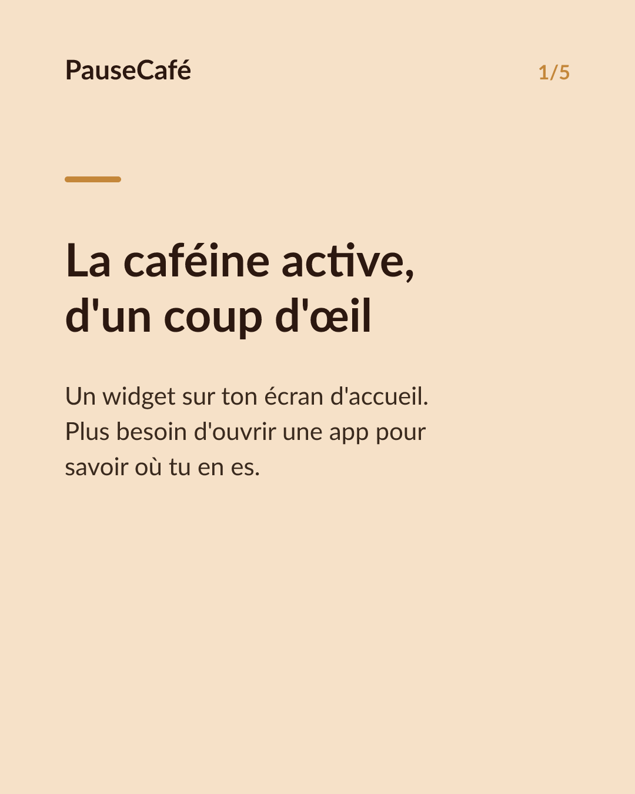
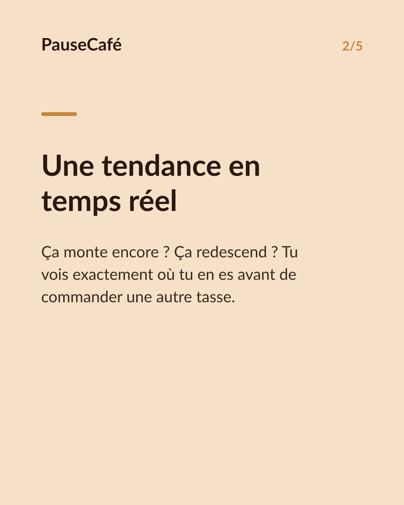
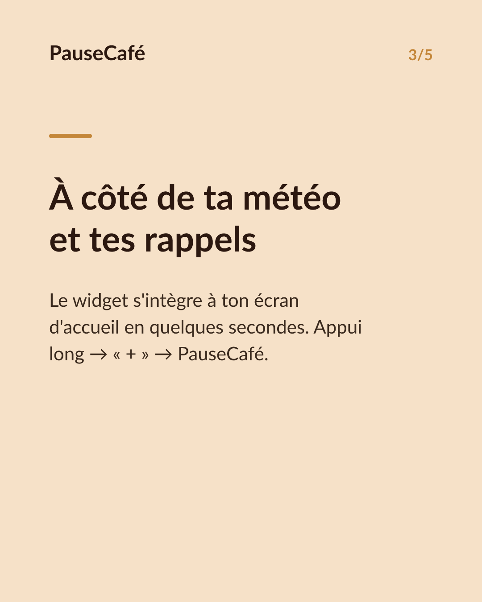
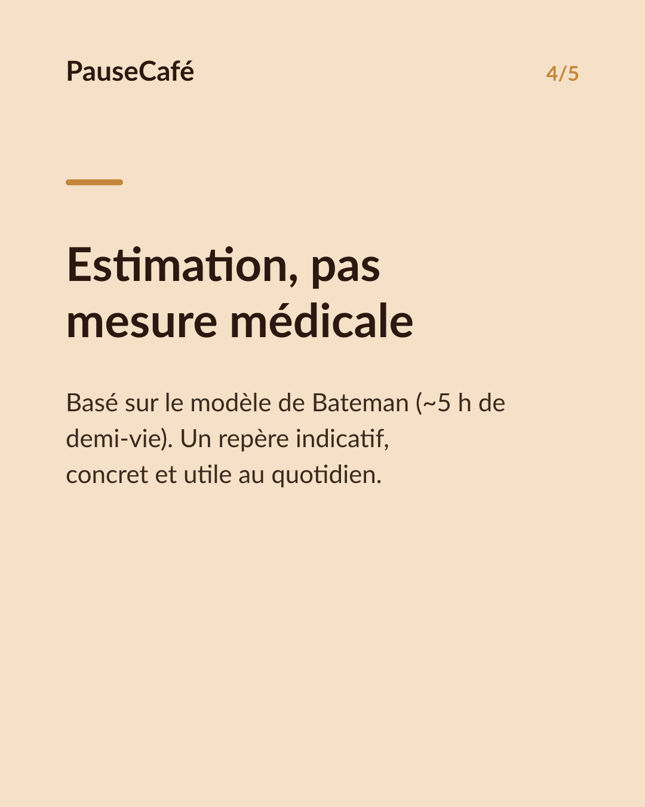
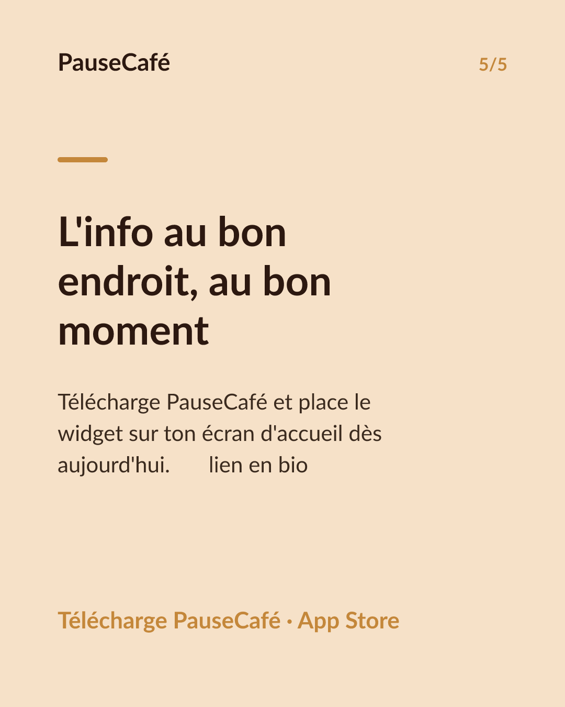

# Brouillon posts sociaux — widget-cafeine

- Archétype : Demo fonctionnalite
- Angle : Le widget caféine active sur l'écran d'accueil : la tendance d'un coup d'œil.
- Généré le : 2026-08-07

> À relire et ajuster avant publication. (Le lien App Store est déjà inséré.)

---

## X (thread)

1/ Ton iPhone t'affiche la météo, tes pas, ta batterie… mais pas si tu peux prendre un café. ☕
2/ PauseCafé a un widget pour l'écran d'accueil. Un coup d'œil, et tu vois la caféine encore active dans ton corps — maintenant.
3/ Le widget affiche la tendance en temps réel : est-ce que ça monte encore ? Ça redescend ? Tu es dans la fenêtre pour une autre tasse ou pas.
4/ Plus besoin d'ouvrir l'app. L'info est là, entre ta météo et tes rappels. En 2 secondes tu sais où tu en es.
5/ C'est une estimation (modèle de Bateman, demi-vie ~5 h), pas une mesure médicale. Mais c'est suffisant pour prendre une décision éclairée.
6/ Tu configures le widget en quelques secondes : appui long sur l'écran d'accueil → "+" → PauseCafé. C'est tout. 🎯
7/ Essaie le widget PauseCafé → https://apps.apple.com/app/id6761892198

## Instagram

**Légende :** La caféine encore active dans ton corps, visible d'un coup d'œil depuis ton écran d'accueil. Le widget PauseCafé affiche la tendance en temps réel — sans même ouvrir l'app. Indicatif, bien-être. 👉 lien en bio.

**Hashtags :** #widget #iPhone #caféine #café #bienêtre #iOS #coffeelover #habitudes #santé #astuceiPhone

**Visuel du thread X :** Screenshot de l'écran d'accueil iPhone avec le widget PauseCafé visible, affichant la courbe de caféine active en temps réel.

**Carrousel (images générées) :**

**Textes des slides :**

1. **La caféine active, d'un coup d'œil** — Un widget sur ton écran d'accueil. Plus besoin d'ouvrir une app pour savoir où tu en es.
2. **Une tendance en temps réel** — Ça monte encore ? Ça redescend ? Tu vois exactement où tu en es avant de commander une autre tasse.
3. **À côté de ta météo et tes rappels** — Le widget s'intègre à ton écran d'accueil en quelques secondes. Appui long → « + » → PauseCafé.
4. **Estimation, pas mesure médicale** — Basé sur le modèle de Bateman (~5 h de demi-vie). Un repère indicatif, concret et utile au quotidien.
5. **L'info au bon endroit, au bon moment** — Télécharge PauseCafé et place le widget sur ton écran d'accueil dès aujourd'hui. 👉 lien en bio
